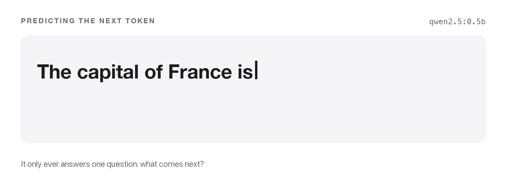
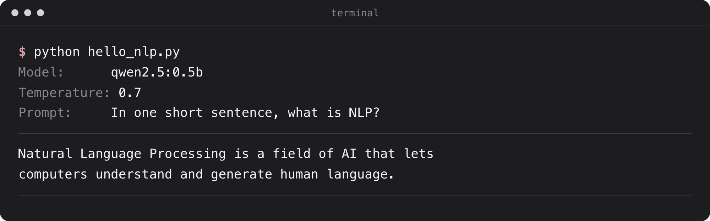

# W1C1 Lab: Environment Setup & Your First Local LLM

**Goal:** a working course environment and your first prompt to an LLM running
on your own laptop.

This lab has no unit tests. Instead **every step ends with a command and the
exact output you should see**. If your output does not match, stop there and fix
it before moving on; a broken environment in Week 1 costs you the whole semester.

## Before you code: the picture and the math



The model you are about to run does exactly one thing, over and over: given the words so far, it picks the next token. Formally, it models

$$P(w_t \mid w_1, w_2, \ldots, w_{t-1})$$

and generates text by sampling one token at a time from that distribution. The `temperature` knob you tweak in Step 5 rescales the model's raw scores $z_w$ before sampling:

$$P(w) = \frac{e^{z_w / T}}{\sum_{v} e^{z_v / T}}$$

Small $T$ sharpens the distribution toward the single most likely token; large $T$ flattens it, so less likely tokens get picked more often.



Your finished setup runs `hello_nlp.py`, which sends a prompt string to a 0.5B-parameter model served locally by Ollama and prints the model's completion, as in the run above. Nothing leaves your laptop: the "AI" is a next-token predictor executing on your own CPU. **Check yourself before coding:** at temperature $T = 0.0$, why should two runs of the same prompt give (near) identical outputs? (Because the flattening disappears and the model always takes the highest-probability next token, so sampling becomes deterministic.)

---

### Step 1, Build the image and pull the model

Run all three from the **repository root**. The first one takes a while the first
time; it is downloading and installing the whole scientific Python stack.

```bash
docker compose -f docker/docker-compose.yml build
docker compose -f docker/docker-compose.yml up -d ollama
docker compose -f docker/docker-compose.yml exec ollama ollama pull qwen2.5:0.5b
```

**Done when** the model is listed:

```bash
docker compose -f docker/docker-compose.yml exec ollama ollama list
```

```
NAME            ID              SIZE      MODIFIED
qwen2.5:0.5b    a8b0c5157701    397 MB    ...
```

**397 MB is the entire model.** Worth sitting with for a second: the thing that is
about to write English sentences for you is a single file smaller than a podcast
episode.

**If it fails:** the most common cause is that the `ollama` service is not
running. `docker compose -f docker/docker-compose.yml ps` should show it as `Up`.

---

### Step 2, Verify the environment

```bash
docker compose -f docker/docker-compose.yml run --rm course python scripts/env_check.py
```

**Done when** every library reports `[ok]`, Ollama is reachable, and the last
line reads `ENV CHECK OK`:

```
Python 3.12.13
Core libraries:
  [ok]  numpy                  2.5.1
  [ok]  scipy                  1.18.0
  ...
  [ok]  ollama                 ?
Ollama:
  [ok]  Ollama reachable at http://ollama:11434; models: ['qwen2.5:0.5b']

ENV CHECK OK.
```

Exact version numbers will drift; what matters is that nothing says `[FAIL]` and
that the Ollama line finds your model.

**If Ollama is unreachable:** you are probably running `env_check.py` with
`--no-deps`, which skips starting the Ollama container. Drop that flag.

---

### Step 3, Run your first LLM prompt

```bash
docker compose -f docker/docker-compose.yml run --rm course python weeks/week-01/class-01/exercise/hello_nlp.py
```

**Done when** you get a completion:

```
Model:       qwen2.5:0.5b
Temperature: 0.7
Prompt:      In one short sentence, what is Natural Language Processing?
------------------------------------------------------------
Natural Language Processing (NLP) is the study of how computers can understand
and interpret human language, enabling machines to communicate with humans.
------------------------------------------------------------
Try editing the TODOs in this file and re-running!
```

Your sentence will differ from this one, and that is expected at temperature
0.7. Step 5 is about exactly that.

**Stop and notice:** you are not talking to a server. Unplug your network and
this still works.

---

### Step 4, Change the prompt (STEP 4 in `hello_nlp.py`)

Edit the `prompt` variable. Ask the model something you actually want to know,
then re-run the command from Step 3.

**Done when** the `Prompt:` line in the output shows your new text and the
completion responds to it.

**Try to make it fail.** Ask for arithmetic with four-digit numbers, or a fact
about your hometown, or today's date. A 0.5B model is small enough that you can
find its edges in about three prompts, and you will need one of those failures
for the scavenger hunt below.

---

### Step 5, Change the temperature (STEP 5 in `hello_nlp.py`)

Set `temperature = 0.0` and run **twice**. Then set `temperature = 1.2` and run
**twice** more.

**Done when** you can state what changed. What you should see:

```
T=0.0: Natural Language Processing (NLP) is the study of how computers can understand
       and interpret human language, enabling machines to communicate with humans.
T=0.0: Natural Language Processing (NLP) is the study of how computers can understand
       and interpret human language, enabling machines to communicate with humans.
T=1.2: Natural Language Processing (NLP) involves the development of systems and
       algorithms that can understand, interpret, generate human language naturally
```

The two runs at **T = 0.0 are identical**. The run at **T = 1.2 differs**, and
running it again will differ again.

**Write down your explanation before reading on.** Then check it against the
formula at the top of this page: temperature divides the scores before they are
turned into probabilities. Dividing by a small number exaggerates the gaps, so
the top token wins every time and sampling stops being random. Dividing by a
large number flattens the gaps, so unlikely tokens get a real chance.

We come back to this properly in Week 7 (decoding), where you will implement the
sampling itself.

---

### Step 6, Reflect (STEP 6 in `hello_nlp.py`)

Write 2-3 sentences as a comment at the bottom of the file: what surprised you
about a 0.5B model running on your own laptop?

**Done when** the comment is there and says something specific. "It was cool" is
not a reflection; "it answered a definition question fine but confidently
invented a wrong date" is.

---

## In-Class Activity: First-Prompt Scavenger Hunt (pairs, ~10 min)

Once your environment runs, pair up:

1. Take turns prompting **qwen2.5:0.5b** with anything you like.
2. Find **one thing the model gets right** and **one thing it gets wrong** (a
   wrong fact, broken arithmetic, a refusal, a confident hallucination).
3. Post both prompts and their outputs to the **shared class board**, then read
   what other pairs found. We will skim the board together at the wrap-up.

This is a low-stakes way to build intuition for what a tiny local model can and
cannot do, and it previews the reliability themes we revisit all semester.

## When you are done

Nothing to submit. You are finished when `env_check.py` prints `ENV CHECK OK`
and your edited `hello_nlp.py` runs. If class ends first, finish it on your own
time before the next session: everything after this week assumes the environment
works.

## Troubleshooting

- **Ollama not reachable:** `docker compose -f docker/docker-compose.yml up -d ollama`,
  then re-pull the model.
- **`The 'ollama' package is missing`:** you are running the script on your host
  Python instead of inside the container. Use the full `docker compose ... run`
  command.
- **Build is very slow or fails partway:** see `docker/README.md`.

A step-by-step companion, including what each command is actually doing and the
answers to the questions above, is in `../solutions/WALKTHROUGH.md`. **These labs
are not graded**, so reading it is not cheating: getting unstuck and finishing the
idea beats stalling.
