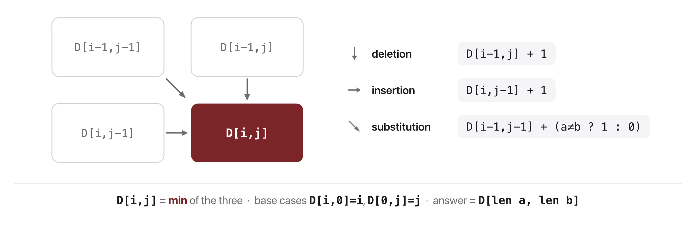
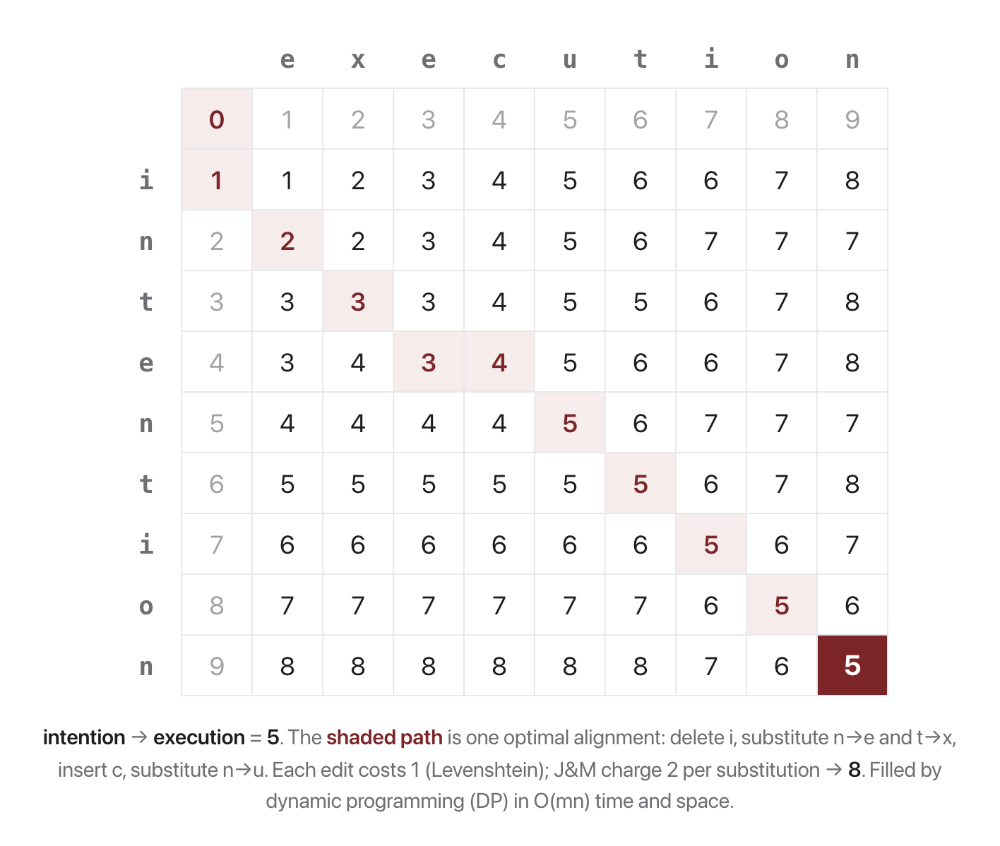

# W1C2 Lab: Tokenizer, Regex Extractor & Edit Distance

## 1. Learning objective

Build the text tools every later week leans on: split text into tokens, and
measure how far apart two strings are with the edit-distance recurrence.

You write two functions in `text_tools.py`. Normalizing, the extraction
regexes and the demo are already written for you.

## 2. Understanding the math

`edit_distance(a, b)` is the fewest single-character inserts, deletes and
substitutes that turn $a$ into $b$. Fill a table $D$ where $D[i,j]$ is the
distance between the first $i$ characters of $a$ and the first $j$ of $b$:

$$D[i,0] = i, \qquad D[0,j] = j$$

$$D[i,j] = \min \begin{cases} D[i-1,j] + 1 & \text{(deletion)} \\ D[i,j-1] + 1 & \text{(insertion)} \\ D[i-1,j-1] + [\,a_i \neq b_j\,] & \text{(substitution, cost 0 if the characters match)} \end{cases}$$



Row by row, `intention` to `execution` fills in like the worked example from
lecture. The answer is the bottom-right cell, $D[\text{len}(a), \text{len}(b)]$:



Substitution costs 1 here (Levenshtein), not the cost-2 variant J&M also mention.

## 3. Getting started

From the repository root on your own machine, once per session:

```bash
docker compose -f docker/docker-compose.yml run --rm --no-deps -w /workspace/weeks/week-01/class-02/exercise course bash
```

A step you have not written yet reports `skipped`, not a failure. If you get
stuck, `../solutions/WALKTHROUGH.md` works out every step, and these labs are
not graded.

## 4. Implement `tokenize`

Clean the text, then let `_TOKEN_RE` find every token in it. Punctuation is a
token of its own, so `"Hello, world!"` gives four, not two.

```bash
pytest -k step1 -q
```

```
..                                                                       [100%]
2 passed, 8 deselected
```

## 5. Implement `edit_distance`

Build the table from section 2 and return its bottom-right cell. Watch the
off-by-one: row $i$ is about the character `a[i-1]`.

```bash
pytest -k step2 -q
```

```
.....                                                                    [100%]
5 passed, 5 deselected
```

## 6. Run it, then break it

```bash
python text_tools.py
```

```
============================================================
Text tools
============================================================
  raw        '  Email A.B+x@Mail.co  or ping @alice at https://x.io/p?q=1 !! '
  normalized 'email a.b+x@mail.co or ping @alice at https://x.io/p?q=1 !!'
  tokens     ['email', 'a', '.', 'b', '+', 'x', '@', 'mail', '.', 'co', 'or', 'ping', '@', 'alice', 'at', 'https', ':', '/', '/', 'x', '.', 'io', '/', 'p', '?', 'q', '=', '1', '!', '!']
  emails     ['A.B+x@Mail.co']
  urls       ['https://x.io/p?q=1']
  mentions   ['alice']

  edit_distance('intention', 'execution') = 5
  edit_distance('kitten', 'sitting') = 3
  edit_distance('same', 'same') = 0
```

Compare the `tokens` line with the `emails` line. Each experiment below is a
one-line edit; undo it before the next.

1. Words only. Change `_TOKEN_RE` to `re.compile(r"\w+")` and re-run.
   `"Hello, world!"` now yields 2 tokens instead of 4, and `pytest -k step1`
   fails. Which downstream task would prefer this tokenizer, and which would
   break without the punctuation?
2. Charge more for substitution. In `edit_distance`, make a mismatch cost 2
   instead of 1. `intention`/`execution` goes from 5 to 8 and `kitten`/`sitting`
   from 3 to 5. Why did the distance rise by exactly 3 in the first case?
3. Check symmetry. Print `edit_distance("execution", "intention")`. It is 5,
   the same as the other direction. Which line of the recurrence guarantees
   that, and would it survive experiment 2?
4. `extract` runs on the RAW string, before tokenizing. The demo output shows
   why: the tokenizer shreds `a.b+x@mail.co` into nine pieces. What would you
   have to do to recover the email from the token list instead?
