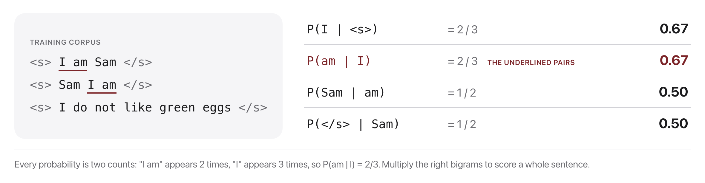
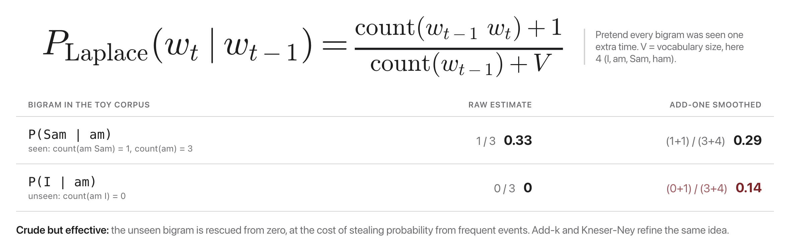

# W2C1 Lab: Build an N-gram Bard

Train a baby language model on a corpus, make it **babble**, and score how good
it is with **perplexity**. Then face off against your classmates in the
**Babble-Off**.

**You will write four functions** in `ngram_lm.py`, one per step, each with its
own check.

## Before you code: the picture and the math



A bigram probability is just two counts divided (this is exactly what `count_ngrams` collects and `prob` computes):

$$P(w_t \mid w_{t-1}) = \frac{\text{count}(w_{t-1}, w_t)}{\text{count}(w_{t-1})}$$



With add-one (Laplace) smoothing and vocabulary size $V$, no probability is ever zero:

$$P_{\text{lap}}(w_t \mid w_{t-1}) = \frac{\text{count}(w_{t-1}, w_t) + 1}{\text{count}(w_{t-1}) + V}$$

For a general n-gram model the context is the last $n-1$ words instead of just $w_{t-1}$. Perplexity on $N$ held-out words is the inverse probability per word, computed in log space:

$$\text{PPL} = \exp\Big(-\frac{1}{N}\sum_{t=1}^{N} \log P_{\text{lap}}(w_t \mid \text{context}_t)\Big)$$

Your finished code counts n-grams from padded sentences, turns those counts into smoothed probabilities with the formula above, samples words one at a time from `<s>` until `</s>` to babble, and averages log-probabilities on held-out text to report perplexity. **Check yourself before coding:** using the three sentences in the first figure, what is the unsmoothed $P(\text{Sam} \mid \text{am})$? ("am" occurs twice and is followed by "Sam" once, so 1/2.)

## The data

A tiny, fun corpus is baked into the file: a mash-up of nursery-rhyme and
Dr.-Seuss-style lines (`CORPUS`). It is small on purpose so everything runs in
seconds. Swap in your own text for the Babble-Off.

## How this lab works

Each step tells you **what to write**, then exactly **how to check it**. Work in
order: every step builds on the one before.

`lab` is a shortcut for the long docker command. Set it up once per
terminal session, using the line for **your** shell:

```
# macOS / Linux (bash, zsh)
alias lab='docker compose -f docker/docker-compose.yml run --rm --no-deps course'

# Windows, PowerShell
function lab { docker compose -f docker/docker-compose.yml run --rm --no-deps course @args }

# Windows, Command Prompt
doskey lab=docker compose -f docker/docker-compose.yml run --rm --no-deps course $*
```

Rather work inside the image? This opens a shell there, and then every
command below runs without its `lab` prefix:

```bash
docker compose -f docker/docker-compose.yml run --rm --no-deps course bash
```

Check **one step**:

```bash
lab python -m pytest weeks/week-02/class-01/exercise/test_ngram_lm.py -k step1 -q
```

Check **everything**:

```bash
lab python -m pytest weeks/week-02/class-01/exercise/test_ngram_lm.py -q
```

Some steps are **already written for you** and marked `(given)`. Run their
check, read the code, and use it as the pattern for the steps you do write. A
step you have not written yet reports `skipped`, never a failure, so the only
red you will ever see is a real wrong answer.

Stuck for more than a few minutes on a step? Open
`../solutions/WALKTHROUGH.md` at that step. It explains the idea and shows the
code. Read the step you are on, not the whole file. The full reference solution
sits in `../solutions/` too. **These labs are not graded**, so reading them is
not cheating: getting unstuck and finishing the idea beats staring at a blank
function.

---

### Step 0, Orientation (nothing to write)

Run the starter as-is:

```bash
lab python weeks/week-02/class-01/exercise/ngram_lm.py
```

You should see:

```
ngram_lm.py is not implemented yet, fill in the TODOs, then re-run.
```

Now open a Python shell and try the three helpers that are **already written**
for you, so you know what you are building on:

```bash
lab python
```

```python
>>> import sys; sys.path.insert(0, "weeks/week-02/class-01/exercise")
>>> from ngram_lm import tokenize, pad, vocab, BOS, EOS
>>> tokenize("The Cat Sat")
['the', 'cat', 'sat']
>>> pad(tokenize("the cat sat"), 2)
['<s>', 'the', 'cat', 'sat', '</s>']
>>> pad(tokenize("the cat sat"), 3)
['<s>', '<s>', 'the', 'cat', 'sat', '</s>']
```

**Notice:** an n-gram model needs `n-1` start symbols so the very first real
word has a full context. That is the only reason `pad` takes `n`.

---

### Step 1, Count the n-grams

**Write:** `count_ngrams(sentences, n)`.

For each sentence: tokenize it, pad it, then slide a window of width `n` across
the padded tokens. Every window is an **n-gram**; everything but its last word is
the **context**. Count both.

Return the dict described in the docstring: `n`, `vocab`, `ngram`, `context`.

**Done when:**

```bash
lab python -m pytest weeks/week-02/class-01/exercise/test_ngram_lm.py -k step1 -q
```

```
.                                                                        [100%]
1 passed, 5 deselected
```

**Check it by hand.** With `TRAIN = ["the cat sat", "the cat ran", "a cat sat"]`:

```python
>>> m = count_ngrams(TRAIN, 2)
>>> m["ngram"][("the", "cat")]     # "the cat" appears in two sentences
2
>>> m["context"][("the",)]         # so does the context "the"
2
>>> m["ngram"][("sat", "</s>")]    # two sentences end in "sat"
2
>>> len(m["vocab"])                # the, cat, sat, ran, a, </s>
6
```

**Why it matters:** every probability in this lab is two of these counts
divided. If the counts are wrong, nothing downstream can be right.

---

### Step 2, Turn counts into smoothed probabilities

**Write:** `prob(model, context, word)`, using add-one (Laplace) smoothing:

$$P(\text{word} \mid \text{context}) = \frac{\text{count}(\text{context}, \text{word}) + 1}{\text{count}(\text{context}) + V}$$

where $V$ is the vocabulary size. Use `.get(key, 0)` so an n-gram you never saw
counts as 0 instead of raising `KeyError`.

**Done when:**

```bash
lab python -m pytest weeks/week-02/class-01/exercise/test_ngram_lm.py -k step2 -q
```

```
..                                                                       [100%]
2 passed, 4 deselected
```

**Check it by hand** (same `TRAIN` as Step 1, so $V = 6$):

```python
>>> m = count_ngrams(TRAIN, 2)
>>> prob(m, ("the",), "cat")        # (2 + 1) / (2 + 6)
0.375
>>> prob(m, ("the",), "ran")        # never seen: (0 + 1) / (2 + 6)
0.125
>>> sum(prob(m, ("the",), w) for w in m["vocab"])
1.0
```

**Why it matters:** the third line is the one to stare at. A probability
distribution has to sum to 1 over everything that could come next. Add-one
smoothing keeps that true **and** gives unseen words a nonzero share, which is
what stops perplexity from being infinite in Step 4.

---

### Step 3, Babble (given)

**Given, already written for you.** Read it in the starter, run its check,
and use it as the pattern for the steps you do write.

It builds on the functions from the earlier steps, so its check reports
`skipped` until you have written those.

**What it does:** `generate(model, n, max_len, seed)`.

Start with `context = (BOS,) * (n - 1)`. At each step, build the probability of
every word in the vocabulary given the current context, sample one word from
that distribution, and slide the context forward. Stop at `EOS` or after
`max_len` words. Return the words **without** the padding symbols.

Two details that the test checks:

- Use a **local** `random.Random(seed)`, not the global `random`, so the same
  seed always gives the same sentence.
- Iterate the vocabulary in a **fixed order** (`sorted(model["vocab"])`), or
  the same seed will still give different results between runs.

**Done when:**

```bash
lab python -m pytest weeks/week-02/class-01/exercise/test_ngram_lm.py -k step3 -q
```

```
.                                                                        [100%]
1 passed, 5 deselected
```

**Check it by hand:**

```python
>>> m = count_ngrams(TRAIN, 2)
>>> generate(m, 2, seed=3)
['a', 'cat', 'ran', 'ran', 'ran']
>>> generate(m, 2, seed=3) == generate(m, 2, seed=3)
True
```

Your exact words may differ if you sample the vocabulary in a different order.
What must be true is that **the same seed gives the same sentence twice** and
that no `<s>` or `</s>` survives in the output.

**Why it matters:** this is generation, in miniature. A modern LLM does the same
loop, with a neural network in place of the count table.

---

### Step 4, Score the model with perplexity (given)

**Given, already written for you.** Read it in the starter, run its check,
and use it as the pattern for the steps you do write.

It builds on the functions from the earlier steps, so its check reports
`skipped` until you have written those.

**What it does:** `perplexity(model, n, sentences)`.

Pad each sentence, then for every **predicted** token (everything after the
`n-1` padding symbols, including the final `</s>`) add `log P(word | context)`
to a running total. Perplexity is `exp(-total / number_of_predicted_tokens)`.

Work in log space with `math.log` and `math.exp`. Multiplying hundreds of small
probabilities underflows to 0.0; adding their logs does not.

**Done when:**

```bash
lab python -m pytest weeks/week-02/class-01/exercise/test_ngram_lm.py -k step4 -q
```

```
..                                                                       [100%]
2 passed, 4 deselected
```

**Check it by hand:**

```python
>>> uni = count_ngrams(TRAIN, 1)
>>> bi  = count_ngrams(TRAIN, 2)
>>> round(perplexity(uni, 1, ["the cat sat"]), 4)
5.1962
>>> round(perplexity(bi, 2, ["the cat sat"]), 4)
2.8284
```

Lower is better, and the bigram model wins because it knows that "cat" tends to
follow "the".

**Why it matters:** perplexity is the number that lets you compare two models
without reading their output. Roughly, it is "how many words was the model
choosing between, on average?"

---

### Step 5, Run the whole thing

Everything is implemented, so the demo works:

```bash
lab python weeks/week-02/class-01/exercise/ngram_lm.py
```

```
============================================================
N-gram Bard, train, babble, and score with perplexity
============================================================

[unigram]  perplexity on held-out =   15.39
   babble: eggs am not

[bigram]  perplexity on held-out =    8.64
   babble: ham am mat

[trigram]  perplexity on held-out =   10.63
   babble: ham and mat a in green a in
```

And the full suite should be green:

```bash
lab python -m pytest weeks/week-02/class-01/exercise/test_ngram_lm.py -q
```

```
......                                                                   [100%]
6 passed
```

**The discussion point:** fluency goes up from unigram to trigram, but
perplexity does **not** keep going down. The trigram scores *worse* than the
bigram here. On a corpus this small the trigram has seen almost every context
exactly once, so it is memorizing rather than generalizing, and a held-out
sentence with a context it never saw punishes it. That is overfitting, and you
just measured it.

---

## The Babble-Off (in class)

1. Pick or paste a themed corpus (song lyrics, sports recaps, your group chat,
   keep it clean). Replace `CORPUS`.
2. Train a bigram **and** a trigram model on it.
3. Generate 5 sentences from each. Vote on the funniest line per table.
4. Report each model's **perplexity** on one held-out sentence.

**Lowest perplexity wins "best modeler"; funniest line wins "best bard."**

Discuss: did the trigram babble more fluently? Did it also *overfit* (just
regurgitate the corpus)?

## Stretch goals

- Add **add-k** smoothing (`k=0.1`) and compare perplexity to add-one.
- Add a `temperature` knob to `generate` (sharpen or flatten the distribution
  before sampling); this previews Week 7 decoding.
- Try `n=4`. What happens to fluency vs. originality on a tiny corpus?

A full reference solution is in `../solutions/ngram_lm.py`, and the step-by-step
explanation is in `../solutions/WALKTHROUGH.md` (don't peek until you've tried).
