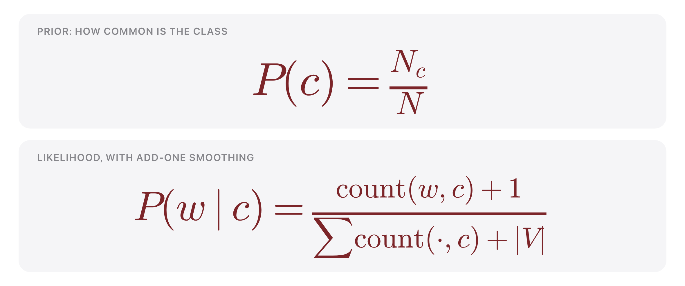
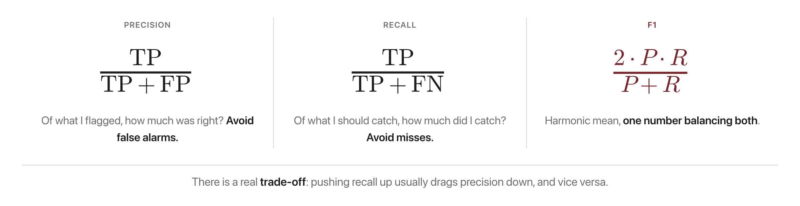

# W2C2 Lab: Sentiment Showdown

Build a **Naive Bayes sentiment classifier from scratch** (no scikit-learn for
the model itself), train it on movie-review snippets, and score it with
**precision, recall, and F1**.

**You will write four functions** in `sentiment.py`, one per step, each with its
own check.

## Before you code: the picture and the math



Training (`train_nb`) is one counting pass. With $N_c$ documents of class $c$ out of $N$ total, and $|V|$ the vocabulary size:

$$P(c) = \frac{N_c}{N} \qquad P(w \mid c) = \frac{\text{count}(w, c) + 1}{\sum_{w'} \text{count}(w', c) + |V|}$$

Scoring (`score`) and prediction (`predict`) work in log space to avoid underflow, then pick the higher-scoring class:

$$\hat{c} = \arg\max_{c \in \{\text{pos}, \text{neg}\}} \Big[ \log P(c) + \sum_{i} \log P(w_i \mid c) \Big]$$



Evaluation (`prf`) turns the test predictions into three numbers: $P = \frac{TP}{TP+FP}$, $R = \frac{TP}{TP+FN}$, and $F_1 = \frac{2PR}{P+R}$.

Your finished code counts words per class to build the two tables above, sums log-probabilities to score each test snippet, labels it with the winning class, and reports precision, recall, and F1 for the `pos` class. **Check yourself before coding:** if the model flags 4 test reviews as positive, 3 of them correctly, and the test set contains 6 truly positive reviews, what are precision and recall? (Precision 3/4, recall 3/6 = 1/2.)

## The data

A small, hand-labeled set of positive/negative review snippets lives in
`sentiment.py` (`TRAIN` and `TEST`). It is tiny so everything runs in seconds.
The phrasing is intentionally tricky ("clever and funny but a bit slow") so you
can see where bag-of-words wins and loses.

## How this lab works

Each step tells you **what to write**, then exactly **how to check it**. Steps 1
to 3 build on each other; Step 4 is independent, so you can do it first if the
model is fighting you.

Set a shortcut for the long docker command first:

```bash
alias lab='docker compose -f docker/docker-compose.yml run --rm --no-deps course'
```

Check **one step**:

```bash
lab python -m pytest weeks/week-02/class-02/exercise/test_sentiment.py -k step1 -q
```

Check **everything**:

```bash
lab python -m pytest weeks/week-02/class-02/exercise/test_sentiment.py -q
```

Stuck for more than a few minutes? Open the walkthrough released after class at the
matching step.

---

### Step 0, Orientation (nothing to write)

Run the starter as-is:

```bash
lab python weeks/week-02/class-02/exercise/sentiment.py
```

```
sentiment.py is not implemented yet, fill in the TODOs, then re-run.
```

Look at the data you are about to model, and at the one helper already written
for you:

```bash
lab python
```

```python
>>> import sys; sys.path.insert(0, "weeks/week-02/class-02/exercise")
>>> from sentiment import TRAIN, TEST, CLASSES, tokenize
>>> len(TRAIN), len(TEST), CLASSES
(10, 5, ('pos', 'neg'))
>>> TRAIN[0]
('a wonderful and moving film i loved it', 'pos')
>>> tokenize("A Wonderful, moving film!")
['a', 'wonderful', 'moving', 'film']
```

**Notice:** five positive and five negative training documents, so the class
prior is going to be uninformative here. Everything the model knows will come
from the word likelihoods.

---

### Step 1, Train

**Write:** `train_nb(docs, labels)`.

One counting pass. For each class you need: how many documents it had, how many
word tokens it had in total, and how many times each word appeared in it. Then
turn those counts into **log** probabilities with add-one smoothing, following
the docstring's return shape exactly (`classes`, `log_prior`, `log_likelihood`,
`vocab`, `class_total`).

Two things the docstring asks for that are easy to skip:

- Smooth the **priors** too: `P(c) = (class_docs[c] + 1) / (N + num_classes)`.
- Store `class_total[c]` and `vocab`, because `score` needs them to compute the
  fallback probability for a word this class never saw.

**Done when:**

```bash
lab python -m pytest weeks/week-02/class-02/exercise/test_sentiment.py -k step1 -q
```

```
.                                                                        [100%]
1 passed, 7 deselected
```

**Check it by hand:**

```python
>>> docs   = [d for d, _ in TRAIN]
>>> labels = [y for _, y in TRAIN]
>>> m = train_nb(docs, labels)
>>> import math
>>> {c: round(math.exp(m["log_prior"][c]), 4) for c in m["classes"]}
{'pos': 0.5, 'neg': 0.5}
>>> len(m["vocab"])
40
>>> m["class_total"]
{'pos': 32, 'neg': 30}
```

**Why it matters:** "training" here is literally counting. No gradients, no
iterations. It is worth appreciating how far this gets you before Week 4
introduces anything that learns by optimization.

---

### Step 2, Score

**Write:** `score(model, tokens)`, returning `{class: log-probability}`.

For each class start from `log_prior[c]`, then add `log P(w | c)` for every
token. Two rules from the docstring:

- A word **outside the vocabulary entirely** is skipped (the model has no
  opinion about it).
- A word **in the vocabulary but never seen in class c** is not skipped: it gets
  the smoothed fallback `1 / (class_total[c] + |V|)`. Skipping it instead is the
  most common bug here, and it quietly makes the classifier overconfident.

Stay in log space and add. Multiplying probabilities underflows.

**Done when:**

```bash
lab python -m pytest weeks/week-02/class-02/exercise/test_sentiment.py -k step2 -q
```

```
..                                                                       [100%]
2 passed, 6 deselected
```

**Check it by hand:**

```python
>>> t = tokenize("a wonderful and moving film")
>>> {c: round(v, 4) for c, v in score(m, t).items()}
{'pos': -17.0013, 'neg': -18.9399}
```

Both numbers are negative (they are logs of probabilities, so always below
zero), and `pos` is the larger of the two. Your values should match these
closely; if they are wildly different, check whether you handled the fallback
case.

**Why it matters:** the gap between the two scores, about 1.94 here, is the
model's confidence. Step 3 throws that gap away and keeps only its sign, which
is exactly what a threshold knob (see the stretch goals) would let you tune.

---

### Step 3, Predict

**Write:** `predict(model, tokens)`, returning the class with the highest score.

This is a one-liner over `score`. `max(scores, key=scores.get)` does it.

**Done when:**

```bash
lab python -m pytest weeks/week-02/class-02/exercise/test_sentiment.py -k step3 -q
```

```
.                                                                        [100%]
1 passed, 7 deselected
```

**Check it by hand:**

```python
>>> predict(m, tokenize("a wonderful and moving film"))
'pos'
>>> predict(m, tokenize("dreadful and boring"))
'neg'
```

**Why it matters:** notice you never computed an actual probability, only
compared two log-scores. Naive Bayes' denominator is the same for both classes,
so it cancels. That is why you can ignore it entirely and still classify
correctly.

---

### Step 4, Evaluate

**Write:** `prf(gold, pred, target="pos")`, returning
`{"precision": p, "recall": r, "f1": f1}` for the target class.

Count three things over the paired lists:

- **TP:** predicted `target` and gold is `target`
- **FP:** predicted `target` but gold is not
- **FN:** gold is `target` but you predicted something else

Then `P = TP/(TP+FP)`, `R = TP/(TP+FN)`, `F1 = 2PR/(P+R)`. **Any time a
denominator is 0, define that metric as 0.0** rather than crashing. That is what
the third test checks, and it is a real situation: a model that never predicts
`pos` has no precision denominator at all.

**Done when:**

```bash
lab python -m pytest weeks/week-02/class-02/exercise/test_sentiment.py -k step4 -q
```

```
...                                                                      [100%]
3 passed, 5 deselected
```

**Check it by hand:**

```python
>>> prf(["pos", "neg"], ["pos", "neg"])
{'precision': 1.0, 'recall': 1.0, 'f1': 1.0}
>>> prf(["pos", "pos", "neg"], ["pos", "neg", "pos"])
{'precision': 0.5, 'recall': 0.5, 'f1': 0.5}
```

Work the second one out on paper before you accept it: one true positive, one
false positive, one false negative.

**Why it matters:** accuracy would have called that second case 33% and told you
nothing about *how* it failed. Precision and recall separate "when it says pos,
is it right?" from "does it find all the pos?", and those two failures have very
different consequences in a real system.

---

### Step 5, Run the whole thing

```bash
lab python weeks/week-02/class-02/exercise/sentiment.py
```

```
============================================================
Sentiment Showdown, Naive Bayes from scratch
============================================================
  [OK ] gold=pos  pred=pos   'a great and moving story i loved it'
  [OK ] gold=pos  pred=pos   'brilliant and beautifully shot'
  [OK ] gold=neg  pred=neg   'a dull and boring waste of time'
  [OK ] gold=neg  pred=neg   'the worst and most forgettable mess'
  [OK ] gold=pos  pred=pos   'clever and funny but a bit slow'

  pos-class  precision=1.00  recall=1.00  F1=1.00
```

And the full suite:

```bash
lab python -m pytest weeks/week-02/class-02/exercise/test_sentiment.py -q
```

```
........                                                                 [100%]
8 passed
```

**Do not be impressed by that 1.00.** Five test documents, drawn from the same
tiny vocabulary as training, is not evidence of anything. The final test case,
"clever and funny but a bit slow", is the one to discuss: the model gets it right
by *counting* two positive words against one negative one, not by understanding
the "but" that flips the sentence. Round 2 of the Showdown is about finding where
that shortcut breaks.

---

## The Showdown (in class)

1. **Round 1, Beat the baseline.** Each table adds 5-10 of their own labeled
   review snippets to `TRAIN`. Re-run. Did test F1 go up or down? Why might
   *more* data *hurt* on a set this small?
2. **Round 2, Stump the model.** Write one review you think the model will get
   wrong (sarcasm, negation, mixed sentiment). Read the winning "stumper" aloud
   and explain *why* bag-of-words fails on it.
3. **Round 3, Inspect the weights.** Print the words with the biggest
   `log P(w|pos) - log P(w|neg)`. Which words are the strongest positive and
   negative signals? Any surprises?

Report your table's test **F1**. Highest F1 wins the showdown; best stumper wins
"most adversarial."

## Stretch goals

- Add a **threshold** knob: predict `pos` only if `score_pos - score_neg > t`.
  Sweep `t` and plot the precision/recall trade-off.
- Compare your from-scratch NB to scikit-learn's `MultinomialNB` (already
  installed). Do they agree?
- Replace raw counts with **binary** (presence/absence) features. Better or worse
  on this data?

A full reference solution is in the reference solution released after class, and the step-by-step
explanation is in the walkthrough released after class (don't peek until you've tried).
