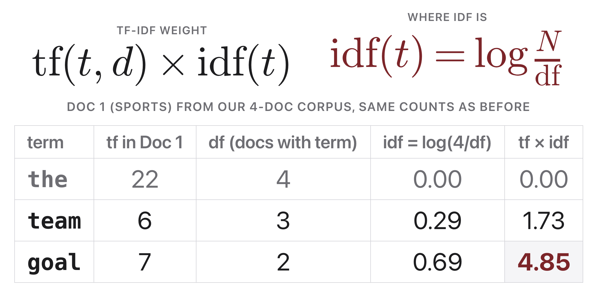
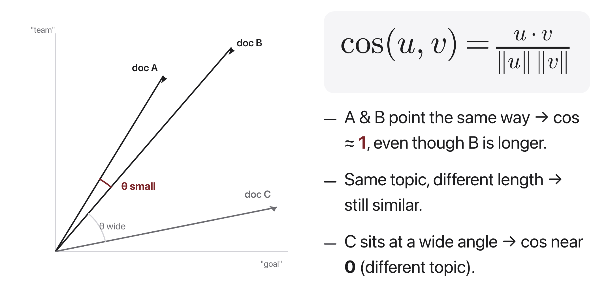

# W3C1 Lab: Tiny Search Engine

Build a **TF-IDF + cosine-similarity** document search engine from scratch, then
race it against your classmates to find the most relevant document for tricky
queries.

**You will write four functions** in `search.py`, one per step, each with its own
check.

## Before you code: the picture and the math





The two formulas behind the whole engine (same notation as the slides; `log` is the natural log, `N` is the number of documents, `df_t` is how many documents contain term `t`):

$$\mathrm{idf}_t = \log\frac{N}{\mathrm{df}_t} \qquad\qquad w_{t,d} = \mathrm{tf}_{t,d} \times \mathrm{idf}_t$$

$$\cos(u, v) = \frac{u \cdot v}{\lVert u \rVert \, \lVert v \rVert}$$

Your finished code turns every document (and the query) into a sparse `{term: tf-idf weight}` vector using the first pair of formulas, then ranks documents by the cosine of the angle between the query vector and each document vector. High cosine means "points the same direction in term space," which is our stand-in for "about the same topic." **Check yourself before coding:** in the first figure, "the" appears 22 times in Doc 1 yet gets tf-idf weight 0.00, why? (It appears in all 4 documents, so idf = log(4/4) = 0, and tf times 0 is 0 no matter how large tf is.)

## The data

A small corpus of one-line "documents" about animals, food, and sports lives in
`search.py` (`DOCS`). It is tiny so everything runs instantly. The topics overlap
on purpose ("hot dog" the food vs "dog" the animal) so you can see TF-IDF earn
its keep.

## How this lab works

Each step tells you **what to write**, then exactly **how to check it**. Step 3
(`cosine`) does not depend on Steps 1 and 2, so you can do it out of order if you
get stuck. Step 4 needs all three.

Set a shortcut for the long docker command first:

```bash
alias lab='docker compose -f docker/docker-compose.yml run --rm --no-deps course'
```

Check **one step**:

```bash
lab python -m pytest weeks/week-03/class-01/exercise/test_search.py -k step1 -q
```

Check **everything**:

```bash
lab python -m pytest weeks/week-03/class-01/exercise/test_search.py -q
```

Stuck for more than a few minutes? Open the walkthrough released after class at the
matching step.

---

### Step 0, Orientation (nothing to write)

Run the starter as-is:

```bash
lab python weeks/week-03/class-01/exercise/search.py
```

```
search.py is not implemented yet, fill in the TODOs, then re-run.
```

Look at the corpus you are about to index:

```bash
lab python
```

```python
>>> import sys; sys.path.insert(0, "weeks/week-03/class-01/exercise")
>>> from search import DOCS, tokenize
>>> len(DOCS)
8
>>> DOCS[3]
'i grilled a hot dog and ate it with mustard'
>>> tokenize(DOCS[3])
['i', 'grilled', 'a', 'hot', 'dog', 'and', 'ate', 'it', 'with', 'mustard']
```

**Notice:** `DOCS[1]` ("a dog and a cat can be good friends") and `DOCS[3]` (the
hot dog) share the word "dog" but are about completely different things. Keep
those two in mind, they are the pair that shows what your ranking is really
doing.

---

### Step 1, Build the index

**Write:** `build_index(docs)`.

Tokenize every document, then compute two things per term:

- **df** (document frequency): in how many *documents* does the term appear? A
  term appearing five times in one document still has df 1, so count each
  document once. A `set()` per document is the easy way.
- **idf**: `log(n / df)` with the natural log.

Return the dict from the docstring: `docs` (tokenized), `n`, `df`, `idf`.

**Done when:**

```bash
lab python -m pytest weeks/week-03/class-01/exercise/test_search.py -k step1 -q
```

```
.                                                                        [100%]
1 passed, 6 deselected
```

**Check it by hand:**

```python
>>> idx = build_index(["the cat", "the dog", "the bird"])
>>> idx["idf"]["the"]        # in all 3 docs: log(3/3)
0.0
>>> round(idx["idf"]["cat"], 4)   # in 1 of 3: log(3/1)
1.0986
```

And on the real corpus:

```python
>>> idx = build_index(DOCS)
>>> idx["n"], idx["df"]["dog"], round(idx["idf"]["dog"], 4)
(8, 2, 1.3863)
>>> idx["df"]["pizza"], round(idx["idf"]["pizza"], 4)
(1, 2.0794)
```

**Why it matters:** idf is the entire reason this works. A word in every document
gets weight exactly 0 and disappears; a word in one document gets the highest
weight. You are building a stop-word list without writing one, straight from the
statistics.

---

### Step 2, Weight the terms

**Write:** `tfidf_vector(index, tokens)`.

Count each term in `tokens` (that is tf), multiply by its idf, and return
`{term: weight}`. Use `index["idf"].get(term, 0.0)` so a term the index has never
seen scores 0 instead of raising.

**Done when:**

```bash
lab python -m pytest weeks/week-03/class-01/exercise/test_search.py -k step2 -q
```

```
.                                                                        [100%]
1 passed, 6 deselected
```

**Check it by hand:**

```python
>>> idx = build_index(["the cat", "the dog"])
>>> tfidf_vector(idx, ["the", "the", "cat"])
{'cat': 0.6931471805599453}
```

**Look at what is missing.** "the" appeared **twice** and still does not appear
in the vector at all. Its idf is 0, so its weight is 0, and a zero-weight term
carries no information about which document you want. The test checks exactly
this: `"the" not in vec`.

Whether you drop zero-weight terms or store them as 0.0 changes nothing
mathematically, but dropping them keeps the vectors genuinely sparse, which is
what makes real search engines fast.

**Why it matters:** raw counts would rank the document with the most "the" first.
Weighting by idf is what turns counting into retrieval.

---

### Step 3, Compare two vectors

**Write:** `cosine(u, v)` for two sparse `{term: weight}` dicts.

Dot product over the terms they **share**, divided by the product of both norms.
Return 0.0 if either norm is 0, otherwise you divide by zero.

Iterating the smaller dict and looking up in the larger is the natural way to get
the dot product without materializing the full term space.

**Done when:**

```bash
lab python -m pytest weeks/week-03/class-01/exercise/test_search.py -k step3 -q
```

```
..                                                                       [100%]
2 passed, 5 deselected
```

**Check it by hand:**

```python
>>> round(cosine({"a": 1.0}, {"a": 1.0}), 6)
1.0
>>> cosine({"a": 1.0}, {"b": 1.0})
0.0
>>> cosine({}, {"a": 1.0})
0.0
>>> round(cosine({"a": 1.0, "b": 2.0}, {"a": 3.0, "b": 6.0}), 6)
1.0
```

Note the `round`: identical vectors come out as `0.9999999999999998` in floating
point, not exactly `1.0`. That is normal, and it is why the tests use
`pytest.approx` rather than `==`.

**The last case is the important one.** `{a:1, b:2}` and `{a:3, b:6}` are the
same direction at three times the length, and cosine says they are identical.
That is deliberate: it means a long document is not penalized for being long,
only for being *about* something else.

**Why it matters:** this is the first time in the course you measure meaning as
an **angle** between vectors. Exactly the same function reappears next class on
word embeddings, and again in Week 11 for retrieval.

---

### Step 4, Search

**Write:** `search(index, query, k)`, returning the top-`k` `(doc_id, score)`
pairs.

Build the query's tf-idf vector, build each document's tf-idf vector, take the
cosine of each pair, and return the `k` best. **Break ties by `doc_id`
ascending**, which the third test checks by searching for a word that appears in
no document (every score is 0.0, so the tie-break is the only thing ordering the
results).

`sorted(results, key=lambda pair: (-score, doc_id))` handles "descending by score,
ascending by id" in one pass.

**Done when:**

```bash
lab python -m pytest weeks/week-03/class-01/exercise/test_search.py -k step4 -q
```

```
...                                                                      [100%]
3 passed, 4 deselected
```

**Check it by hand:**

```python
>>> idx = build_index(DOCS)
>>> search(idx, "hot dog mustard", k=1)
[(3, 0.5820...)]
>>> [d for d, _ in search(idx, "zzzznonexistent", k=3)]
[0, 1, 2]
```

**Why it matters:** you now have the complete retrieval loop that Week 11's RAG
system uses, with a neural embedding swapped in for tf-idf.

---

### Step 5, Run the whole thing

```bash
lab python weeks/week-03/class-01/exercise/search.py
```

```
============================================================
Tiny Search Engine, TF-IDF + cosine similarity
============================================================

query: 'cat and dog'
   0.447  [1] a dog and a cat can be good friends
   0.235  [3] i grilled a hot dog and ate it with mustard
   0.202  [0] the cat chased the mouse around the house

query: 'hot dog mustard'
   0.582  [3] i grilled a hot dog and ate it with mustard
   0.121  [1] a dog and a cat can be good friends
   0.000  [0] the cat chased the mouse around the house
```

And the full suite:

```bash
lab python -m pytest weeks/week-03/class-01/exercise/test_search.py -q
```

```
.......                                                                  [100%]
7 passed
```

**Read the first two queries together.** "cat and dog" puts the animals document
first and the hot-dog document second; "hot dog mustard" flips them decisively
(0.582 against 0.121). The engine has no idea that "hot dog" is a food, it only
knows that "mustard" and "grilled" are rare and that document 3 has them. Rare
words doing the work is the whole trick.

Also notice the third result for "hot dog mustard" scores **0.000**. It is in the
list only because you asked for `k=3`. A real engine would cut off at a score
threshold, and Week 11 revisits exactly this when a RAG system retrieves
irrelevant context and the model dutifully uses it anyway.

---

## The Relevance Race (in class)

1. **Query duel.** Each table invents 3 queries (one easy, one ambiguous, one
   adversarial). Run them. Did the *right* doc rank first?
2. **Stop-word showdown.** Run a query made only of common words ("the and of a").
   What ranks first, and why does TF-IDF mostly ignore them?
3. **Add your own docs.** Append 3-5 documents about a topic of your choice,
   rebuild the index, and find a query that retrieves *exactly one* of them.
   Hardest-to-retrieve doc wins "needle in the haystack."

Discuss: where does TF-IDF fail? (Synonyms. "couch" and "sofa" never match unless
they literally co-occur. That is exactly what embeddings fix next class.)

## Stretch goals

- Add **sublinear TF** (`1 + log(count)`) and compare rankings.
- Normalize document vectors once at index time so `search` is faster.
- Compare against scikit-learn's `TfidfVectorizer` (already installed). Same top
  hits? (Careful: its default idf formula is smoothed and differs from ours.)

A full reference solution is in the material released after class, and the step-by-step
explanation is in the walkthrough released after class (don't peek until you've tried).
