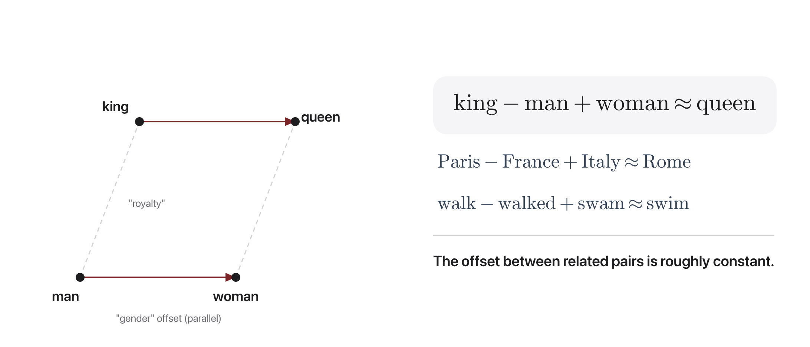
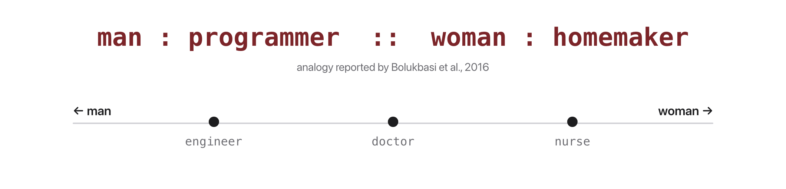

# W3C2 Lab: Embedding Explorer (Optional / Take-Home)

> **In class this session we go to the whiteboard and discuss, not code.** See
> "In-Class Activity" below. This coding lab is an **optional take-home**: it
> lets you confirm in code exactly what you computed by hand on the board.

## Before you code: the picture and the math





Everything here (whiteboard and take-home) is three uses of one similarity measure:

$$\cos(u, v) = \frac{u \cdot v}{\lVert u \rVert \, \lVert v \rVert}$$

$$\text{analogy}(a, b, c) = \arg\max_{w \notin \{a, b, c\}} \; \cos\big(\mathrm{vec}(w), \; \mathrm{vec}(b) - \mathrm{vec}(a) + \mathrm{vec}(c)\big)$$

$$\mathrm{bias}(w) = \cos\big(\mathrm{vec}(w), \; \mathrm{vec}(\mathit{pos}) - \mathrm{vec}(\mathit{neg})\big)$$

Your finished code computes cosine similarity between word vectors, uses it to rank nearest neighbors, solves analogies by building the target vector `vec(b) - vec(a) + vec(c)` (the parallel-offset trick in the first figure) and returning its closest words, and measures bias by projecting a word onto a difference direction like `woman - man` (the axis in the second figure). A positive bias score leans toward `pos`, a negative one toward `neg`. **Check yourself before coding:** in the second figure, "nurse" sits on the woman side of the axis, so what sign should `bias_score("nurse", pos="woman", neg="man")` return? (Positive, because vec(nurse) has positive cosine with the woman minus man direction.)

## In-Class Activity (no laptop required)

**Part 1: Whiteboard: king - man + woman (small teams, ~12 min).**
On paper, using the toy 8-D vectors below, compute the analogy by hand and find
the closest word.

| word  | royal | masc | fem | animal | pet | care | tech | status |
|-------|-------|------|-----|--------|-----|------|------|--------|
| king  | 0.9   | 0.7  | 0.0 | 0.0    | 0.0 | 0.0  | 0.0  | 0.8    |
| man   | 0.0   | 0.8  | 0.0 | 0.0    | 0.0 | 0.0  | 0.0  | 0.1    |
| woman | 0.0   | 0.0  | 0.8 | 0.0    | 0.0 | 0.0  | 0.0  | 0.1    |
| queen | 0.9   | 0.0  | 0.7 | 0.0    | 0.0 | 0.0  | 0.0  | 0.8    |

1. Compute `king - man + woman` dimension-by-dimension. (Answer row:
   `[0.9, -0.1, 0.8, 0, 0, 0, 0, 0.8]`.)
2. Which listed word is closest to that result? Why does the masculine to
   feminine direction do the work? (Answer: **queen**.)

**Part 2: Socratic discussion: who owns the bias? (small teams, ~13 min).**
The algorithm is "just doing math." Discuss, then share out:

1. The text, the engineers, the company, or the user, where did the bias
   actually *come from*?
2. If a hiring tool uses these vectors and discriminates, *who is accountable*?
3. Should we debias the vectors, fix the training text, or change how the tool
   is used?
4. "It's just math" is a defense we will hear all semester. When is it valid, and
   when is it a dodge? (We return to this in Week 15.)

---

## Take-Home Coding Lab: Embedding Explorer

Do **vector arithmetic on meaning**: find nearest neighbors, solve analogies
(*man : king :: woman : ?*), and **probe embeddings for social bias**.

**You will write four functions** in `embeddings.py`, one per step, each with its
own check. Step 1 is the foundation; Steps 2 to 4 each build on it independently,
so if one fights you, move on.

## The data

A small **hand-built** 8-dimensional embedding table (`EMB`) ships with the file
so everything runs **offline, instantly, and deterministically**, with no
downloads. The vectors are *illustrative*, not trained, but they reproduce the
real patterns: semantic neighbors are close, a consistent gender offset exists,
and an occupation-gender association is baked in for the bias probe. The math you
write is exactly what you would run on real word2vec or GloVe vectors.

## How this lab works

Set a shortcut for the long docker command first:

```bash
alias lab='docker compose -f docker/docker-compose.yml run --rm --no-deps course'
```

Check **one step**:

```bash
lab python -m pytest weeks/week-03/class-02/exercise/test_embeddings.py -k step1 -q
```

Check **everything**:

```bash
lab python -m pytest weeks/week-03/class-02/exercise/test_embeddings.py -q
```

Stuck for more than a few minutes? Open the walkthrough released after class at the
matching step.

---

### Step 0, Orientation (nothing to write)

Run the starter as-is:

```bash
lab python weeks/week-03/class-02/exercise/embeddings.py
```

```
embeddings.py is not implemented yet, fill in the TODOs, then re-run.
```

Look at the space you are about to explore:

```bash
lab python
```

```python
>>> import sys; sys.path.insert(0, "weeks/week-03/class-02/exercise")
>>> from embeddings import EMB, vec
>>> len(EMB)
15
>>> vec("king")
array([0.9, 0.7, 0. , 0. , 0. , 0. , 0. , 0.8])
>>> vec("queen")
array([0.9, 0. , 0.7, 0. , 0. , 0. , 0. , 0.8])
```

**Notice:** `king` and `queen` differ in exactly two dimensions (1 = masculine,
2 = feminine) and agree on the other six. That is the structure every step below
exploits. Real embeddings have the same property in spirit, but spread across
hundreds of dimensions none of which have names.

---

### Step 1, Cosine similarity

**Write:** `cosine(u, v)` for two numpy arrays. Return 0.0 if either norm is 0.

`np.dot` and `np.linalg.norm` do the work; this is a three-line function.

**Done when:**

```bash
lab python -m pytest weeks/week-03/class-02/exercise/test_embeddings.py -k step1 -q
```

```
..                                                                       [100%]
2 passed, 6 deselected
```

**Check it by hand:**

```python
>>> round(cosine(vec("king"), vec("king")), 6)
1.0
>>> round(cosine(vec("king"), vec("queen")), 4)
0.7474
>>> round(cosine(vec("king"), vec("cat")), 4)
0.0
```

**Why it matters:** this is the same formula as last class, but the code is much
shorter because the vectors are dense arrays instead of sparse dicts. That
simplification is the whole point of the sparse-to-dense shift.

Note `king` and `cat` come out at exactly 0.0. The toy table puts royalty and
animals on disjoint dimensions. Real embeddings never give a clean zero, because
every pair of words co-occurs somewhere.

---

### Step 2, Nearest neighbors

**Write:** `nearest(word, table, k)`, the `k` most similar words, **excluding
`word` itself**, sorted by similarity descending.

Sort with the key `(-similarity, word)` so that words tied on score come back in
a stable alphabetical order. Several words score exactly 0.0 in this small table,
so without the tie-break your output depends on dict ordering.

**Done when:**

```bash
lab python -m pytest weeks/week-03/class-02/exercise/test_embeddings.py -k step2 -q
```

```
..                                                                       [100%]
2 passed, 6 deselected
```

**Check it by hand:**

```python
>>> [(w, round(s, 4)) for w, s in nearest("cat", EMB, k=3)]
[('kitten', 1.0), ('dog', 0.994), ('aunt', 0.0)]
>>> [(w, round(s, 4)) for w, s in nearest("king", EMB, k=3)]
[('prince', 0.927), ('queen', 0.7474), ('uncle', 0.7001)]
```

**Two things to stare at.**

- `kitten` scores exactly **1.0** with `cat`. Their vectors point in the same
  direction and differ only in length, and cosine ignores length entirely.
- The third neighbor of `cat` is `aunt` at **0.0**, which is not a neighbor at
  all. There is no third animal in the table, so `nearest` returns whatever is
  left. A fixed `k` always returns `k` things, relevant or not, exactly like the
  0.000 search result last class.

---

### Step 3, Analogies

**Write:** `analogy(a, b, c, table, k)`. Build the target vector
`vec(b) - vec(a) + vec(c)`, then return the `k` closest words by cosine,
**excluding `a`, `b`, and `c`**.

**Done when:**

```bash
lab python -m pytest weeks/week-03/class-02/exercise/test_embeddings.py -k step3 -q
```

```
..                                                                       [100%]
2 passed, 6 deselected
```

**Check it by hand:**

```python
>>> [(w, round(s, 4)) for w, s in analogy("man", "king", "woman", EMB, k=1)]
[('queen', 0.9958)]
```

Compare that against the vector you computed on the whiteboard in Part 1. The
target row was `[0.9, -0.1, 0.8, 0, 0, 0, 0, 0.8]`, and `queen` is its closest
word.

**Try deleting the exclusion** and re-running. You get `king` back, not `queen`,
because the target vector stays closest to `king` itself. Every published
word2vec analogy result excludes the three input words for exactly this reason,
which is worth knowing before you are impressed by one.

---

### Step 4, Bias probing

**Write:** `bias_score(word, pos, neg, table)`, the cosine between `vec(word)` and
the direction `vec(pos) - vec(neg)`.

Positive means the word leans toward `pos`, negative toward `neg`, and the
magnitude says how strongly.

**Done when:**

```bash
lab python -m pytest weeks/week-03/class-02/exercise/test_embeddings.py -k step4 -q
```

```
..                                                                       [100%]
2 passed, 6 deselected
```

**Check it by hand:**

```python
>>> for occ in ["nurse", "doctor", "engineer", "teacher"]:
...     print(occ, round(bias_score(occ, "woman", "man", EMB), 4))
nurse 0.3434
doctor -0.0357
engineer -0.3402
teacher 0.2265
```

**Read this carefully, because it is easy to over-claim.** These vectors were
hand-written, so the association was deliberately put there; this run proves
nothing about the world on its own. What is real is the **probe**: four lines of
arithmetic, and running the identical probe on genuine word2vec vectors trained
on news text produces the same shape of result (Bolukbasi et al. 2016; Caliskan
et al. 2017).

The point is not the slogan "embeddings are biased." It is that a representation
learned from text absorbs the statistical regularities of that text including
social ones, that those regularities are measurable with the code you just wrote,
and that any downstream system inherits them silently because nobody inspects the
embedding.

---

### Step 5, Run the whole thing

```bash
lab python weeks/week-03/class-02/exercise/embeddings.py
```

```
============================================================
Word Embeddings, neighbors, analogies & bias probing
============================================================

Nearest neighbors of 'king':
   0.927  prince
   0.747  queen
   0.700  uncle

Analogy  man : king :: woman : ?
   0.996  queen

Bias probe along the (woman - man) direction:
   nurse     +0.343  -> woman
   doctor    -0.036  -> man
   engineer  -0.340  -> man
   teacher   +0.226  -> woman
```

And the full suite:

```bash
lab python -m pytest weeks/week-03/class-02/exercise/test_embeddings.py -q
```

```
........                                                                 [100%]
8 passed
```

**Closing the two-class arc.** Last class ended on a specific failure: under
TF-IDF, "couch" and "sofa" have cosine 0, exactly as unrelated as "couch" and
"championship", because every term is its own orthogonal dimension. Step 2 is the
fix: `kitten` and `cat` come out close without sharing a single character.

What embeddings did **not** fix: every vector here is static. `bank` gets one
vector whether the sentence is about rivers or money. That is the gap Week 6
opens with ELMo.

## The Exploration (take-home)

1. **Analogy hunt.** Find 3 analogies the toy space gets right and 1 it gets
   wrong. Why does it fail? (Hint: the vocabulary is small and the dimensions are
   coarse.)
2. **Bias audit.** Run `bias_score` for *nurse, doctor, engineer, teacher* along
   (woman - man). Which lean which way? Now imagine these vectors feeding a
   resume-ranking model. What goes wrong?
3. **Whose fault is the bias?** Revisit the in-class discussion. Where did the
   bias actually come from, and who is responsible for catching it?

Report your most surprising analogy and your starkest bias result.

## Stretch goals

- Implement **3CosMul** analogy scoring and compare to the additive version.
- Call `load_pretrained()` to load real sentence embeddings (one-time download;
  it degrades gracefully offline). Re-run the bias probe on real vectors. Does
  the pattern hold? Expect the analogies to work *less* cleanly than the toy
  table, which is the more honest picture.
- Add a `most_biased(table, pos, neg, k)` helper that ranks the whole vocabulary
  by bias score.

A full reference solution is in the reference solution released after class, and the
step-by-step explanation is in the walkthrough released after class (don't peek until
you've tried).
