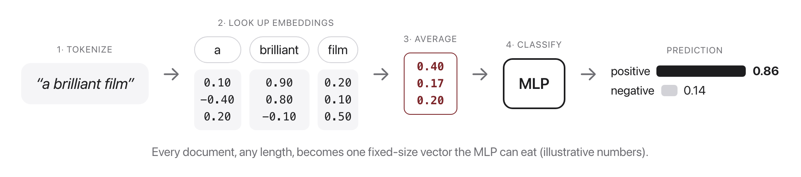
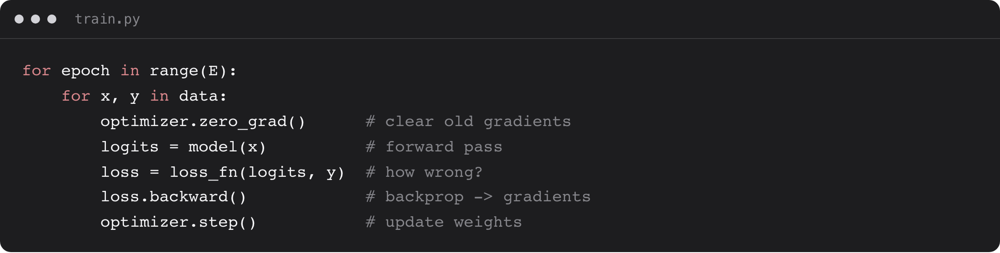

# W4C1 Lab: MLP Text Classifier

## 1. Learning objective

Build the first neural classifier of the course: average a document's word
embeddings into one vector, push it through a two-layer network, and train the
network and the embeddings together.

You write two things in `mlp_classifier.py`: the averaging, and the forward
pass. The vocabulary, the training loop and the accuracy check are given.

## 2. Understanding the math



A document of $n$ tokens becomes one vector by averaging its embedding rows,
and that vector goes through a linear layer, a nonlinearity, and a second
linear layer. $E$ is the embedding table, $W$ and $U$ the two weight matrices:

$$x = \frac{1}{n}\sum_{i=1}^{n} E[w_i] \qquad h = \sigma(Wx + b) \qquad z = Uh$$

$z$ is a pair of raw scores, not probabilities. The loss applies the softmax
itself, so applying one in `forward` too would flatten the gradients.



## 3. Getting started

From the repository root on your own machine, once per session:

```bash
docker compose -f docker/docker-compose.yml run --rm --no-deps -w /workspace/weeks/week-04/class-01/exercise course bash
```

A step you have not written yet reports `skipped`, not a failure. If you get
stuck, `../solutions/WALKTHROUGH.md` works out every step, and these labs are
not graded.

## 4. Implement `embed_document`

Turn a document into one vector of length `embedding_dim`. Looking up a
document's tokens gives you a 2-D tensor: one row per token, and the columns
are the dimensions of the embedding space, so averaging the rows leaves one
number per dimension. A document with no tokens still has to return that shape.

```bash
pytest -k step1 -q
```

```
.                                                                        [100%]
1 passed, 3 deselected
```

## 5. Implement `MLP.forward`

One line: first linear layer, activation, second linear layer. Stop there.
A layer is called like a function, so `self.fc1(x)` runs `x` through `fc1` and
gives you back what it produced.

```bash
pytest -k step2 -q
```

```
.                                                                        [100%]
1 passed, 3 deselected
```

## 6. Run it, then break it

```bash
python mlp_classifier.py
```

```
vocab size: 25
epoch   1 loss: 0.7414
epoch 200 loss: 0.0000
train accuracy: 1.00
```

Loss 0.0000 on eight training sentences means memorized, not learned. Each
experiment below is a one-line edit; undo it before the next.

1. Delete the nonlinearity. In `MLP.__init__`, set `self.act = nn.Identity()`.
   Accuracy stays at 1.00 and the loss still reaches 0.0000. What does that say
   about this dataset, and what would you have to change about the data before
   the ReLU started earning its place?
2. Starve the hidden layer. Change `hidden=8` to `hidden=1` in `main`. Still
   1.00. How many numbers is the model squeezing the whole document through,
   and why is that enough here?
3. Stop early. Change `epochs=200` to `epochs=5`. Accuracy drops to 0.88 and
   loss sits at 0.5431. Which sentence do you think it gets wrong first, and
   how would you check?
4. Test the averaging. Compare `embed_document("great", ...)` with
   `embed_document("great great great", ...)`: the two vectors are identical.
   Then compare `"a wonderful movie"` with `"movie wonderful a"`: also
   identical. Which of those two facts is a feature of averaging, and which is
   the limitation that Week 5's attention exists to fix?
