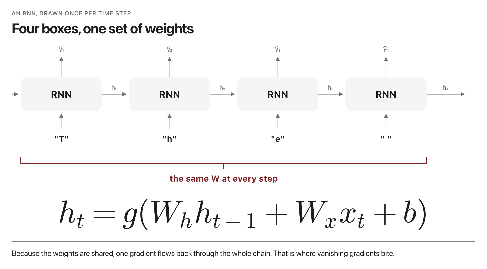
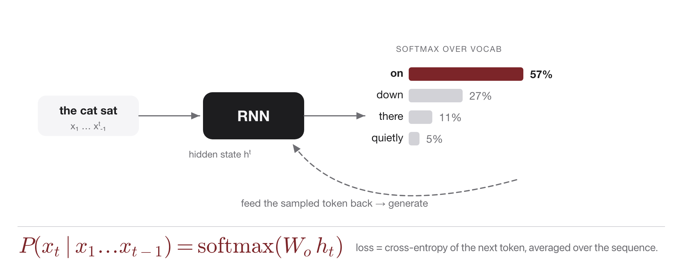

# W4C2 Lab: A Char-Level RNN that Invents Names

**Goal:** build and train a **character-level RNN language model** in PyTorch
that learns the "shape" of a list of names and then **generates brand-new ones**,
dinosaur names by default (try band names as a stretch).

This is the smallest interesting *generative* sequence model. It runs
**CPU-only** and trains in well under a minute on the tiny dataset.

> **After you generate names (pairs, 5 min).** Trade your three favorite invented
> names with a partner and **vote** on the single most plausible dinosaur, one
> that sounds real but is **not** in the training list. Bring your winner to the
> class leaderboard.

## Before you code: the picture and the math

The RNN unrolled over time, from lecture: one input character per step, one hidden state passed along, one prediction per step, and every box is the SAME network (shared weights):



Generation is that same loop run on the model's own output, predict a distribution over the next character, sample one, feed it back in:



In slide notation, `CharRNN.forward` implements the recurrence and the projection to logits:

$$h_t = g(W_h\, h_{t-1} + W_x\, x_t + b) \qquad P(x_t \mid x_1 \ldots x_{t-1}) = \mathrm{softmax}(W_o\, h_t)$$

Training minimizes the cross-entropy of the true next character, averaged over all positions in the name; `make_training_pairs` builds exactly those (current chars, next chars) targets.

In plain words: the finished code reads a name one character at a time, keeps a running memory $h_t$, and at every step outputs a probability for each possible next character (including the end marker `.`). Training pushes probability toward the character that actually comes next; `sample` then runs the loop generatively, feeding each sampled character back in until it draws `.`. **Check yourself before coding:** for the training name `rex`, what are the input and target sequences that `make_training_pairs` should produce? (Input `r, e, x` and target `e, x, .`: each position's target is the NEXT character, and the final target is the end marker.)

## How this lab works

Each step tells you **what to write**, then exactly **how to check it**. Steps 1
and 2 are independent of each other; Step 3 needs Step 1; Step 4 needs all three.

`lab` is a shortcut for the long docker command. Set it up once per
terminal session, using the line for **your** shell:

```
# macOS / Linux (bash, zsh)
alias lab='docker compose -f docker/docker-compose.yml run --rm --no-deps course'

# Windows, PowerShell
function lab { docker compose -f docker/docker-compose.yml run --rm --no-deps course @args }

# Windows, Command Prompt
doskey lab=docker compose -f docker/docker-compose.yml run --rm --no-deps course $*
```

Rather work inside the image? This opens a shell there, and then every
command below runs without its `lab` prefix:

```bash
docker compose -f docker/docker-compose.yml run --rm --no-deps course bash
```

Check **one step**:

```bash
lab python -m pytest weeks/week-04/class-02/exercise/test_char_rnn.py -k step1 -q
```

Check **everything**:

```bash
lab python -m pytest weeks/week-04/class-02/exercise/test_char_rnn.py -q
```

Some steps are **already written for you** and marked `(given)`. Run their
check, read the code, and use it as the pattern for the steps you do write. A
step you have not written yet reports `skipped`, never a failure, so the only
red you will ever see is a real wrong answer.

Stuck for more than a few minutes? Open `../solutions/WALKTHROUGH.md` at the
matching step. The full reference solution sits in `../solutions/` too. **These
labs are not graded**, so reading them is not cheating: getting unstuck and
finishing the idea beats staring at a blank function.

---

### Step 0, Orientation (nothing to write)

`build_vocab` and `train` are already written. Look at the vocabulary:

```bash
lab python -m pytest weeks/week-04/class-02/exercise/test_char_rnn.py -k step0 -q
```

```
.                                                                        [100%]
1 passed, 4 deselected
```

```python
>>> import sys; sys.path.insert(0, "weeks/week-04/class-02/exercise")
>>> from char_rnn import NAMES, build_vocab, END
>>> stoi, itos = build_vocab(NAMES)
>>> len(stoi)
23
>>> END in stoi
True
```

**Notice:** 23 symbols, and one of them is `.`, the end-of-name marker. The model
has to *learn when to stop*, which is why `.` is in the vocabulary at all rather
than being handled by special-case code.

---

### Step 1, The forward pass

**Write:** `CharRNN.forward`. Three lines, then return both values:

```
x = self.emb(ids)          # (batch, seq, emb_dim)
out, h_n = self.rnn(x, h0) # out: (batch, seq, hidden)
logits = self.out(out)     # (batch, seq, vocab_size)
return logits, h_n
```

**Return the hidden state too**, not just the logits. `sample` needs `h_n` to
carry memory from one generated character to the next, and forgetting it is what
makes Step 3 impossible.

**Done when:**

```bash
lab python -m pytest weeks/week-04/class-02/exercise/test_char_rnn.py -k step1 -q
```

```
.                                                                        [100%]
1 passed, 4 deselected
```

**Check it by hand:**

```python
>>> import torch
>>> from char_rnn import CharRNN
>>> model = CharRNN(len(stoi))
>>> ids = torch.tensor([[stoi[c] for c in "abc"]])
>>> logits, h = model(ids)
>>> tuple(logits.shape)
(1, 3, 23)
```

Three characters in, and a **full distribution over all 23 characters at every
one of the three positions**. The RNN makes a prediction at every step, not just
at the end.

**Why it matters:** `nn.RNN` hides the loop over time, but it is the same
recurrence from the slide: one shared set of weights applied at each step, with
the hidden state threaded through.

---

### Step 2, Build the training pairs (given)

**Given, already written for you.** Read it in the starter, run its check,
and use it as the pattern for the steps you do write.

**What it does:** `make_training_pairs(name, stoi)`. The input is the name's characters;
the target is the name shifted left by one, ending with `END`.

```
in_chars  = list(name)
out_chars = list(name[1:]) + [END]
```

Convert both to ids with `stoi` and return them as 1-D `LongTensor`s.

**Done when:**

```bash
lab python -m pytest weeks/week-04/class-02/exercise/test_char_rnn.py -k step2 -q
```

```
.                                                                        [100%]
1 passed, 4 deselected
```

**Check it by hand:**

```python
>>> xin, yt = make_training_pairs("abc", stoi)
>>> [itos[i.item()] for i in xin]
['a', 'b', 'c']
>>> [itos[i.item()] for i in yt]
['b', 'c', '.']
```

**Why it matters:** this shift is the entire training signal of a language model.
Position 0 sees `a` and must predict `b`; position 2 sees `c` and must predict
"the name is over". No human labelled anything, the text supervises itself, which
is what "self-supervised" means and why this scales to the whole internet.

---

### Step 3, Sample a new name

**Write:** the body of the generation loop in `sample`. `ch` already holds the
character just drawn. You need to:

1. If `ch == END`, `break`.
2. Otherwise append `ch` to `result`.
3. Rebuild `ids` as a `(1, 1)` tensor holding just that new character's id.
4. Call the model again **passing `h`**, and reassign both `logits` and `h`.

Step 4 is the one to get right: `logits, h = model(ids, h)`. Dropping the `h`
means every character is generated with no memory of the ones before it.

**Done when:**

```bash
lab python -m pytest weeks/week-04/class-02/exercise/test_char_rnn.py -k step3 -q
```

```
.                                                                        [100%]
1 passed, 4 deselected
```

**Check it by hand** (an untrained model produces gibberish, which is fine here,
you are checking the mechanics):

```python
>>> name = sample(model, stoi, itos, seed="t")
>>> isinstance(name, str) and name.startswith("t") and "." not in name
True
```

The end marker must **not** appear in the returned string. It is a control
signal, not a character of the name.

**Why it matters:** this is autoregressive generation, the same loop that
produces every token you have ever seen an LLM emit. The only difference at scale
is what computes the distribution.

---

### Step 4, Train and generate

Everything is implemented, so the whole thing runs:

```bash
lab python weeks/week-04/class-02/exercise/char_rnn.py
```

```
vocab size: 23
epoch   1 loss: 3.1450
epoch 400 loss: 0.0916

Generated dinosaur names:
  tyrannosaurus
  allosaurus
  spinosaurus
  velociraptor
  megalosaurus
  rantyrannosaurus
```

And the full suite:

```bash
lab python -m pytest weeks/week-04/class-02/exercise/test_char_rnn.py -q
```

```
.....                                                                    [100%]
5 passed
```

**Look hard at those names before you celebrate.** Five of the six are **copied
verbatim from the training list**. Only `rantyrannosaurus` is new, and it is a
mashup. With 34 names and 400 epochs the model has memorized the corpus rather
than learned the shape of dinosaur names, exactly the overfitting you measured in
W2C1 with the trigram.

Notice the loss started at **3.1450**. A uniform guess over 23 characters would
give $\ln(23) = 3.14$, so the untrained model is at chance, precisely as expected.

**The activity depends on you changing the seed.** The default seed gives
everyone identical output, so for the name vote run:

```bash
lab python weeks/week-04/class-02/exercise/char_rnn.py --seed 42
```

Use any number. Then hunt for a name that is genuinely *not* in `NAMES`, which is
harder than it sounds and is the real lesson of the activity.

## Stretch goals

- Swap `nn.RNN` for **`nn.LSTM`** (one line plus a tweak to the hidden-state
  handling, since LSTM returns a tuple) and compare the generated names.
- Add a **temperature** knob to `sample` (divide the logits before the softmax)
  and watch creativity trade off against gibberish. This previews Week 7 decoding.
- Cut `epochs` to 100 and see whether the model copies less. Fewer epochs on a
  tiny corpus is a crude but real regularizer.
- Feed a **band-names** list instead of dinosaurs.

## Why this matters

Next-character (or next-token) prediction *is* how GPT-style models are trained,
just at massive scale. You are building the kernel of a language model.

A full reference solution is in `../solutions/char_rnn.py`, and the step-by-step
explanation is in `../solutions/WALKTHROUGH.md` (don't peek until you've tried).
