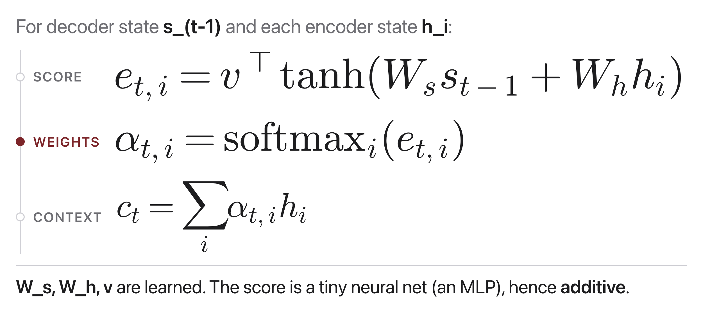
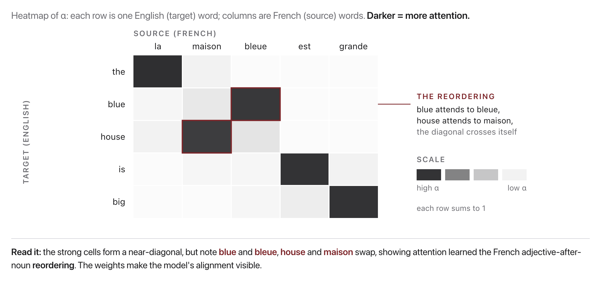

# W5C1 Lab: Additive Attention

## 1. Learning objective

Implement Bahdanau attention, watch a random scorer turn into a diagonal
alignment, and see what the attention weights let you inspect.

You write two things in `attention.py`: the score, and the score-softmax-blend
pass. The parameters and the ASCII heatmap are given.

## 2. Understanding the math



Each encoder state $h_i$ is scored against the decoder state $s_{t-1}$, the
scores become a distribution, and the distribution blends the values:

$$e_{t,i} = v^\top \tanh(W_s s_{t-1} + W_h h_i) \qquad \alpha_{t,i} = \mathrm{softmax}_i(e_{t,i}) \qquad c_t = \sum_i \alpha_{t,i} h_i$$

The softmax runs over $i$, the key axis, so the weights say how the query
divided its attention across the source positions and sum to 1.



## 3. Getting started

From the repository root on your own machine, once per session:

```bash
docker compose -f docker/docker-compose.yml run --rm --no-deps -w /workspace/weeks/week-05/class-01/exercise course bash
```

A step you have not written yet reports `skipped`, not a failure. If you get
stuck, `../solutions/WALKTHROUGH.md` works out every step, and these labs are
not graded.

## 4. Implement `additive_scores`

One number per key. The projected query broadcasts across every key's row, so
there is no loop.

```bash
pytest -k step1 -q
```

```
.                                                                        [100%]
1 passed, 3 deselected
```

## 5. Implement `AdditiveAttention.forward`

Score, softmax over the key axis, blend the values. Return the context and the
weights.

```bash
pytest -k step2 -q
```

```
..                                                                       [100%]
2 passed, 2 deselected
```

## 6. Run it, then break it

```bash
python attention.py
```

```
UNTRAINED attention weights: [0.328, 0.322, 0.35]
  (a random scorer has no opinion yet: everything gets ~1/3)
weights sum: 1.0

Untrained heatmap (3 queries x 3 keys), a uniform gray blur:
        k0   k1   k2
   q0 ---- ---- ----
   q1 ---- ---- ----
   q2 ---- ---- ----

TRAINED attention weights (query 1): [0.0, 1.0, 0.0]
context vector: [0.0, 1.0, 0.0, 0.0, 0.0, 0.0, 0.0, 0.0]

Trained heatmap, the diagonal emerges (dark = high weight):
        k0   k1   k2
   q0 @@@@
   q1      @@@@
   q2           @@@@
```

Each experiment below is a one-line edit; undo it before the next.

1. Sharpen the untrained scorer by hand. Multiply the scores by 5 before the
   softmax, then by 20: the weights go from `[0.328, 0.322, 0.35]` to
   `[0.302, 0.278, 0.42]` to `[0.182, 0.132, 0.686]`. The scorer learned
   nothing in between, so what exactly did scaling change?
2. Change the values but not the keys. Pass `values=torch.arange(24.).reshape(3, 8)`
   while leaving `keys` alone. The weights come back identical and only the
   context moves. Say precisely which of keys/values decides "where to look"
   and which decides "what you get".
3. Skip the softmax. Blend the values with the raw scores instead of the
   normalized weights. The "weights" now sum to -0.1456 rather than 1.0, the
   context comes out near zero, and `pytest -k step2` fails. Attention still
   ran and still produced a vector, so what exactly did normalizing buy?
4. Look at the trained weights: `[0.0, 1.0, 0.0]`, a hard one-hot. That is a
   perfect alignment on a toy task built to have one. What would the heatmap
   look like for a real translation where one target word draws on three source
   words at once?
