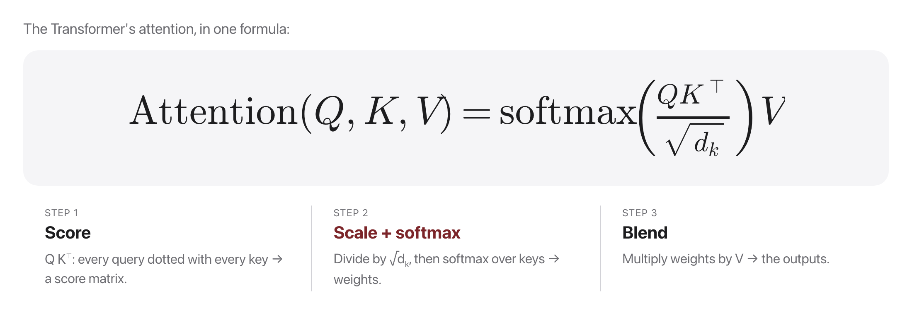
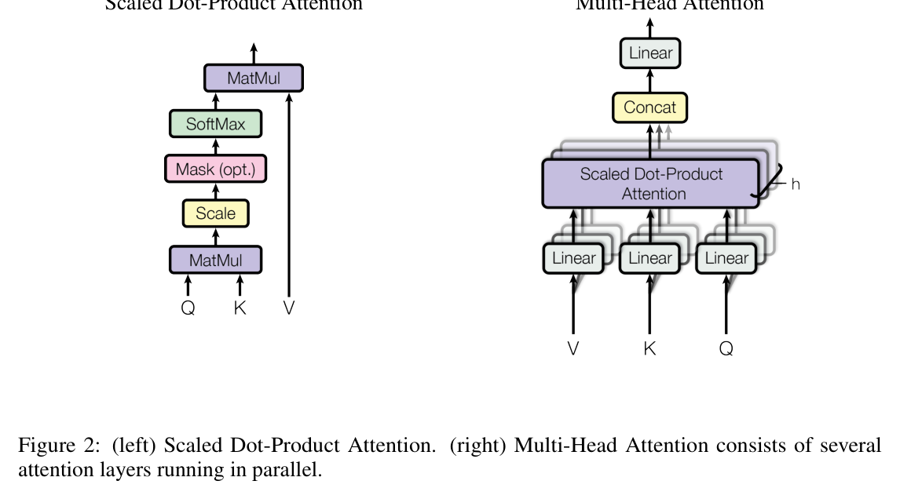

# W5C2 Lab: Build Self-Attention & Multi-Head Attention

> **This is a full-period, hands-on coding lab (individual).** After a brief
> ~10-min recap and Quiz 5, the rest of class is yours to build.

You just saw the Transformer's core. Now build it, in NumPy only. This is the
literal math behind every LLM you will use this term.

**You will write six functions** in `attention_lab.py` across five steps, each
with its own check.

## Before you code: the picture and the math



Steps 1 to 3 implement exactly this formula (mask included), and Step 5 runs $h$ copies of it:

$$\mathrm{Attention}(Q, K, V) = \mathrm{softmax}\!\left(\frac{QK^\top}{\sqrt{d_k}}\right)V$$

$$\mathrm{head}_i = \mathrm{Attention}(QW_i^Q,\, KW_i^K,\, VW_i^V) \qquad \mathrm{MultiHead}(Q,K,V) = \mathrm{Concat}(\mathrm{head}_1, \ldots, \mathrm{head}_h)\, W^O$$



The left diagram is your Steps 1 to 3 as a circuit, bottom to top: MatMul is $QK^\top$, Scale divides by $\sqrt{d_k}$, "Mask (opt.)" is your `causal_mask` setting future scores to $-\infty$, SoftMax makes each row of weights sum to 1, and the final MatMul blends $V$. The right diagram is Step 5: project $Q, K, V$ down $h$ times, run $h$ attentions in parallel, concat, project back. **Check yourself before coding:** does the causal mask act before or after the softmax, and why? (Before: masked scores become $-\infty$ so softmax assigns them exactly zero weight while each row still sums to 1.)

## How this lab works

Each step tells you **what to write**, then exactly **how to check it**. The
steps are strictly sequential: every one builds on the last.

The file also has a **progressive runner**. Run it at any point and it reports
how far you have got:

```bash
alias lab='docker compose -f docker/docker-compose.yml run --rm --no-deps course'
lab python weeks/week-05/class-02/exercise/attention_lab.py
```

Check **one step**:

```bash
lab python -m pytest weeks/week-05/class-02/exercise/test_attention_lab.py -k step1 -q
```

Check **everything**:

```bash
lab python -m pytest weeks/week-05/class-02/exercise/test_attention_lab.py -q
```

Stuck for more than a few minutes? Open the walkthrough released after class at the
matching step.

---

### Step 1, Numerically stable softmax

**Write:** `softmax(x, axis=-1)`. Subtract the max along `axis` **before**
exponentiating, then normalize.

```
x = x - np.max(x, axis=axis, keepdims=True)
e = np.exp(x)
return e / np.sum(e, axis=axis, keepdims=True)
```

`keepdims=True` in both calls is what lets the subtraction and division broadcast
back over the original shape.

**Done when:**

```bash
lab python -m pytest weeks/week-05/class-02/exercise/test_attention_lab.py -k step1 -q
```

```
.                                                                        [100%]
1 passed, 4 deselected
```

**Check it by hand, including the reason for the max subtraction:**

```python
>>> import numpy as np, sys; sys.path.insert(0, "weeks/week-05/class-02/exercise")
>>> from attention_lab import softmax
>>> softmax(np.array([1.0, 2.0, 3.0]))
array([0.09003057, 0.24472847, 0.66524096])
>>> softmax(np.array([1000.0, 1001.0, 1002.0]))
array([0.09003057, 0.24472847, 0.66524096])
```

The second call is the point. `np.exp(1000)` overflows to `inf` and the naive
version returns `nan`. Subtracting the max leaves the answer mathematically
identical (the constant cancels) while keeping every exponent at or below 0.

**Why it matters:** attention scores grow with `d_k`, so this is not a
hypothetical. Every real implementation does this subtraction.

---

### Step 2, Scaled dot-product attention

**Write:** `scaled_dot_product_attention(Q, K, V, mask=None)`, returning
`(output, weights)`.

```
d_k = Q.shape[-1]
scores = (Q @ np.swapaxes(K, -1, -2)) / np.sqrt(d_k)
if mask is not None:
    scores = np.where(mask, scores, -1e9)
weights = softmax(scores, axis=-1)
return weights @ V, weights
```

**Use `np.swapaxes(K, -1, -2)`, not `K.T`.** In Step 5 you will pass 3-D arrays
with a leading head axis, and `K.T` reverses *all* axes, which silently produces
garbage. Swapping only the last two works for both 2-D and 3-D.

**Softmax over `axis=-1`** normalizes across the keys, so each query's weights sum
to 1.

**Done when:**

```bash
lab python -m pytest weeks/week-05/class-02/exercise/test_attention_lab.py -k step2 -q
```

```
.                                                                        [100%]
1 passed, 4 deselected
```

**Check it by hand:**

```bash
lab python weeks/week-05/class-02/exercise/attention_lab.py
```

```
MILESTONE 1  softmax + scaled dot-product attention: WORKS
  weights row 0: [0.598 0.104 0.2   0.097]  (sums to 1.0 )
```

**Why the $\sqrt{d_k}$ is there:** the dot product of two random $d_k$-dimensional
vectors has variance proportional to $d_k$, so without the scaling the scores
spread out as dimensions grow, softmax saturates into a near one-hot, and the
gradients vanish. Dividing by $\sqrt{d_k}$ keeps the variance roughly constant.

---

### Step 3, The causal mask

**Write:** `causal_mask(T)`, a lower-triangular boolean array of shape `(T, T)`.

`np.tril(np.ones((T, T), dtype=bool))` is the whole function.

**Done when:**

```bash
lab python -m pytest weeks/week-05/class-02/exercise/test_attention_lab.py -k step3 -q
```

```
.                                                                        [100%]
1 passed, 4 deselected
```

**Check it by hand:**

```bash
lab python weeks/week-05/class-02/exercise/attention_lab.py
```

```
MILESTONE 2  causal mask: WORKS
  masked weights (rounded); note the zeros ABOVE the diagonal, the future:
    [1. 0. 0. 0.]
    [0.02 0.98 0.   0.  ]
    [0.17 0.22 0.62 0.  ]
    [0.08 0.3  0.11 0.51]
```

**Read that matrix carefully.** Row 0 is `[1, 0, 0, 0]`: the first token can only
attend to itself, so softmax over a single unmasked position gives exactly 1.0.
Every row still sums to 1, and everything above the diagonal is exactly zero.

**Why `-1e9` and not `0`.** The mask is applied to the *scores*, before the
softmax. Setting a score to a large negative number makes $e^{score}$
underflow to 0, so the weight becomes exactly zero while the remaining weights
renormalize correctly. Zeroing the *weights* after the softmax would break the
sum-to-1 property.

**Why it matters:** this one triangle is the entire difference between BERT
(bidirectional, no mask) and GPT (causal, masked). Same code otherwise.

---

### Step 4, Split and combine heads

**Write:** `split_heads(X, num_heads)` and `combine_heads(X)`.

```
split:   (T, d_model)          -> (num_heads, T, d_head)
combine: (num_heads, T, d_head) -> (T, num_heads * d_head)
```

Split is `reshape(T, num_heads, d_head).transpose(1, 0, 2)`. Combine is the exact
inverse: `transpose(1, 0, 2).reshape(T, num_heads * d_head)`.

**The transpose is not optional.** Reshaping alone gives `(T, num_heads, d_head)`,
which has the head axis in the middle; attention needs heads leading so it can
batch over them. Getting this wrong produces correct-looking shapes and wrong
numbers, which is why the test checks a round trip rather than just the shape.

**Done when:**

```bash
lab python -m pytest weeks/week-05/class-02/exercise/test_attention_lab.py -k step4 -q
```

```
.                                                                        [100%]
1 passed, 4 deselected
```

**Check it by hand:**

```python
>>> from attention_lab import split_heads, combine_heads
>>> X = np.arange(24).reshape(4, 6)
>>> split_heads(X, 2).shape
(2, 4, 3)
>>> np.array_equal(combine_heads(split_heads(X, 2)), X)
True
```

**Why it matters:** multi-head attention is not a new mechanism. It is the same
attention, run on `num_heads` slices of the feature dimension in parallel, so
different heads can specialize.

---

### Step 5, Multi-head attention

**Write:** `multi_head_attention(X, Wq, Wk, Wv, Wo, num_heads, mask=None)`.

```
Q, K, V = X @ Wq, X @ Wk, X @ Wv
Qh, Kh, Vh = (split_heads(M, num_heads) for M in (Q, K, V))
out_h, _ = scaled_dot_product_attention(Qh, Kh, Vh, mask=mask)
return combine_heads(out_h) @ Wo
```

Note `scaled_dot_product_attention` is called **once**, on 3-D arrays. All the
heads run in one batched matmul, which is exactly why this is fast on a GPU. If
you wrote `K.T` in Step 2 instead of `swapaxes`, this is where it breaks.

**Done when:**

```bash
lab python -m pytest weeks/week-05/class-02/exercise/test_attention_lab.py -k step5 -q
```

```
.                                                                        [100%]
1 passed, 4 deselected
```

**Check it by hand:**

```bash
lab python weeks/week-05/class-02/exercise/attention_lab.py
```

```
MILESTONE 3  multi-head attention: WORKS, output shape (4, 8)

All milestones run. Now make the tests pass.
```

---

### Step 6, The checkpoint

```bash
lab python -m pytest weeks/week-05/class-02/exercise/test_attention_lab.py -q
```

```
.....                                                                    [100%]
5 passed
```

**The last test is the one worth understanding.** It checks that multi-head
attention with `num_heads=1` gives the *same answer* as plain scaled dot-product
attention (up to the output projection). If that holds, your head splitting is
genuinely a partition of the feature space and not a reshape that happens to
produce the right shape.

You have now written, in about forty lines of NumPy, the exact computation at the
heart of every Transformer in this course. The rest of a real implementation is
batching, layer norm, residual connections, and a feed-forward block. The
attention is this.

## Stretch goals

- Return the per-head weights from `multi_head_attention` and print them. Do
  different heads attend to different positions?
- Remove the $\sqrt{d_k}$ scaling, then run with `d = 64`. Watch the weights
  collapse toward one-hot.
- Add a padding mask (mask out positions past a per-sequence length) and combine
  it with the causal mask using `&`.

A full reference solution is in the reference solution released after class, and the
step-by-step explanation is in the walkthrough released after class (don't peek until
you've tried).
