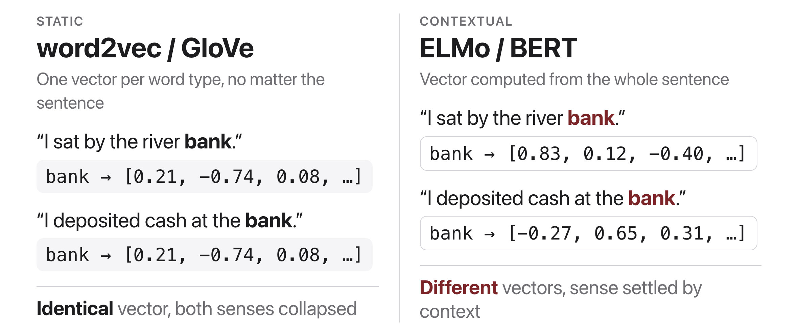
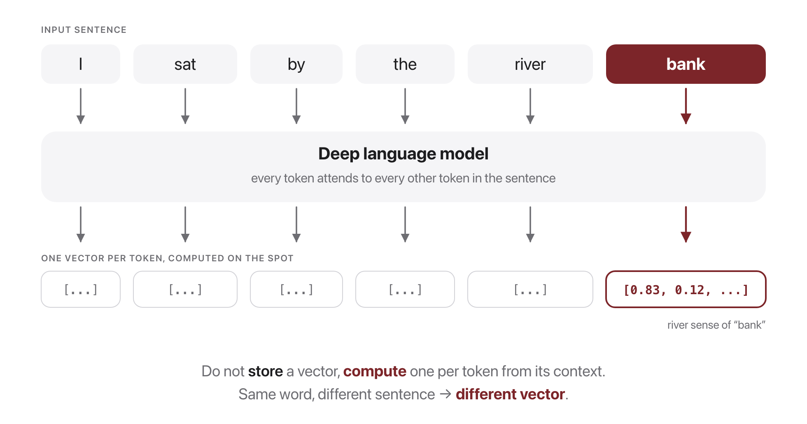

# W6C1 Lab: Static vs. Contextual Embeddings

> **Optional / take-home lab.** In class this session runs as a **jigsaw
> teach-back** (teams of 3): each member becomes the expert on one piece of the
> pretrain to finetune story, teaches the others, and the team confirms it by
> running the polysemy demo live. The coding below is a take-home lab; the tests
> pass and skip cleanly offline.
>
> **In-class activity (teams of 3, jigsaw, ~20 min):**
> 1. **Own one piece:** (A) how ELMo works, (B) feature-extraction vs
>    fine-tuning, (C) why context matters.
> 2. **Become the expert:** 5 min to prepare a 2-minute explanation.
> 3. **Teach the others** so the team holds the whole paradigm.
> 4. **Confirm live:** run the polysemy demo and watch the static cosine (1.000)
>    and the lower contextual cosine pull apart.

**Goal (take-home):** *see* the difference between a static word embedding and a
contextual one. Same word, two sentences: does the vector change?

We use a **tiny** BERT (`prajjwal1/bert-tiny`) so everything runs on a laptop CPU
in seconds. The first run downloads a few MB, then it is cached.

**You will write three functions** in `contextual_embeddings.py`, one per step,
each with its own check.

## Before you code: the picture and the math





The three functions you will write are exactly these quantities:

$$\mathrm{cosine}(\mathbf{u}, \mathbf{v}) = \frac{\mathbf{u} \cdot \mathbf{v}}{\lVert\mathbf{u}\rVert \, \lVert\mathbf{v}\rVert}$$

$$\text{static\_vector}(w) = \frac{1}{m}\sum_{i=1}^{m} E[t_i] \qquad \text{contextual\_vector}(s, w) = \frac{1}{m}\sum_{i=1}^{m} \mathbf{h}^{(L)}_i$$

where $t_1,\dots,t_m$ are the word's sub-tokens, $E$ is the model's **input embedding table** (context-free, top figure's left side), and $\mathbf{h}^{(L)}_i$ is the **last-layer hidden state** at each sub-token position after running the whole sentence $s$ through the model (bottom figure). The finished code computes both vectors for "bank" in a river sentence and a money sentence, then compares them with cosine: the static pair scores $\approx 1.0$ while the contextual pair scores lower. **Check yourself before coding:** why is $\mathrm{cosine}(\text{static\_vector}(\text{bank}), \text{static\_vector}(\text{bank}))$ guaranteed to be $\approx 1.0$ regardless of the sentences? (Because $E[t_i]$ never sees the sentence: the same word always maps to the exact same vector, and any vector has cosine 1 with itself.)

## How this lab works

Each step tells you **what to write**, then exactly **how to check it**. Step 1
is pure arithmetic; Steps 2 and 3 need the model, which loads on first use.

Set a shortcut for the long docker command first:

```bash
alias lab='docker compose -f docker/docker-compose.yml run --rm --no-deps course'
```

Check **one step**:

```bash
lab python -m pytest weeks/week-06/class-01/exercise/test_contextual.py -k step1 -q
```

Check **everything**:

```bash
lab python -m pytest weeks/week-06/class-01/exercise/test_contextual.py -q
```

Stuck for more than a few minutes? Open the walkthrough released after class at the
matching step.

---

### Step 0, Orientation (nothing to write)

`load_model()` is written for you. Use it to see what the tokenizer does, since
everything downstream depends on it:

```bash
lab python
```

```python
>>> import sys; sys.path.insert(0, "weeks/week-06/class-01/exercise")
>>> from contextual_embeddings import load_model
>>> tok, model = load_model()
>>> tok("I sat by the river bank.")["input_ids"]
[101, 1045, 2938, 2011, 1996, 2314, 2924, 1012, 102]
>>> tok("bank", add_special_tokens=False)["input_ids"]
[2924]
```

**Notice two things.** The sentence is wrapped in `101` and `102`, BERT's
`[CLS]` and `[SEP]` markers. And "bank" alone is a single id, `2924`, which
appears in the sentence at position 6. Finding that position is what Step 2 is
really about.

Note the model loads with a warning about unexpected keys. That is normal: we are
loading a checkpoint trained with a masked-LM head into a bare `BertModel`, so
the head weights are discarded. It is not an error.

---

### Step 1, Cosine similarity

**Write:** `cosine_similarity(u, v)` for two plain Python lists. Use `math` and
built-ins, no numpy. Return 0.0 if either norm is 0.

You have written this twice already (W3C1 on dicts, W3C2 on numpy arrays). This
time it is on lists.

**Done when:**

```bash
lab python -m pytest weeks/week-06/class-01/exercise/test_contextual.py -k step1 -q
```

```
...                                                                      [100%]
3 passed, 3 deselected
```

**Check it by hand:**

```python
>>> from contextual_embeddings import cosine_similarity
>>> cosine_similarity([1.0, 0.0], [1.0, 0.0])
1.0
>>> cosine_similarity([1.0, 0.0], [0.0, 1.0])
0.0
>>> cosine_similarity([1.0, 1.0], [3.0, 3.0])
1.0
```

The third is the scale-invariance check: three times the length, same direction,
so cosine is 1. (The test compares approximately, since for other inputs this
lands a hair off 1.0 in floating point.)

---

### Step 2, Contextual vector

**Write:** `contextual_vector(sentence, word)`.

1. Tokenize the **sentence** with `return_tensors="pt"`.
2. Run the model with `output_hidden_states=True` inside `torch.no_grad()`, and
   take `out.hidden_states[-1][0]`, the last layer, first (only) batch item.
3. Tokenize the **word alone** with `add_special_tokens=False` to get its
   sub-token ids, find where that run of ids occurs in the sentence's
   `input_ids`, and average the hidden states at those positions.
4. Return a plain list of floats.

**Why you cannot just use position 1.** A word can be several word-pieces, and it
can sit anywhere in the sentence. Tokenizing the word alone and searching for
that id run is the general way to locate it.

**Done when:**

```bash
lab python -m pytest weeks/week-06/class-01/exercise/test_contextual.py -k step2 -q
```

```
.                                                                        [100%]
1 passed, 5 deselected
```

**Check it by hand:**

```python
>>> from contextual_embeddings import contextual_vector
>>> a = contextual_vector("I sat by the river bank and watched the water.", "bank")
>>> b = contextual_vector("I deposited my paycheck at the bank downtown.", "bank")
>>> len(a)
128
>>> round(cosine_similarity(a, b), 3)
0.809
```

**Two different vectors for the same word.** That is the entire point of the
week, and you just measured it.

---

### Step 3, Static vector

**Write:** `static_vector(word)`. Get the model's input embedding table with
`model.get_input_embeddings()`, look up the word's sub-token ids, and average
their rows.

**Note what is missing:** there is no sentence argument. That is not an
oversight, it is the definition of a static embedding.

**Done when:**

```bash
lab python -m pytest weeks/week-06/class-01/exercise/test_contextual.py -k step3 -q
```

```
.                                                                        [100%]
1 passed, 5 deselected
```

**Check it by hand:**

```python
>>> from contextual_embeddings import static_vector
>>> round(cosine_similarity(static_vector("bank"), static_vector("bank")), 3)
1.0
```

Exactly 1.0, and it could not be anything else: the same lookup twice returns the
same row.

---

### Step 4, Run the comparison

```bash
lab python weeks/week-06/class-01/exercise/contextual_embeddings.py
```

```
Contextual cosine('bank' river vs. money): 0.809
Static     cosine('bank' river vs. money): 1.000
```

And the full suite:

```bash
lab python -m pytest weeks/week-06/class-01/exercise/test_contextual.py -q
```

```
......                                                                   [100%]
6 passed
```

**Those two numbers are the week in miniature.** The static embedding cannot tell
the two senses apart, by construction: 1.000 means "identical vector". The
contextual embedding gives 0.809, meaningfully lower, because the surrounding
words changed the representation.

**But do not oversell 0.809.** It is not "the model knows these are different
words". The two vectors are still quite similar, and `bert-tiny` is a 2-layer
model of about 4M parameters. What the number shows is that the representation is
*a function of the sentence*, which is the property static embeddings lack
entirely. How *much* it separates senses is a question of model quality.

## Stretch goals

- Try other polysemous words: "bat" (animal / sports), "spring" (season /
  water / coil), "light" (weight / illumination). Which separate best?
- Compare the **first** hidden layer against the last. ELMo's finding was that
  lower layers carry syntax and higher layers carry word sense, so the contextual
  cosine should be *higher* (less separated) at layer 1.
- Swap `prajjwal1/bert-tiny` for `bert-base-uncased` (bigger download) and see
  whether the senses separate more.

A full reference solution is in the material released after class, and the
step-by-step explanation is in the walkthrough released after class (don't peek until
you've tried).
