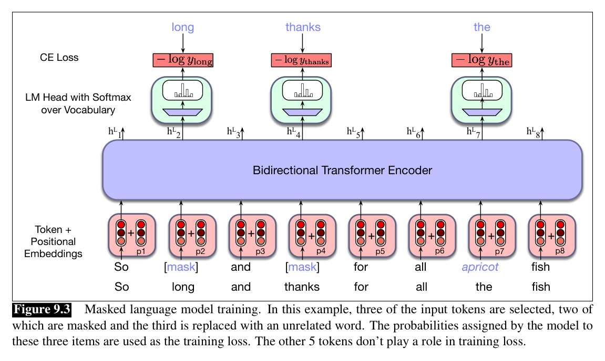
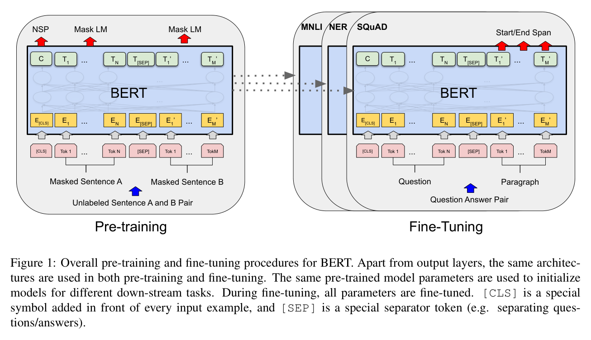

# W6C2 Lab: Fill in the [MASK] & Fine-tune a Tiny BERT

Two short parts that mirror BERT's two phases: **pretraining objective** (masked
LM) and **fine-tuning** (adapt to a task).

Everything uses a **tiny** model (`prajjwal1/bert-tiny`) so it runs on a laptop
CPU in **seconds**. First run downloads a few MB, then caches.

**You will write two functions** in `bert_mlm.py`, one per step, each with its
own check.

> **In-class competition between the two steps (pairs, ~10 min): MASK roulette.**
> Using your Step 1 `top_mask_predictions`, each pair crafts a sentence with one
> `[MASK]` and **secretly guesses** the model's top fill. Run fill-mask to check.
> **Score:** +1 for a correct top-1 guess, +2 if you stump your partner with a
> tricky `[MASK]` (right-context-only sentences are great). Highest score wins,
> then move on to fine-tuning in Step 2.

## Before you code: the picture and the math





**Step 1** is the top figure's prediction step at inference time: for the masked position $i$, the model produces a distribution over the vocabulary, and you return the $k$ most probable words,

$$P(w \mid \text{context}) = \mathrm{softmax}\big(\mathbf{W}\,\mathbf{h}^{(L)}_i\big), \qquad \text{top-}k = \operatorname{arg\,top}_k \; P(w \mid \text{context})$$

**Step 2** is the bottom figure's right-hand side: keep the pretrained encoder, bolt on a 2-class head over the `[CLS]` hidden state, and train everything with cross-entropy,

$$\hat{\mathbf{y}} = \mathrm{softmax}\big(\mathbf{W}_c\,\mathbf{h}_{\text{[CLS]}} + \mathbf{b}\big), \qquad \mathcal{L} = -\log \hat{y}_{\text{true}}$$

The finished code (1) returns the top-k fills for any `[MASK]` sentence using both left AND right context, and (2) returns test accuracy after a few epochs of fine-tuning on the tiny sentiment set. **Check yourself before coding:** in the top figure, which token positions contribute to the pretraining loss, all of them or only some? (Only the selected ~15%: loss flows through the masked/replaced/kept-but-selected positions, not the rest of the sentence.)

## How this lab works

Each step tells you **what to write**, then exactly **how to check it**. The two
steps are independent; do them in either order.

`lab` is a shortcut for the long docker command. Set it up once per
terminal session, using the line for **your** shell:

```
# macOS / Linux (bash, zsh)
alias lab='docker compose -f docker/docker-compose.yml run --rm --no-deps course'

# Windows, PowerShell
function lab { docker compose -f docker/docker-compose.yml run --rm --no-deps course @args }

# Windows, Command Prompt
doskey lab=docker compose -f docker/docker-compose.yml run --rm --no-deps course $*
```

Rather work inside the image? This opens a shell there, and then every
command below runs without its `lab` prefix:

```bash
docker compose -f docker/docker-compose.yml run --rm --no-deps course bash
```

Check **one step**:

```bash
lab python -m pytest weeks/week-06/class-02/exercise/test_bert_mlm.py -k step1 -q
```

Check **everything**:

```bash
lab python -m pytest weeks/week-06/class-02/exercise/test_bert_mlm.py -q
```

Stuck for more than a few minutes? Open `../solutions/WALKTHROUGH.md` at the
matching step. The full reference solution sits in `../solutions/` too. **These
labs are not graded**, so reading them is not cheating: getting unstuck and
finishing the idea beats staring at a blank function.

---

### Step 0, Orientation (nothing to write)

Run the starter and confirm it reports the TODOs:

```bash
lab python weeks/week-06/class-02/exercise/bert_mlm.py
```

```
Implement the TODOs in bert_mlm.py first.
```

Look at the data you will fine-tune on:

```python
>>> import sys; sys.path.insert(0, "weeks/week-06/class-02/exercise")
>>> from bert_mlm import TRAIN_DATA, TEST_DATA
>>> len(TRAIN_DATA), len(TEST_DATA)
(8, 2)
```

**Eight training sentences and two test sentences.** Keep that in mind when you
read the accuracy in Step 2.

---

### Step 1, Fill the mask

**Write:** `top_mask_predictions(sentence_with_mask, k=5)`, returning the top-`k`
predicted words as stripped strings.

```
from transformers import BertForMaskedLM, BertTokenizerFast, pipeline
tok = BertTokenizerFast.from_pretrained(MLM_MODEL)
model = BertForMaskedLM.from_pretrained(MLM_MODEL)
fill = pipeline("fill-mask", model=model, tokenizer=tok)
results = fill(sentence_with_mask, top_k=k)
return [r["token_str"].strip() for r in results]
```

**Build the tokenizer and model explicitly**, do not pass `model=MLM_MODEL` as a
string. `bert-tiny` ships only a `vocab.txt` and a config without `model_type`,
so the `Auto*` dispatch that the pipeline would use fails under transformers 5.

`.strip()` matters: the pipeline returns token strings that can carry leading
whitespace, and the test compares exact strings.

**Done when:**

```bash
lab python -m pytest weeks/week-06/class-02/exercise/test_bert_mlm.py -k step1 -q
```

```
..                                                                       [100%]
2 passed, 1 deselected
```

**Check it by hand:**

```python
>>> from bert_mlm import top_mask_predictions
>>> top_mask_predictions("The capital of France is [MASK].")
['france', 'spain', 'germany', 'algeria', 'canada']
```

**This output is worth a minute of your time.** The model's top answer is
*france*, which is wrong in a revealing way: it has learned that the sentence is
about countries, and that "France" is the most salient country token nearby, but
it has not learned the fact "the capital of France is Paris". A 4M-parameter
model trained to fill blanks picks up distributional shape long before it picks
up facts.

That is also what makes MASK roulette fun: you are guessing the model's
statistics, not the truth.

**Why bidirectional matters:** try `"The [MASK] of France is Paris."` The model
uses the words on *both* sides of the blank. A GPT-style causal model cannot do
this at all, which is the architectural difference from W6C1.

---

### Step 2, Fine-tune a classifier

**Write:** `finetune_and_eval(epochs=8, seed=0)`, returning test accuracy.

The loop is short:

1. `torch.manual_seed(seed)` for determinism.
2. Load `BertTokenizerFast` and
   `BertForSequenceClassification.from_pretrained(MLM_MODEL, num_labels=2)`.
3. Tokenize `TRAIN_DATA` with `padding=True, truncation=True, return_tensors="pt"`.
4. Train with `AdamW` for `epochs`. Passing `labels=` makes the model return the
   loss directly, so it is `out.loss.backward()`.
5. `model.eval()`, tokenize `TEST_DATA`, `argmax` the logits, return accuracy.

**Expect a warning that `classifier.weight` and `classifier.bias` are MISSING.**
That is correct and is the whole point: the pretrained checkpoint has no 2-class
head, so a fresh one is created randomly. Everything *below* it transfers. That
is the bottom figure's right-hand side, made literal.

**Done when:**

```bash
lab python -m pytest weeks/week-06/class-02/exercise/test_bert_mlm.py -k step2 -q
```

```
.                                                                        [100%]
1 passed, 2 deselected
```

**Check it by hand:**

```bash
lab python weeks/week-06/class-02/exercise/bert_mlm.py
```

```
Top [MASK] predictions: ['france', 'spain', 'germany', 'algeria', 'canada']
Fine-tuned tiny BERT test accuracy: 1.00
```

---

### Step 3, Run the whole thing

```bash
lab python -m pytest weeks/week-06/class-02/exercise/test_bert_mlm.py -q
```

```
...                                                                      [100%]
3 passed
```

**Treat that 1.00 with suspicion, as usual.** The test set is **two sentences**,
so the only possible scores are 0.00, 0.50, and 1.00. Getting 1.00 means the
model got two easy, in-vocabulary examples right. It is a smoke test that
fine-tuning ran, not a measurement of anything.

Note the test is named "beats chance" rather than "is accurate", for exactly this
reason.

**The real result of this step is elsewhere:** eight training sentences and eight
epochs on a CPU produced a working sentiment classifier in a few seconds. That is
only possible because the encoder already knew English before you started. Try
Step 2 again with a randomly initialized model of the same size (see the stretch
goals) and it will not learn anything from eight examples. Transfer is doing all
the work.

## Stretch goals

- Compare against training from scratch: build the same architecture with
  `BertForSequenceClassification(BertConfig(...))` instead of `from_pretrained`,
  and re-run. That gap is the value of pretraining, quantified.
- Sweep `epochs` from 1 to 20 and plot accuracy. Where does it saturate?
- Feed the fine-tuned model a sentence with negation ("not good at all"). Does it
  handle it better than the Naive Bayes model from W2C2?
- Freeze the encoder (`param.requires_grad = False` for everything but the
  classifier) and re-run. That is the feature-based transfer from W6C1's lecture,
  as opposed to full fine-tuning.

A full reference solution is in `../solutions/bert_mlm.py`, and the step-by-step
explanation is in `../solutions/WALKTHROUGH.md` (don't peek until you've tried).
