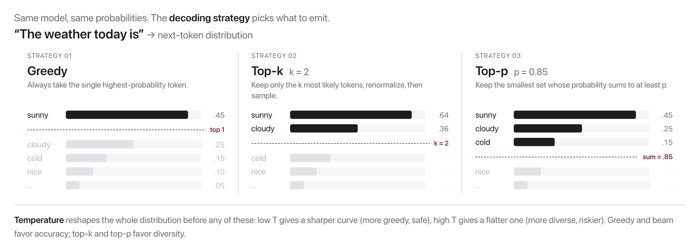

# W7C1 Lab: Decoding Strategies from Scratch

Implement the core math of decoding on a toy next-token distribution (pure
Python, no model needed). Then `playground.py` lets you feel the **same knobs on
a real local LLM** via Ollama.

**You will write five functions** in `decoding.py` across five steps, each with
its own check.

A "distribution" here is a dict `{token: probability}` that sums to about 1.0.

## Before you code: the picture and the math



Every strategy is a way of turning the model's raw scores into one chosen token. Temperature rescales the scores before the softmax:

$$P(w) = \frac{\exp(z_w / T)}{\sum_v \exp(z_v / T)}$$

Top-$k$ keeps the $k$ highest-probability tokens and renormalizes. Top-$p$ (nucleus) keeps the *smallest* set of top tokens whose probabilities sum to at least $p$, then renormalizes. Greedy is the $T \to 0$ limit: all mass on the argmax.

**Check yourself before coding:** if a distribution is `{a: 0.9, b: 0.05, c: 0.05}`, how many tokens survive top-p with $p = 0.8$? (Just one: `a` alone already reaches 0.9, which is at least 0.8, so the nucleus stops there.)

## How this lab works

Each step tells you **what to write**, then exactly **how to check it**. Steps 1
to 4 are independent of each other; Step 5 works on whatever distribution you
hand it.

Set a shortcut for the long docker command first:

```bash
alias lab='docker compose -f docker/docker-compose.yml run --rm --no-deps course'
```

Check **one step**:

```bash
lab python -m pytest weeks/week-07/class-01/exercise/test_decoding.py -k step1 -q
```

Check **everything**:

```bash
lab python -m pytest weeks/week-07/class-01/exercise/test_decoding.py -q
```

Stuck for more than a few minutes? Open the walkthrough released after class at the
matching step.

---

### Step 0, Orientation (nothing to write)

Look at the toy logits you will be decoding all lab:

```bash
lab python
```

```python
>>> logits = {"sunny": 2.0, "cloudy": 1.2, "cold": 0.6, "nice": 0.1, "banana": -3.0}
```

These are **logits**, raw scores, not probabilities: they are not all positive and
they do not sum to 1. `banana` is there on purpose as the implausible tail token
that every filter should remove.

---

### Step 1, Temperature

**Write:** `apply_temperature(logits, temperature)`, returning a normalized
probability dict.

Divide every logit by `T`, then softmax (subtract the max before exponentiating,
same numerical-stability trick as W5C2). If `T` is very close to 0, return all
mass on the argmax instead, since dividing by zero would blow up.

**Done when:**

```bash
lab python -m pytest weeks/week-07/class-01/exercise/test_decoding.py -k step1 -q
```

```
...                                                                      [100%]
3 passed, 6 deselected
```

**Check it by hand:**

```python
>>> from decoding import apply_temperature
>>> {k: round(v, 3) for k, v in apply_temperature(logits, 0.5).items()}
{'sunny': 0.778, 'cloudy': 0.157, 'cold': 0.047, 'nice': 0.017, 'banana': 0.0}
>>> {k: round(v, 3) for k, v in apply_temperature(logits, 1.5).items()}
{'sunny': 0.435, 'cloudy': 0.255, 'cold': 0.171, 'nice': 0.123, 'banana': 0.016}
```

**Read those two rows side by side.** At `T = 0.5` the top token takes 78% and
`banana` rounds to zero. At `T = 1.5` the top token drops to 44% and `banana`
climbs to 1.6%. Low temperature sharpens toward the favourite; high temperature
flattens and gives the tail a real chance.

**Why it matters:** this is the knob you turned blindly in W1C1. Now you know
exactly what it does to the numbers.

---

### Step 2, Greedy

**Write:** `greedy(dist)`, returning the highest-probability token.

`max(dist, key=dist.get)` is the whole function.

**Done when:**

```bash
lab python -m pytest weeks/week-07/class-01/exercise/test_decoding.py -k step2 -q
```

```
.                                                                        [100%]
1 passed, 8 deselected
```

**Check it by hand:**

```python
>>> from decoding import greedy
>>> greedy(apply_temperature(logits, 1.0))
'sunny'
```

**Why it matters:** greedy is deterministic and safe, which is exactly why it is
also repetitive. It is the right choice for a classification-shaped task and the
wrong one for open-ended text, which is why the other three functions exist.

---

### Step 3, Top-k

**Write:** `top_k_filter(dist, k)`. Keep the `k` highest-probability tokens and
renormalize them so they sum to 1.

Sort by probability descending, slice the first `k`, divide each by the new
total.

**Done when:**

```bash
lab python -m pytest weeks/week-07/class-01/exercise/test_decoding.py -k step3 -q
```

```
.                                                                        [100%]
1 passed, 8 deselected
```

**Check it by hand:**

```python
>>> from decoding import top_k_filter
>>> base = apply_temperature(logits, 1.0)
>>> {k: round(v, 3) for k, v in top_k_filter(base, 2).items()}
{'sunny': 0.69, 'cloudy': 0.31}
```

**Notice the renormalization.** Before filtering, `sunny` had roughly 0.55 of the
mass. After dropping three tokens and renormalizing it has 0.69, because the
discarded probability had to go somewhere.

**Why it matters:** top-k is a hard cap on how many options survive. Its weakness
is that `k` is fixed regardless of how confident the model is, which is the
problem Step 4 solves.

---

### Step 4, Top-p (nucleus)

**Write:** `top_p_filter(dist, p)`. Walk the tokens from most to least probable,
accumulating probability, and stop **as soon as** the running total reaches `p`.
Keep everything up to and including that token, then renormalize.

**Always keep at least one token.** Adding the token *before* checking the
cumulative sum handles this automatically, and one of the tests checks it with a
`p` smaller than the top token's probability.

**Done when:**

```bash
lab python -m pytest weeks/week-07/class-01/exercise/test_decoding.py -k step4 -q
```

```
..                                                                       [100%]
2 passed, 7 deselected
```

**Check it by hand:**

```python
>>> from decoding import top_p_filter
>>> {k: round(v, 3) for k, v in top_p_filter(base, 0.8).items()}
{'sunny': 0.59, 'cloudy': 0.265, 'cold': 0.145}
```

**Compare against top-2 in Step 3.** Same distribution; top-k gave 2 tokens,
top-p gave 3. That is the point: the nucleus **adapts**. When the model is
confident, one token can exceed `p` and the nucleus is tiny; when the model is
unsure, the nucleus widens to include everything plausible. A fixed `k` cannot do
that.

**Why it matters:** nucleus sampling (Holtzman et al. 2020) is the default in
most production text generation for exactly this adaptivity.

---

### Step 5, Sample

**Write:** `sample(dist, seed=None)`. Draw one token according to its
probability.

Use `random.Random(seed)` (a **local** generator, so the tests are
deterministic), take one `random()` value in `[0, 1)`, and walk the tokens
accumulating probability until the running total reaches it.

Return the last token as a fallback if the loop ends without returning; floating
point can leave the total a hair under 1.0.

**Done when:**

```bash
lab python -m pytest weeks/week-07/class-01/exercise/test_decoding.py -k step5 -q
```

```
..                                                                       [100%]
2 passed, 7 deselected
```

**Check it by hand:**

```python
>>> from decoding import sample
>>> sample(base, seed=0) == sample(base, seed=0)
True
>>> sample({"only": 1.0}, seed=3)
'only'
```

**Why it matters:** this is the last piece. Temperature reshapes, top-k and top-p
truncate, and `sample` is what actually picks. Every text-generating system is
some composition of these four.

---

### Step 6, Run the whole thing

```bash
lab python weeks/week-07/class-01/exercise/decoding.py
```

```
temp=0.5 -> {'sunny': 0.778, 'cloudy': 0.157, 'cold': 0.047, 'nice': 0.017, 'banana': 0.0}
temp=1.5 -> {'sunny': 0.435, 'cloudy': 0.255, 'cold': 0.171, 'nice': 0.123, 'banana': 0.016}
greedy   -> sunny
top-2    -> {'sunny': 0.69, 'cloudy': 0.31}
top-p .8 -> {'sunny': 0.59, 'cloudy': 0.265, 'cold': 0.145}
```

And the full suite:

```bash
lab python -m pytest weeks/week-07/class-01/exercise/test_decoding.py -q
```

```
.........                                                                [100%]
9 passed
```

### Then feel it on a real model

```bash
docker compose -f docker/docker-compose.yml run --rm course \
    python weeks/week-07/class-01/exercise/playground.py
```

This runs the same knobs against a real local LLM through Ollama, and skips
cleanly with a message if Ollama is not running. The toy distribution makes the
math visible; the playground makes it *felt*. Do both.

## Stretch goals

- Combine the filters: apply temperature, then top-p, then sample. That is the
  actual pipeline in most inference servers.
- Implement **min-p** (keep tokens with probability at least `min_p` times the
  top token's) and compare its behavior to top-p on a confident vs an uncertain
  distribution.
- Implement a **repetition penalty**: divide the logit of any token already
  generated before applying temperature.

A full reference solution is in the material released after class, and the step-by-step
explanation is in the walkthrough released after class (don't peek until you've tried).
