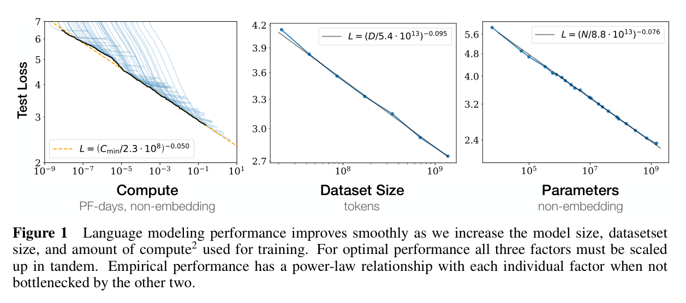
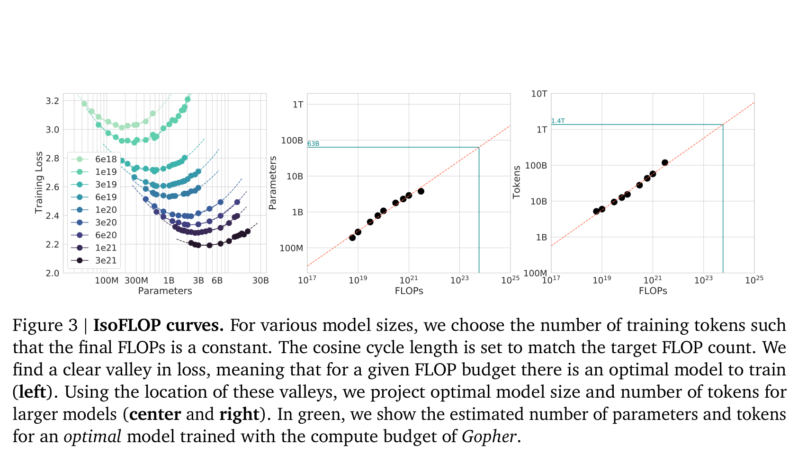

# W7C2 Lab: Measure Scaling Behavior (Optional / take-home)

> **This is an optional take-home lab (or a quick instructor demo).** The
> in-class time this session goes to two team activities instead of coding (see
> "In-class activities" below). Do this on your own time to *see* the scaling
> laws on your own laptop.

Can you *see* scaling on a laptop? Run the **same task suite** on two or more
models of different sizes and compare accuracy. Bigger should do at least as
well.

**You will write four functions** in `scaling.py`, one per step, each with its own
check. Then `measure.py` drives real Ollama models.

## Before you code: the picture and the math





The lecture's key relations (same notation as the slides, $N$ parameters, $D$ training tokens, $C$ compute):

$$C \approx 6\,N D \qquad \text{(training compute budget)} \qquad D_{\text{opt}} \approx 20\,N \qquad \text{(Chinchilla rule of thumb)}$$

What your code computes is the miniature, measurable version of those curves:

$$\text{accuracy} = \frac{1}{n} \sum_{i=1}^{n} \mathbf{1}\big[\text{is\_correct}(o_i, t_i)\big] \qquad \text{scaling\_trend} = \text{True} \iff a_1 \le a_2 \le \dots \le a_m$$

In plain words: you grade each model's outputs leniently (normalized target as a substring of the normalized output), average the results into one accuracy per model, and then check whether accuracy is non-decreasing as models get bigger, your laptop-scale echo of the paper plots above. **Check yourself before coding:** if the accuracies from smallest to largest model are 0.6, 0.6, 1.0, what does `scaling_trend` return? (True, because the rule is non-decreasing, so ties are allowed.)

> ### Read this first: pick a task where scale actually shows
> The built-in `TASKS` suite is deliberately **simple arithmetic and
> strict-format short answers** ("just the number", "one word"). On this kind of
> task a 0.5B model really does trip up where a 1B or 3B model succeeds, so the
> gap is **real and visible**.
>
> **Do NOT swap in a 4-choice benchmark like MMLU here.** On a 4-option
> multiple-choice test, pure guessing already scores **~25%** (the "chance
> floor"). With only a handful of questions, a 0.5B and a 3B model can both land
> near 25% by luck, and you would wrongly conclude "scaling does not work". That
> is a measurement problem, not a fact about scaling.
>
> **Sample size matters too:** 5 questions is a demo, not evidence. Read the
> *direction* of the trend, not tiny differences. If two models tie or the
> smaller one wins by one item, that is almost certainly noise.

## In-class activities (no coding)

1. **Budget the compute (whiteboard, teams).** Your team gets a fixed compute
   budget where `C ≈ 6 · N(params) · D(tokens)`. Pick a split, bigger model on
   less data or smaller model on more data, and apply the **Chinchilla rule of
   thumb (~20 tokens per parameter)** on paper. Which split is compute-optimal?
   Defend it in one sentence. Twists: you will run this model billions of times at
   inference; and Kaplan (2020, parameter-heavy) vs Chinchilla (2022, data-heavy).
2. **Structured debate (teams, assigned positions).** Two motions:
   *"Bigger is always better."* and *"Emergence is real, not a metric mirage."*
   You will be **assigned** a side. Use the lecture evidence (Chinchilla beating a
   4x larger model; Schaeffer et al. 2023's metric critique of emergence) to
   argue it.

## Pre-baked results to interpret (if Ollama is unavailable)

No models pulled? You can still do the analysis. Here is a representative run of
the built-in suite (5 arithmetic/short-answer items). Answer these *without*
running anything:

| Model         | Params | Accuracy | Items correct |
|---------------|--------|----------|---------------|
| qwen2.5:0.5b  | 0.5B   | 0.60     | 3 / 5         |
| llama3.2:1b   | 1B     | 0.80     | 4 / 5         |
| qwen2.5:3b    | 3B     | 1.00     | 5 / 5         |

1. Is accuracy **non-decreasing** with size here? (What would `scaling_trend`
   return?)
2. The 0.5B model missed "10 minus 3". Is that a *reasoning* failure or a
   *format* failure (e.g. it answered "seven" or added a sentence)? How would you
   tell them apart, and does lenient substring grading hide it?
3. If instead these were MMLU-style 4-choice questions, roughly what accuracy
   would a model that knows *nothing* score? Why does that make a tiny MMLU run a
   bad way to "see" scaling?

## How this lab works

Each step tells you **what to write**, then exactly **how to check it**. Steps 1
to 3 build on each other; Step 4 is independent.

`lab` is a shortcut for the long docker command. Set it up once per
terminal session, using the line for **your** shell:

```
# macOS / Linux (bash, zsh)
alias lab='docker compose -f docker/docker-compose.yml run --rm --no-deps course'

# Windows, PowerShell
function lab { docker compose -f docker/docker-compose.yml run --rm --no-deps course @args }

# Windows, Command Prompt
doskey lab=docker compose -f docker/docker-compose.yml run --rm --no-deps course $*
```

Rather work inside the image? This opens a shell there, and then every
command below runs without its `lab` prefix:

```bash
docker compose -f docker/docker-compose.yml run --rm --no-deps course bash
```

Check **one step**:

```bash
lab python -m pytest weeks/week-07/class-02/exercise/test_scaling.py -k step1 -q
```

Check **everything**:

```bash
lab python -m pytest weeks/week-07/class-02/exercise/test_scaling.py -q
```

Some steps are **already written for you** and marked `(given)`. Run their
check, read the code, and use it as the pattern for the steps you do write. A
step you have not written yet reports `skipped`, never a failure, so the only
red you will ever see is a real wrong answer.

Stuck for more than a few minutes? Open `../solutions/WALKTHROUGH.md` at the
matching step. The full reference solution sits in `../solutions/` too. **These
labs are not graded**, so reading them is not cheating: getting unstuck and
finishing the idea beats staring at a blank function.

---

### Step 0, Orientation (nothing to write)

Look at the suite you are grading:

```python
>>> import sys; sys.path.insert(0, "weeks/week-07/class-02/exercise")
>>> from scaling import TASKS
>>> len(TASKS)
5
>>> TASKS[1]
{'q': 'What is the capital of France? One word.', 'answer': 'paris'}
```

**Note the answer is stored lowercase**, and a real model will reply "Paris." with
a capital and a period. Reconciling that is Steps 1 and 2.

---

### Step 1, Normalize (given)

**Given, already written for you.** Read it in the starter, run its check,
and use it as the pattern for the steps you do write.

**What it does:** `normalize(text)`. Lowercase, strip surrounding whitespace, and strip
surrounding punctuation.

`text.strip().strip(string.punctuation + " ").lower()` does it. Note `str.strip`
with an argument removes any of those characters from **both ends**, which is
what you want, not `replace`.

**Done when:**

```bash
lab python -m pytest weeks/week-07/class-02/exercise/test_scaling.py -k step1 -q
```

```
.                                                                        [100%]
1 passed, 7 deselected
```

**Check it by hand:**

```python
>>> from scaling import normalize
>>> normalize("  Paris.  ")
'paris'
>>> normalize("Green!")
'green'
```

**Why it matters:** every grader in the rest of the course does some version of
this. The choices you make here (strip punctuation? lowercase? only at the ends?)
silently decide what counts as a correct answer.

---

### Step 2, Lenient matching (given)

**Given, already written for you.** Read it in the starter, run its check,
and use it as the pattern for the steps you do write.

**What it does:** `is_correct(model_output, target)`, true when the normalized target
appears **as a substring** of the normalized output.

**Done when:**

```bash
lab python -m pytest weeks/week-07/class-02/exercise/test_scaling.py -k step2 -q
```

```
.                                                                        [100%]
1 passed, 7 deselected
```

**Check it by hand:**

```python
>>> from scaling import is_correct
>>> is_correct("Paris.", "paris")
True
>>> is_correct("7 days", "7")
True
>>> is_correct("The answer is 4", "4")
True
```

**Substring matching is a deliberate trade, and it cuts both ways.** It rescues
"7 days" when you wanted "7", which is right. But it would also accept "not 4"
for target "4", and "17" contains "7". Lenient graders overcount; strict graders
undercount honest answers wrapped in prose. There is no neutral choice, which is
the thing to notice. W9C2 returns to this as the central problem of evaluation.

---

### Step 3, Accuracy

**Write:** `accuracy(outputs, targets)`, the fraction correct. Return 0.0 for
empty input rather than dividing by zero.

**Done when:**

```bash
lab python -m pytest weeks/week-07/class-02/exercise/test_scaling.py -k step3 -q
```

```
..                                                                       [100%]
2 passed, 6 deselected
```

**Check it by hand:**

```python
>>> from scaling import accuracy, TASKS
>>> targets = [t["answer"] for t in TASKS]
>>> accuracy(["4", "Lyon", "7", "green", "six"], targets)
0.6
>>> accuracy([], [])
0.0
```

---

### Step 4, The scaling trend

**Write:** `scaling_trend(results)`. Given `{model: accuracy}` ordered smallest to
largest model, return True if accuracy never *decreases* as you walk the values
in insertion order.

Python dicts preserve insertion order, so `list(results.values())` gives the
sizes in order. Compare consecutive pairs with `<=`, not `<`: ties are allowed.

**Done when:**

```bash
lab python -m pytest weeks/week-07/class-02/exercise/test_scaling.py -k step4 -q
```

```
...                                                                      [100%]
3 passed, 5 deselected
```

**Check it by hand:**

```python
>>> from scaling import scaling_trend
>>> scaling_trend({"small": 0.6, "large": 1.0})
True
>>> scaling_trend({"small": 0.6, "mid": 0.6, "large": 1.0})
True
>>> scaling_trend({"small": 1.0, "large": 0.6})
False
```

**The `<=` is a real modeling decision.** Requiring strict improvement would call
a tie a failure, and with a 5-question suite ties are common noise. Being explicit
about what counts as "scaling helped" *before* seeing the data is the discipline
this step is really teaching.

---

### Step 5, Run the whole thing

```bash
lab python weeks/week-07/class-02/exercise/scaling.py
```

```
small-model accuracy: 0.60
large-model accuracy: 1.00
accuracy non-decreasing with size? True
```

And the full suite:

```bash
lab python -m pytest weeks/week-07/class-02/exercise/test_scaling.py -q
```

```
........                                                                 [100%]
8 passed
```

Those outputs are **simulated** (hard-coded strings representing what a tiny and a
bigger model might say), so they demonstrate the scoring code, not scaling itself.

### Then measure real models (`measure.py`)

`measure.py` drives Ollama models (default `qwen2.5:0.5b` then `llama3.2:1b`,
smallest first) over the `TASKS` suite and prints an accuracy-vs-size table.

```bash
docker compose -f docker/docker-compose.yml up -d ollama
docker compose -f docker/docker-compose.yml exec ollama ollama pull qwen2.5:0.5b
docker compose -f docker/docker-compose.yml exec ollama ollama pull llama3.2:1b
docker compose -f docker/docker-compose.yml run --rm course python weeks/week-07/class-02/exercise/measure.py
```

Pick your own models with `SCALING_MODELS="qwen2.5:0.5b,llama3.2:1b,qwen2.5:3b"`.
Any model that is not pulled is **skipped with a note**; if none are reachable
the script prints setup help and exits cleanly. It falls back to the reference
scoring core if you have not finished the steps above, so the demo always runs.

**When you read your own numbers, apply your own warning from the top of this
file.** Five questions is a demo. A one-item difference is noise. What you are
looking for is direction, and even then, one run on one suite is an anecdote.

## Stretch goals

- Add more questions until the difference between models stops moving. How many
  items did it take before the ranking stabilized?
- Deliberately construct the failure mode the warning describes: build a 4-choice
  suite, run both models, and watch them both land near the 25% chance floor.
- Add a **strict** grader (exact match after normalization) alongside the lenient
  one and report both. How much does the measured accuracy depend on the grader
  rather than the model?

A full reference solution is in `../solutions/scaling.py`, and the step-by-step
explanation is in `../solutions/WALKTHROUGH.md` (don't peek until you've tried).
