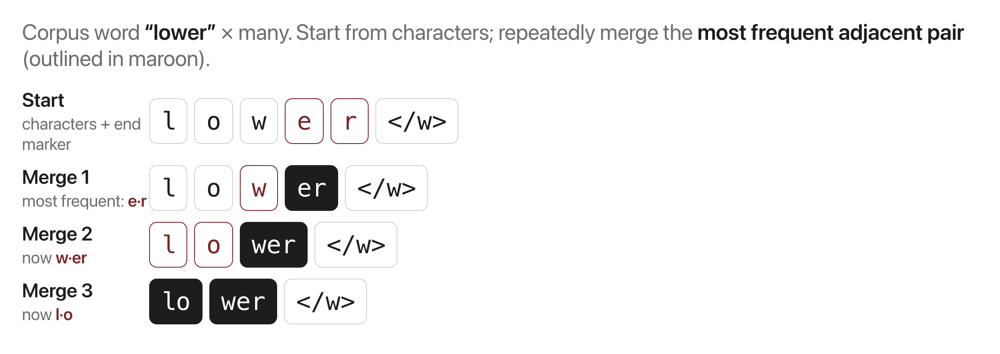

# W8C1 Lab: Train a BPE Tokenizer from Scratch

Build **Byte-Pair Encoding** end to end: learn merges from a corpus, then use
them to tokenize a word the tokenizer has never seen. Standard library only, no
network.

**You will write five functions** in `bpe.py` across five steps, each with its own
check.

**The representation used throughout:**

- A "word" is a tuple of symbols, e.g. `("l", "o", "w", "</w>")`.
- The end-of-word marker `</w>` is appended so the tokenizer knows where words
  end, and so `er` at a word end differs from `er` inside a word.
- A "vocab" is a dict `{word_tuple: frequency}` over the training corpus.

## Before you code: the picture and the math



BPE is one greedy loop. Starting from characters, repeat `num_merges` times:

$$(a, b)^* = \arg\max_{(a,b)} \; \mathrm{count}(a, b) \qquad \text{then replace every adjacent } (a,b) \text{ with the single symbol } ab$$

where counts are summed over the corpus, weighted by word frequency. The learned output is not a vocabulary list but an **ordered list of merges**, and encoding a new word means replaying those merges in the same order.

**Check yourself before coding:** why does the order of the merge list matter when encoding? (Because a later merge can only fire on symbols produced by earlier ones: `low` has to exist before `low` + `</w>` can merge.)

## How this lab works

Each step tells you **what to write**, then exactly **how to check it**. The
steps are strictly sequential: Step 4 orchestrates Steps 1 to 3.

Set a shortcut for the long docker command first:

```bash
alias lab='docker compose -f docker/docker-compose.yml run --rm --no-deps course'
```

Check **one step**:

```bash
lab python -m pytest weeks/week-08/class-01/exercise/test_bpe.py -k step1 -q
```

Check **everything**:

```bash
lab python -m pytest weeks/week-08/class-01/exercise/test_bpe.py -q
```

Stuck for more than a few minutes? Open the walkthrough released after class at the
matching step.

---

### Step 1, Build the vocabulary

**Write:** `build_vocab(corpus)`. Lowercase each line, split on whitespace, turn
each word into a tuple of its characters plus `END`, and count.

**Done when:**

```bash
lab python -m pytest weeks/week-08/class-01/exercise/test_bpe.py -k step1 -q
```

```
.                                                                        [100%]
1 passed, 7 deselected
```

**Check it by hand:**

```python
>>> import sys; sys.path.insert(0, "weeks/week-08/class-01/exercise")
>>> from bpe import build_vocab
>>> build_vocab(["low low"])
{('l', 'o', 'w', '</w>'): 2}
```

**Why the tuple, not the string.** Tuples are hashable (so they can be dict keys)
and immutable, and they let a merged symbol like `"low"` sit in a single slot
alongside single characters. The whole algorithm is about symbols growing, and a
string could not represent "these three characters are now one symbol".

---

### Step 2, Count adjacent pairs

**Write:** `count_pairs(vocab)`, a `Counter` of `(sym_a, sym_b)` to total count,
**weighted by word frequency**.

`zip(symbols, symbols[1:])` walks adjacent pairs. Add `freq`, not 1: a pair
inside a word seen 100 times counts 100 times.

**Done when:**

```bash
lab python -m pytest weeks/week-08/class-01/exercise/test_bpe.py -k step2 -q
```

```
.                                                                        [100%]
1 passed, 7 deselected
```

**Check it by hand:**

```python
>>> from bpe import count_pairs
>>> count_pairs({('l', 'o', 'w', '</w>'): 2})[('l', 'o')]
2
```

---

### Step 3, Merge a pair

**Write:** `merge_pair(pair, vocab)`, returning a **new** vocab where every
adjacent occurrence of `pair` has become one symbol.

Walk each word left to right with an index. When positions `i` and `i+1` match
the pair, append the concatenation and advance by **2**; otherwise append one
symbol and advance by **1**.

**Do not use `str.replace` on a joined string.** Merging `("e","r")` must not
touch an `e` and `r` that are not adjacent as symbols, and once symbols are
multi-character, string replacement matches across symbol boundaries.

**Accumulate into the new vocab with `+=`**, since two different words can merge
into the same tuple and their frequencies must add.

**Done when:**

```bash
lab python -m pytest weeks/week-08/class-01/exercise/test_bpe.py -k step3 -q
```

```
.                                                                        [100%]
1 passed, 7 deselected
```

**Check it by hand:**

```python
>>> from bpe import merge_pair
>>> merge_pair(('e', 'r'), {('l', 'o', 'w', 'e', 'r', '</w>'): 1})
{('l', 'o', 'w', 'er', '</w>'): 1}
```

---

### Step 4, Train

**Write:** `train_bpe(corpus, num_merges)`, returning the **ordered list of
merges**.

Loop `num_merges` times: count pairs, pick the most frequent, merge it, record
it. Stop early if there are no pairs left.

**Break ties deterministically.** `max(pairs.items(), key=lambda kv: (kv[1], kv[0]))`
sorts by count first, then by the pair itself. Without the tie-break, two pairs
with equal counts resolve by dict order and your merge list changes between runs,
which one of the tests checks.

**Done when:**

```bash
lab python -m pytest weeks/week-08/class-01/exercise/test_bpe.py -k step4 -q
```

```
...                                                                      [100%]
3 passed, 5 deselected
```

**Check it by hand:**

```python
>>> from bpe import train_bpe
>>> train_bpe(["low low low low low", "lower lower",
...            "newest newest newest", "widest"], num_merges=3)
[('o', 'w'), ('l', 'ow'), ('low', '</w>')]
```

**Watch the merges compound.** Merge 1 creates `ow`. Merge 2 can then use it to
build `low`. Merge 3 attaches the end marker. Each merge operates on the output of
the last, which is why the *order* is the model.

---

### Step 5, Encode

**Write:** `encode_word(word, merges)`. Start from characters plus `END`, then
apply **every learned merge in order**, fusing all adjacent occurrences of each.

The inner loop is the same walk as Step 3. The difference is that you replay the
whole merge list, in training order, on a single word.

**Done when:**

```bash
lab python -m pytest weeks/week-08/class-01/exercise/test_bpe.py -k step5 -q
```

```
..                                                                       [100%]
2 passed, 6 deselected
```

**Check it by hand:**

```python
>>> from bpe import encode_word, train_bpe
>>> merges = train_bpe(["low low low low low", "lower lower",
...                     "newest newest newest", "widest"], num_merges=10)
>>> encode_word("lowest", merges)
['low', 'est</w>']
```

**`lowest` was never in the training corpus.** It came out as two subwords, both
learned from other words: `low` from "low"/"lower", and `est</w>` from
"newest"/"widest". That is the entire point of subword tokenization, and you just
watched it happen.

---

### Step 6, Run the whole thing

```bash
lab python weeks/week-08/class-01/exercise/bpe.py
```

```
Learned merges (in order):
   1. 'o' + 'w'
   2. 'l' + 'ow'
   3. 'low' + '</w>'
   4. 't' + '</w>'
   5. 's' + 't</w>'
   6. 'e' + 'st</w>'
   7. 'w' + 'est</w>'
   8. 'n' + 'e'
   9. 'ne' + 'west</w>'
  10. 'r' + '</w>'

Encoding 'lowest': ['low', 'est</w>']
```

And the full suite:

```bash
lab python -m pytest weeks/week-08/class-01/exercise/test_bpe.py -q
```

```
........                                                                 [100%]
8 passed
```

**Read the merge list as a story.** The algorithm never saw a dictionary. It
found `ow`, then `low`, then `low</w>` because "low" is frequent in this corpus.
Separately it built `t</w>`, `st</w>`, `est</w>`, discovering the English suffix
*-est* purely from the fact that "newest" and "widest" both end that way. No
linguist told it that *-est* is a morpheme; frequency did.

That is why BPE handles words it has never seen, why vocabulary size is a knob
you choose rather than a property of the language, and why every model in the
rest of this course tokenizes this way.

## Stretch goals

- Train on a bigger corpus (paste a few paragraphs) with `num_merges=100`. How
  many merges before recognizable words appear as single tokens?
- Count how many tokens `encode_word` produces for common vs rare words. Rare
  words should fragment more, which is the "fertility" measure from lecture.
- Try a word in another language, or with an emoji. What happens, and why is that
  a fairness issue for speakers of under-represented languages?

A full reference solution is in the reference solution released after class, and the step-by-step
explanation is in the walkthrough released after class (don't peek until you've tried).
