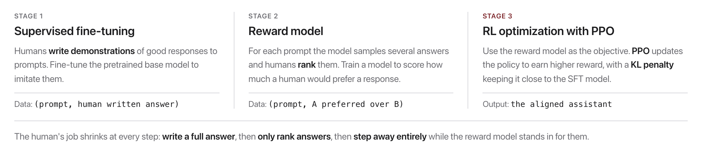
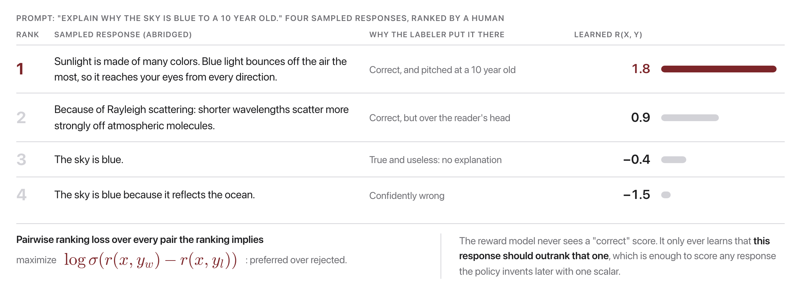

# W8C2 Lab: Be the Reward Model

You will experience RLHF's Stage 2 from the inside: **label preference data**,
then **fit a reward model** to your labels and watch it recover your ranking.

**You will write two functions** in `preferences.py`. The other one is already
written for you, to read and run. Every step has its own check.

## Before you code: the picture and the math

This exercise lives in the middle box of the RLHF pipeline from lecture, Stage 2:



Stage 2 turns human **rankings** into a function $r(x, y)$ that scores any response with one scalar, trained with a pairwise ranking loss:



In our tiny version, one prompt is fixed, so each response just gets a scalar score $s$ (playing the role of $r(x, y)$). The Bradley-Terry model says the probability that the preferred response $w$ beats the rejected one $l$ is

$$P(w \succ l) \;=\; \sigma(s_w - s_l), \qquad \sigma(x) = \frac{1}{1 + e^{-x}},$$

and we fit the scores by minimizing the mean negative log-likelihood over all labeled pairs (the same thing as maximizing the slide's $\log \sigma\big(r(x, y_w) - r(x, y_l)\big)$):

$$\mathcal{L} \;=\; -\frac{1}{N} \sum_{(w,\,l)} \log \sigma(s_w - s_l).$$

Each gradient step pushes $s_w$ up and $s_l$ down by $1 - \sigma(s_w - s_l)$, so confidently-ordered pairs barely move while violated preferences get a big correction. **Check yourself before coding:** if the current scores are $s_A = 1.2$ and $s_B = -0.3$, what probability does the model assign to A beating B? ($\sigma(1.2 - (-0.3)) = \sigma(1.5) \approx 0.82$.)

## Part A: Label preferences (paper / discussion, do this first)

Open `label_sheet.md`. For each prompt, **rank** the candidate responses and
write a one-line reason. The items are chosen to surface the real judgment calls:
helpfulness, honesty (hallucination), harmlessness, and sycophancy. Compare with
a neighbor: **disagreement is the lesson**, not a problem to resolve.

Keep your rankings. Step 4 below feeds them into the model you are about to
build.

## How this lab works

Each step tells you **what to write**, then exactly **how to check it**. Steps 1
to 3 are sequential: Step 3 calls Step 1, and Step 2 is how you know Step 3 is
working.

`lab` is a shortcut for the long docker command. Set it up once per
terminal session, using the line for **your** shell:

```
# macOS / Linux (bash, zsh)
alias lab='docker compose -f docker/docker-compose.yml run --rm --no-deps course'

# Windows, PowerShell
function lab { docker compose -f docker/docker-compose.yml run --rm --no-deps course @args }

# Windows, Command Prompt
doskey lab=docker compose -f docker/docker-compose.yml run --rm --no-deps course $*
```

Rather work inside the image? This opens a shell there, and then every
command below runs without its `lab` prefix:

```bash
docker compose -f docker/docker-compose.yml run --rm --no-deps course bash
```

Check **one step**:

```bash
lab python -m pytest weeks/week-08/class-02/exercise/test_preferences.py -k step1 -q
```

Check **everything**:

```bash
lab python -m pytest weeks/week-08/class-02/exercise/test_preferences.py -q
```

Some steps are **already written for you** and marked `(given)`. Run their
check, read the code, and use it as the pattern for the steps you do write. A
step you have not written yet reports `skipped`, never a failure, so the only
red you will ever see is a real wrong answer.

Stuck for more than a few minutes? Open `../solutions/WALKTHROUGH.md` at the
matching step. The full reference solution sits in `../solutions/` too. **These
labs are not graded**, so reading them is not cheating: getting unstuck and
finishing the idea beats staring at a blank function.

---

### Step 0, Orientation (nothing to write)

Look at the toy comparison set:

```python
>>> import sys; sys.path.insert(0, "weeks/week-08/class-02/exercise")
>>> from preferences import PREFERENCES
>>> PREFERENCES
[('A', 'B'), ('A', 'C'), ('A', 'D'), ('B', 'C'), ('B', 'D'), ('C', 'D')]
```

Each tuple is `(winner, loser)`. These six pairs encode a complete, consistent
ranking `A > B > C > D`. **Note that no response has a score anywhere.** All the
model ever sees is comparisons, which is exactly the situation in real RLHF:
humans are reliable at "which of these two is better" and unreliable at "rate
this 1 to 10".

---

### Step 1, Numerically stable sigmoid (given)

**Given, already written for you.** Read it in the starter, run its check,
and use it as the pattern for the steps you do write.

**What it does:** `sigmoid(x)`, branching on the sign of `x`.

```
if x >= 0:  return 1 / (1 + exp(-x))
else:       z = exp(x); return z / (1 + z)
```

**Why the branch.** The textbook form `1 / (1 + exp(-x))` overflows for very
negative `x`, since `exp(710)` is `inf` in float64. Flipping the algebra for
negative inputs keeps every exponent at or below zero. Both branches compute the
same function; only their floating-point behavior differs.

**Done when:**

```bash
lab python -m pytest weeks/week-08/class-02/exercise/test_preferences.py -k step1 -q
```

```
..                                                                       [100%]
2 passed, 4 deselected
```

**Check it by hand:**

```python
>>> from preferences import sigmoid
>>> sigmoid(0.0)
0.5
>>> round(sigmoid(1.5), 4)
0.8176
>>> sigmoid(-800.0)
0.0
```

That last one is the whole reason for the branch: the naive version raises
`OverflowError` instead of returning 0.0.

---

### Step 2, The loss

**Write:** `neg_log_likelihood(scores, prefs)`, the **mean** of
`-log(sigmoid(s_w - s_l))` over all pairs.

Clamp the probability away from 0 before taking the log, or a confidently wrong
score gives `log(0)` and the loss becomes infinite.

**Done when:**

```bash
lab python -m pytest weeks/week-08/class-02/exercise/test_preferences.py -k step2 -q
```

```
.                                                                        [100%]
1 passed, 5 deselected
```

**Check it by hand:**

```python
>>> from preferences import neg_log_likelihood, PREFERENCES
>>> flat = {k: 0.0 for k in "ABCD"}
>>> round(neg_log_likelihood(flat, PREFERENCES), 4)
0.6931
>>> good = {"A": 3.0, "B": 1.0, "C": -1.0, "D": -3.0}
>>> round(neg_log_likelihood(good, PREFERENCES), 4)
0.0699
```

**0.6931 is `ln(2)` again.** With all scores equal, the model says every
comparison is a coin flip, and the loss is exactly the entropy of a fair coin.
Same sanity check as W4C1 and W4C2: an uninformed model sits at chance.

**Why it matters:** this number is the only thing the fitting loop is trying to
reduce. Step 3 is just gradient descent on it.

---

### Step 3, Fit the model

**Write:** `fit_reward_model(prefs, lr, steps)`.

Start every score at 0.0. For each full pass:

1. Zero the gradients.
2. For each `(w, l)`: compute `p = sigmoid(s_w - s_l)` and `push = 1 - p`. Add
   `push` to `grad[w]` and subtract it from `grad[l]`.
3. Update every score by `lr * grad[x] / len(prefs)`.
4. **Re-center** so the scores have mean 0.

**Read the gradient.** `push = 1 - p` is large when the model thinks the winner is
*losing* (p near 0) and near zero when it is already confident (p near 1). So
violated preferences get a big correction and settled ones barely move. That is
the whole learning signal, and it is worth seeing that it falls out of the
Bradley-Terry likelihood rather than being designed.

**Why re-center.** Adding a constant to every score changes no difference
`s_w - s_l`, so it changes no probability and no loss. The scores are only
identifiable **up to an additive constant**, and without re-centering they can
drift arbitrarily far while the loss sits still. One of the tests checks the mean
is 0.

**Done when:**

```bash
lab python -m pytest weeks/week-08/class-02/exercise/test_preferences.py -k step3 -q
```

```
...                                                                      [100%]
3 passed, 3 deselected
```

---

### Step 4, Run the whole thing

```bash
lab python weeks/week-08/class-02/exercise/preferences.py
```

```
Learned reward-model scores (higher = more preferred):
  A: +5.010
  B: +1.579
  C: -1.579
  D: -5.010
Implied ranking: A > B > C > D
```

And the full suite:

```bash
lab python -m pytest weeks/week-08/class-02/exercise/test_preferences.py -q
```

```
......                                                                   [100%]
6 passed
```

**Two things in those numbers are worth noticing.**

The **ranking is recovered exactly** from comparisons alone. Nobody supplied a
score; the model invented a scale consistent with six binary judgments. That is
Stage 2 of RLHF in miniature.

The **spacing is not uniform**: the A-to-B gap is 3.43 while the B-to-C gap is
3.16. The scores are symmetric around zero (that is the re-centering), but the
extremes get pushed further because A only ever wins and D only ever loses, so
their gradients never oppose. Read this as a caution: the *numbers* a reward model
produces carry less information than the *ordering*, and treating them as a
calibrated quality scale is a mistake.

### Now use your own labels

Replace `PREFERENCES` with the pairs from your Part A ranking and re-run. Does
the model reproduce *your* ordering? You have now labeled preference data and
trained a reward model on it, which is the same loop that produced the models you
use every day, at a different scale and with paid annotators instead of you.

## Stretch goals

- Add a **contradictory** preference (both `("A","B")` and `("B","A")`) and watch
  the scores compromise. Real human labels are noisy like this, and the reward
  model averages the disagreement rather than resolving it.
- Print the loss every 100 steps to watch it descend.
- Cut the data to a **single** preference and see how under-determined the scores
  become. This is the clearest demonstration of why re-centering is needed.
- Give your neighbor's labels to your model. Whose values did it learn?

A full reference solution is in `../solutions/preferences.py`, and the
step-by-step explanation is in `../solutions/WALKTHROUGH.md` (don't peek until
you've tried).
