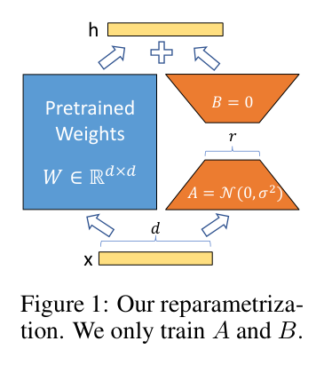

# W9C1 Lab: LoRA Adapter + Quantization Bake-Off

Two ideas, hands-on, in pure PyTorch with no downloads:

- **Steps 1 to 4:** implement a LoRA adapter on a **frozen** Linear layer and
  fine-tune it. Only the low-rank `A` and `B` train.
- **Step 5:** quantize weights to `k` bits and measure error against memory
  saved, the **bake-off**.

Everything is tiny and seeded, so it finishes in well under a minute on CPU.

## Before you code: the picture and the math



LoRA replaces "update all of $W$" with "add a low-rank correction and train only that":

$$h = W_0 x + \frac{\alpha}{r}\, B A x, \qquad A \in \mathbb{R}^{r \times d_{in}}, \; B \in \mathbb{R}^{d_{out} \times r}, \; r \ll \min(d_{in}, d_{out})$$

$W_0$ stays **frozen**. $B$ starts at **zero**, so at step 0 the adapter contributes nothing and the model is exactly the pretrained one. Symmetric $k$-bit quantization is the other half:

$$s = \frac{\max |w|}{2^{k-1} - 1}, \qquad \hat{w} = s \cdot \mathrm{clamp}\!\left(\mathrm{round}\!\left(\frac{w}{s}\right), -(2^{k-1}-1), \, 2^{k-1}-1\right)$$

**Check yourself before coding:** why initialize $B = 0$ rather than $A = 0$? (Either makes the product $BA$ zero at the start, but $A$ must be nonzero for gradients to flow into $B$: with both zero, $\partial L / \partial B \propto Ax = 0$ and the adapter could never start learning.)

## How this lab works

Each step tells you **what to write**, then exactly **how to check it**. Steps 1
to 3 all live in `__init__` and are checked together with Step 4's `forward`.
Step 5 is independent, so start there if the tensor shapes are fighting you.

Set a shortcut for the long docker command first:

```bash
alias lab='docker compose -f docker/docker-compose.yml run --rm --no-deps course'
```

Check **one step**:

```bash
lab python -m pytest weeks/week-09/class-01/exercise/test_lora_lab.py -k step1 -q
```

Check **everything**:

```bash
lab python -m pytest weeks/week-09/class-01/exercise/test_lora_lab.py -q
```

Stuck for more than a few minutes? Open the walkthrough released after class at the
matching step.

---

### Step 1, Freeze the base weight

**Write:** in `LoRALinear.__init__`, set `self.linear.weight.requires_grad = False`.

One line, and it is the entire premise of parameter-efficient fine-tuning: the
pretrained weights do not move.

**Done when:**

```bash
lab python -m pytest weeks/week-09/class-01/exercise/test_lora_lab.py -k step1 -q
```

```
.                                                                        [100%]
1 passed, 8 deselected
```

(You will need Steps 2 and 3 in place for `__init__` to run without raising, so
in practice write all three, then check them in order.)

---

### Step 2, Create the low-rank parameters

**Write:** `self.A` of shape `(r, in_features)` and `self.B` of shape
`(out_features, r)`, both `nn.Parameter`.

Initialize **`A` with small random values** (`torch.randn(...) * 0.01`) and
**`B` with zeros**.

**The asymmetry is deliberate**, and the check-yourself question above is the
reason. `B = 0` makes the whole update zero at step 0, so training starts exactly
at the base model. But `A` must be nonzero, or the gradient reaching `B` is zero
too and neither ever moves.

**Done when:**

```bash
lab python -m pytest weeks/week-09/class-01/exercise/test_lora_lab.py -k step2 -q
```

```
.                                                                        [100%]
1 passed, 8 deselected
```

---

### Step 3, Store the scaling

**Write:** `self.scaling = alpha / r`.

**Done when:**

```bash
lab python -m pytest weeks/week-09/class-01/exercise/test_lora_lab.py -k step3 -q
```

```
.                                                                        [100%]
1 passed, 8 deselected
```

**Why divide by `r`.** It decouples the learning rate from the rank: raise `r`
from 4 to 64 and, without the division, the update's magnitude would grow with
it and you would have to retune everything. With it, `alpha` sets the adapter's
strength and `r` sets its capacity, roughly independently.

---

### Step 4, The forward pass

**Write:** `forward`, returning the base output plus the scaled low-rank update.

```
base   = self.linear(x)
update = (x @ self.A.T) @ self.B.T
return base + self.scaling * update
```

**Note the bracketing.** Computing `(x @ A.T) @ B.T` goes through the rank-`r`
bottleneck and costs `O(n·d·r)`. Computing `x @ (B @ A)` first materializes the
full `d_out × d_in` matrix and costs `O(d_out·d_in·r)` extra. Both give the same
answer; only one is cheap, and cheapness is the entire point of LoRA.

**Done when:**

```bash
lab python -m pytest weeks/week-09/class-01/exercise/test_lora_lab.py -k step4 -q
```

```
....                                                                     [100%]
4 passed, 5 deselected
```

**Check it by hand:**

```python
>>> import sys, torch; sys.path.insert(0, "weeks/week-09/class-01/exercise")
>>> from lora_lab import LoRALinear
>>> torch.manual_seed(0)
>>> m = LoRALinear(8, 4, r=4, alpha=8)
>>> x = torch.randn(2, 8)
>>> torch.allclose(m(x), m.linear(x))
True
```

**That `True` is the property to notice.** Before any training, the adapter's
output is *identical* to the frozen base layer, because `B = 0`. A LoRA adapter
starts as a no-op and can only improve from there.

---

### Step 5, Quantize

**Write:** `quantize(w, bits)`, symmetric per-tensor quantize-dequantize.

```
qmax  = 2 ** (bits - 1) - 1
scale = w.abs().max() / qmax
q     = torch.round(w / scale).clamp(-qmax, qmax)
return q * scale
```

Guard `scale == 0` (an all-zero tensor) or you divide by zero.

**Why it returns floats, not integers.** This is *simulated* quantization: the
values are snapped to the grid a `k`-bit integer could represent, then scaled
back to float so the rest of the code is unchanged. Real quantized inference
stores the integers and the scale, which is where the memory saving actually
comes from.

**Done when:**

```bash
lab python -m pytest weeks/week-09/class-01/exercise/test_lora_lab.py -k step5 -q
```

```
..                                                                       [100%]
2 passed, 7 deselected
```

---

### Step 6, Run the whole thing

```bash
lab python weeks/week-09/class-01/exercise/lora_lab.py
```

```
LoRA loss: 9.744 -> 0.000
Trainable params: 48  |  Frozen params: 32

Quantization bake-off (mean abs error vs original):
  8-bit: error = 0.0072
  4-bit: error = 0.1316
  2-bit: error = 0.7530
```

And the full suite:

```bash
lab python -m pytest weeks/week-09/class-01/exercise/test_lora_lab.py -q
```

```
.........                                                                [100%]
9 passed
```

**Read the bake-off numbers as a curve, not three points.** Going 8 bits to 4
bits multiplies the error by about 18; going 4 to 2 multiplies it by another 6.
Each bit you remove halves the number of representable levels, so the error grows
roughly geometrically. That is why 8-bit and 4-bit quantization are everywhere in
practice and 2-bit is a research problem: 4-bit sits at the knee of the curve,
where you get most of the memory saving for tolerable error.

**One honest caveat on the trainable-parameter count.** This toy layer has 48
trainable and 32 frozen, which looks like LoRA *increased* the parameter count.
That is an artifact of the tiny size: with `r = 4` on an 8x4 layer, the low-rank
factors are bigger than the thing they are approximating. The win only appears
when `r` is genuinely much smaller than the dimensions, as in the lecture's real
numbers, where LoRA trains about 10,000x fewer parameters than full fine-tuning
of GPT-3. Do not let the toy's ratio be the takeaway.

## Stretch goals

- Sweep `r` over 1, 2, 4, 8 and plot the final loss. How much rank does this task
  actually need?
- Merge the adapter: compute `W + scaling * (B @ A)` and confirm a plain Linear
  with that weight gives the same outputs. That is why LoRA adds **zero**
  inference latency once deployed.
- Quantize the base weight to 4 bits, then train the LoRA adapter on top. You have
  just built QLoRA.
- Try `bits=1`. What does the quantizer degenerate to, and is the error what you
  predicted?

A full reference solution is in the material released after class, and the step-by-step
explanation is in the walkthrough released after class (don't peek until you've tried).
