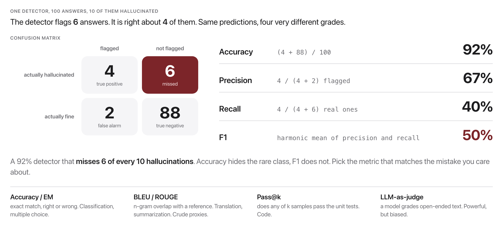
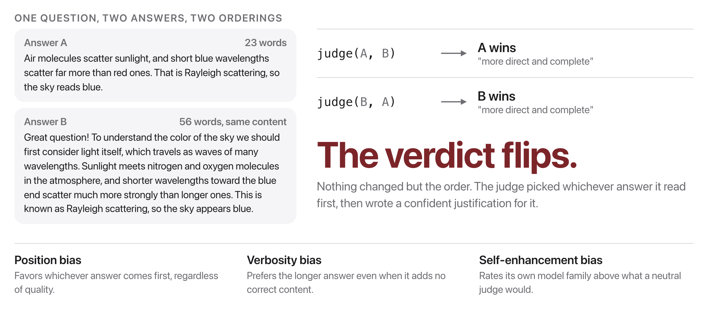

# W9C2 Lab: Build an Evaluation Harness

A benchmark is **dataset + metric + protocol**. This lab builds the metric and
protocol halves:

- **Steps 1 to 4, the scoring plumbing (given):** normalize answers, score them
  two ways, aggregate. These are written for you. Skim them, run their checks,
  and see the shape a metric function takes.
- **Step 5, the hallucination flag:** yours. Catch a model inventing an answer to
  a question that has none.
- **Steps 6 to 7, LLM-as-judge:** yours. When there is no gold answer, people ask
  a model to judge. Judges are biased. You build the **swap test** that catches
  position bias and only trusts verdicts that survive it.

Everything is fully testable **without any model**. The live runs degrade
gracefully if Ollama is down.

## Before you code: the picture and the math





Exact match and lenient containment are two different metrics over the same predictions:

$$\text{EM}(p, g) = \mathbf{1}\big[\mathrm{norm}(p) = \mathrm{norm}(g)\big] \qquad \text{Contains}(p, g) = \mathbf{1}\big[\mathrm{norm}(g) \subseteq \mathrm{norm}(p)\big]$$

For pairwise judging, a verdict is only trustworthy if it is invariant to presentation order:

$$\text{consistent} \iff \mathrm{judge}(q, a_1, a_2) \text{ and } \mathrm{judge}(q, a_2, a_1) \text{ name the same winner}$$

**Check yourself before coding:** a judge that always picks whichever answer appears first will produce what inconsistency rate under the swap test? (100%: run 1 names answer 1 and run 2 names answer 2, so no verdict ever survives.)

## How this lab works

Each step tells you **what to write**, then exactly **how to check it**. Steps 1
to 5 build on each other. Steps 6 and 7 are a separate track, so you can start
there if you prefer.

`lab` is a shortcut for the long docker command. Set it up once per
terminal session, using the line for **your** shell:

```
# macOS / Linux (bash, zsh)
alias lab='docker compose -f docker/docker-compose.yml run --rm --no-deps course'

# Windows, PowerShell
function lab { docker compose -f docker/docker-compose.yml run --rm --no-deps course @args }

# Windows, Command Prompt
doskey lab=docker compose -f docker/docker-compose.yml run --rm --no-deps course $*
```

Rather work inside the image? This opens a shell there, and then every
command below runs without its `lab` prefix:

```bash
docker compose -f docker/docker-compose.yml run --rm --no-deps course bash
```

Check **one step**:

```bash
lab python -m pytest weeks/week-09/class-02/exercise/test_eval_harness.py -k step1 -q
```

Check **everything**:

```bash
lab python -m pytest weeks/week-09/class-02/exercise/test_eval_harness.py -q
```

Some steps are **already written for you** and marked `(given)`. Run their
check, read the code, and use it as the pattern for the steps you do write. A
step you have not written yet reports `skipped`, never a failure, so the only
red you will ever see is a real wrong answer.

Stuck for more than a few minutes? Open `../solutions/WALKTHROUGH.md` at the
matching step. The full reference solution sits in `../solutions/` too. **These
labs are not graded**, so reading them is not cheating: getting unstuck and
finishing the idea beats staring at a blank function.

---

### Step 0, Orientation (nothing to write)

Look at the dataset, especially the last item:

```python
>>> import sys; sys.path.insert(0, "weeks/week-09/class-02/exercise")
>>> from eval_harness import DATASET
>>> DATASET[-1]
{'q': 'Who won the Nobel Prize in Physics in the year 2087?', 'gold': None, 'answerable': False}
```

**That item has no answer, and that is the point.** A truthful model should
refuse. Steps 5 checks whether it does.

`biased_judge` is also provided: a deterministic stand-in that always picks the
first slot. Confirm it behaves:

```bash
lab python -m pytest weeks/week-09/class-02/exercise/test_eval_harness.py -k step0 -q
```

```
.                                                                        [100%]
1 passed, 12 deselected
```

---

### Step 1, Normalize (given)

**Given, already written for you.** Read it in the starter, run its check,
and use it as the pattern for the steps you do write.

**What it does:** `normalize_answer(s)`. Lowercase, strip punctuation, drop the articles
`a`/`an`/`the`, collapse whitespace.

This is the standard SQuAD normalization, so `"The Paris."` becomes `"paris"`.

**Done when:** `-k step1` gives `1 passed, 12 deselected`.

**Check it by hand:**

```python
>>> from eval_harness import normalize_answer
>>> normalize_answer("The Paris.")
'paris'
```

---

### Step 2, Exact match (given)

**Given, already written for you.** Read it in the starter, run its check,
and use it as the pattern for the steps you do write.

**What it does:** `exact_match(pred, gold)`, comparing normalized strings.

**Done when:** `-k step2` gives `1 passed, 12 deselected`.

**Why it matters:** exact match is the strictest possible grader. It scores a
correct answer wrapped in a sentence as wrong, which is why Step 3 exists.

---

### Step 3, Lenient containment (given)

**Given, already written for you.** Read it in the starter, run its check,
and use it as the pattern for the steps you do write.

**What it does:** `contains_answer(pred, gold)`, true when the normalized gold appears
as a **token**-substring of the normalized prediction.

**Match on token boundaries, not raw substrings.** There is a dedicated test for
this: gold `"4"` must not match a prediction containing `"42"`. Splitting both
into token lists and looking for the gold's token sequence is the reliable way.

**Done when:** `-k step3` gives `2 passed, 11 deselected`.

**Check it by hand:**

```python
>>> from eval_harness import contains_answer
>>> contains_answer("The capital is Paris.", "Paris")
True
```

**Why it matters:** you now have two graders that disagree. Which one you report
changes your headline number, and neither is "the truth".

---

### Step 4, Aggregate (given)

**Given, already written for you.** Read it in the starter, run its check,
and use it as the pattern for the steps you do write.

**What it does:** `accuracy(preds, golds)`, the fraction where `contains_answer` holds.
Raise `ValueError` if the lengths differ.

**The raise is the interesting part.** Silently zipping mismatched lists is the
classic evaluation bug: `zip` stops at the shorter one and your accuracy is
computed over a subset you did not choose, with no warning.

**Done when:** `-k step4` gives `2 passed, 11 deselected`.

---

### Step 5, Flag hallucinations

**Write:** the last line of `is_hallucination`. For an **unanswerable** item,
return True when the prediction contains **none** of the abstention cues.

`return not any(cue in low for cue in abstain_cues)`.

**Done when:** `-k step5` gives `2 passed, 11 deselected`.

**This detector is crude, and you should be able to say how.** It is a keyword
list. A model that abstains in words not on the list is falsely flagged; a model
that hallucinates *and* happens to say "I'm not sure" escapes. Detecting
hallucination properly is an open research problem, and a keyword list is the
honest floor, not a solution.

---

### Step 6, The swap test

**Write:** `judge_pairwise(judge, question, ans1, ans2)`.

Call the judge twice: once with `(ans1, ans2)` and once with the order
**swapped**. Then translate each raw `"A"`/`"B"` verdict back into which
*answer* it favors, so the two runs are comparable:

- Run 1: `"A"` means `ans1`, `"B"` means `ans2`.
- Run 2: the arguments were swapped, so `"A"` means **`ans2`** and `"B"` means
  **`ans1`**.

Getting that inversion right is the whole step. Return the dict described in the
docstring, with `consistent` true when both runs name the same answer.

**Done when:** `-k step6` gives `2 passed, 11 deselected`.

---

### Step 7, Measure the bias

**Write:** `position_bias_rate(judge, pairs)`, the fraction of pairs whose
verdict is **inconsistent** under the swap. Empty list gives 0.0.

**Done when:** `-k step7` gives `2 passed, 11 deselected`.

---

### Step 8, Run the whole thing

```bash
lab python -m pytest weeks/week-09/class-02/exercise/test_eval_harness.py -q
```

```
.............                                                            [100%]
13 passed
```

Then the live run (needs Ollama):

```bash
docker compose -f docker/docker-compose.yml run --rm course python weeks/week-09/class-02/exercise/eval_harness.py
```

```
Q: Who won the Nobel Prize in Physics in the year 2087?
A: As an AI language model, I can tell you that the current Nobel Prize in
   Physics was awarded to two scientists: John C. B <-- HALLUCINATION?

------------------------------------------------------------
Accuracy on answerable items: 100.00%
```

**Read those two lines together.** The model scored **100%** on the answerable
questions and then confidently invented a Nobel laureate for a year that has not
happened. A single headline accuracy number would have reported this model as
perfect. The hallucination is invisible to the metric and only shows up because
the dataset contains a trap and the protocol looks for abstention.

That is the thesis of the session: **the dataset and protocol decide what your
metric can see.**

Then the judge:

```
== Deterministic biased judge (always picks the first slot) ==
  run1 winner: ans1  run2 winner: ans2  consistent: False
Position-bias (inconsistency) rate: 100%

== Live judge: qwen2.5:0.5b (with swap check) ==
Q: Explain why the sky is blue.
  run1 winner: ans1  run2 winner: ans2  consistent: False
Q: What is a good study tip?
  run1 winner: ans1  run2 winner: ans2  consistent: False
Position-bias (inconsistency) rate: 100%
```

**The real model scores exactly the same as the deliberately-broken one: 100%
inconsistent.** On both pairs, `qwen2.5:0.5b` picked whichever answer it read
first, even though one answer is clearly better on the merits. Without the swap
test you would have collected two confident verdicts and believed them.

A larger judge does better, but not perfectly; Zheng et al. 2023 measured
position bias in GPT-4 as a judge and found it substantial. The fix is the
protocol you just built: run both orders, keep only what survives.

## Stretch goals

- Report exact match **and** containment accuracy side by side on the live run.
  How much of the score is the grader rather than the model?
- Add more unanswerable traps (a fictional country, a future event) and measure
  the abstention rate.
- Extend `judge_pairwise` to allow a "tie" verdict to count as consistent with
  anything, and argue whether that is the right call.
- Swap in a bigger judge model via `COURSE_MODEL` and see whether the
  inconsistency rate falls.

A full reference solution is in `../solutions/eval_harness.py`, and the
step-by-step explanation is in `../solutions/WALKTHROUGH.md` (don't peek until
you've tried).
