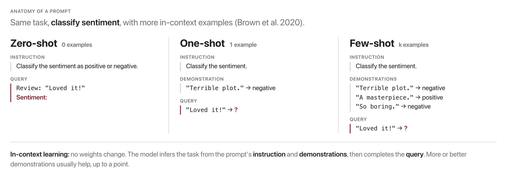
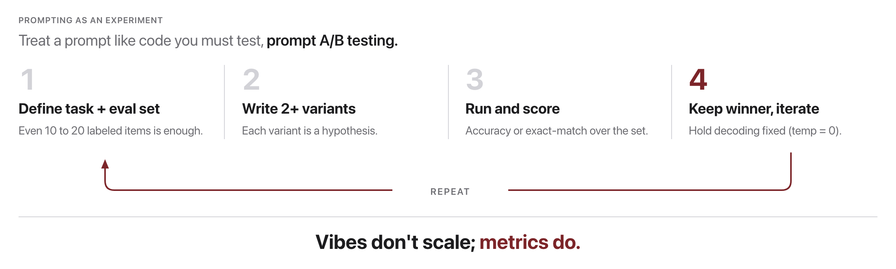

# W10C1 Lab: Systematic Prompt Experiments ("Prompt Golf")

Stop tuning prompts by vibes. Build a tiny **eval harness** and run controlled
A/B experiments over prompt variants, then play *prompt golf*.

**You will write three functions** in `prompt_lab.py`, one per step, each with its
own check.

## Before you code: the picture and the math





The first figure is exactly what `build_fewshot_prompt` assembles: an **instruction**, then $k$ `Input → Output` **demonstrations**, then the **query** with an output cue that leaves the model nowhere to go but the label. The second figure is `run_experiment`: every variant flows through the same model and parser, so the only thing that can move the score is the prompt text.

The score itself is exact-match **accuracy** over the $N$ labeled examples:

$$\text{accuracy} = \frac{1}{N} \sum_{i=1}^{N} \mathbf{1}[\hat{y}_i = y_i]$$

where $\hat{y}_i$ is the label parsed from the model's reply and $y_i$ is the gold label. Prompt golf is then: minimize prompt tokens subject to accuracy staying at or above the target. **Check yourself before coding:** why must temperature be fixed at 0 before comparing two prompts' accuracies? (Otherwise sampling noise could change $\hat{y}_i$ between runs, so a score difference would not be attributable to the prompt.)

## How this lab works

Each step tells you **what to write**, then exactly **how to check it**. The steps
are sequential: Step 3 uses Steps 1 and 2.

`lab` is a shortcut for the long docker command. Set it up once per
terminal session, using the line for **your** shell:

```
# macOS / Linux (bash, zsh)
alias lab='docker compose -f docker/docker-compose.yml run --rm --no-deps course'

# Windows, PowerShell
function lab { docker compose -f docker/docker-compose.yml run --rm --no-deps course @args }

# Windows, Command Prompt
doskey lab=docker compose -f docker/docker-compose.yml run --rm --no-deps course $*
```

Rather work inside the image? This opens a shell there, and then every
command below runs without its `lab` prefix:

```bash
docker compose -f docker/docker-compose.yml run --rm --no-deps course bash
```

Check **one step**:

```bash
lab python -m pytest weeks/week-10/class-01/exercise/test_prompt_lab.py -k step1 -q
```

Check **everything**:

```bash
lab python -m pytest weeks/week-10/class-01/exercise/test_prompt_lab.py -q
```

Stuck for more than a few minutes? Open `../solutions/WALKTHROUGH.md` at the
matching step. The full reference solution sits in `../solutions/` too. **These
labs are not graded**, so reading them is not cheating: getting unstuck and
finishing the idea beats staring at a blank function.

---

### Step 0, Orientation (nothing to write)

`parse_label` and `StubModel` are already written. Confirm they behave:

```bash
lab python -m pytest weeks/week-10/class-01/exercise/test_prompt_lab.py -k step0 -q
```

```
..                                                                       [100%]
2 passed, 4 deselected
```

```python
>>> import sys; sys.path.insert(0, "weeks/week-10/class-01/exercise")
>>> from prompt_lab import parse_label, DATASET, DEMOS
>>> parse_label("Sentiment: positive")
'positive'
>>> parse_label("It is good, not bad")
'positive'
>>> len(DATASET), len(DEMOS)
(8, 2)
```

**Look at that second line.** "It is good, not bad" is parsed as positive because
`parse_label` takes whichever signal appears **first**. That is a real
limitation of the parser, and it means a model that hedges can be graded on the
wrong word. Keep it in mind when your scores look strange.

---

### Step 1, Accuracy

**Write:** `accuracy(preds, golds)`, exact-match accuracy over two label lists.

**Done when:**

```bash
lab python -m pytest weeks/week-10/class-01/exercise/test_prompt_lab.py -k step1 -q
```

```
..                                                                       [100%]
2 passed, 4 deselected
```

---

### Step 2, Build a few-shot prompt

**Write:** `build_fewshot_prompt(instruction, demos, query)`. Assemble the
instruction, then each demo as `Review: ...` / `Sentiment: ...`, then the query
and a trailing `Sentiment:` cue.

**The prompt must end with `Sentiment:` and nothing after it.** That trailing cue
is what leaves the model nowhere to go but the label, and the test asserts it
explicitly. It is also the single most common thing to forget.

**Done when:**

```bash
lab python -m pytest weeks/week-10/class-01/exercise/test_prompt_lab.py -k step2 -q
```

```
.                                                                        [100%]
1 passed, 5 deselected
```

---

### Step 3, Run the experiment

**Write:** `run_experiment(model, prompt_fn, dataset, demos)`. Build a prompt per
item, query the model, parse each reply with `parse_label`, and return
`(predictions, accuracy)`.

**Done when:**

```bash
lab python -m pytest weeks/week-10/class-01/exercise/test_prompt_lab.py -k step3 -q
```

```
.                                                                        [100%]
1 passed, 5 deselected
```

---

### Step 4, Run it against a real model

```bash
lab python -m pytest weeks/week-10/class-01/exercise/test_prompt_lab.py -q
```

```
......                                                                   [100%]
6 passed
```

Then, with Ollama running:

```bash
docker compose -f docker/docker-compose.yml run --rm course python weeks/week-10/class-01/exercise/prompt_lab.py
```

**Par, what the code you are handed already scores** (qwen2.5:0.5b, temperature 0):

| Prompt you are given | Words | Accuracy |
|----------------------|------:|---------:|
| zero-shot            |    17 |      88% |
| few-shot, 2 demos    |    30 |      50% |

Yes, the few-shot prompt scores **worse** than no demonstrations at all. Figuring
out why is the exercise.

> Debugging hint: print the model's **raw reply**, not just the score. The
> baseline's failure is obvious the moment you look at what it actually returns.

## In-class activity: Prompt Golf Arena (team vs team)

Kicked off at the end of Class 1 and finished as take-home alongside HW5, on a
shared class leaderboard. Standings settle at the start of Class 2.

- Form **teams of 3 to 4**. Everyone fixes decoding (temperature 0, same seed/stops).
- Get to **100%** on the shared eval set, then **golf it**: cut every word that
  does not change the score.
- Post your best **(words, accuracy)** to the leaderboard. You only score at 100%.
- Beat a rival team and you take their slot. **Fewest words at 100% wins.**
- Wrap-up: the winning team reads their prompt aloud; discuss what they cut and why.

## Stretch goals

- Add a **reworded** instruction variant; does phrasing alone move the score?
- Shuffle demonstration **order**; how stable is accuracy?
- Report **word count** per prompt and find the shortest variant that ties the best.

A full reference solution is in `../solutions/prompt_lab.py`, and the
step-by-step explanation is in `../solutions/WALKTHROUGH.md` (don't peek until
you've tried).
