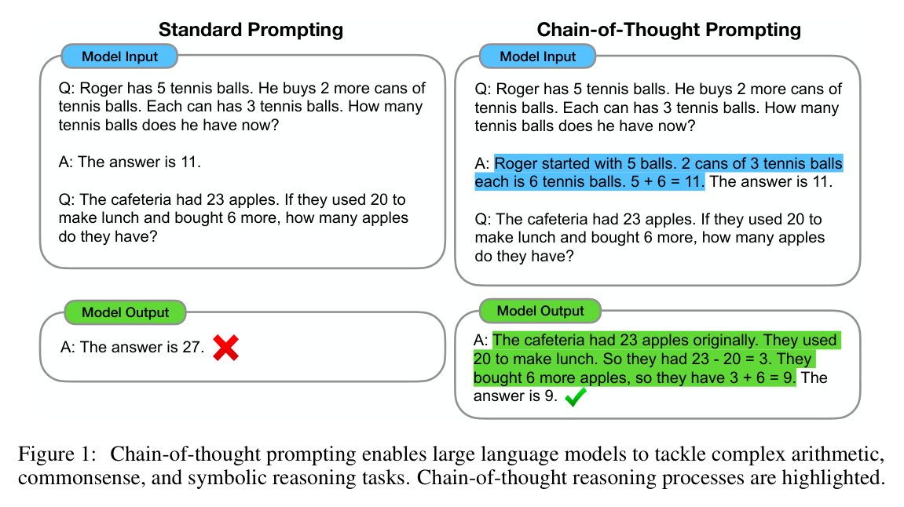
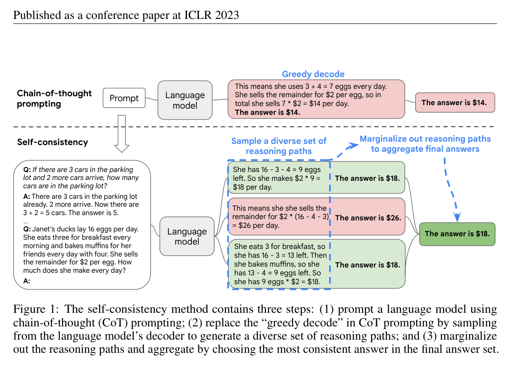

# W10C2 Lab: Chain-of-Thought vs. Direct Prompting

Does "show your work" actually help? Build the harness and **measure** it on a
small set of multi-step brain-teasers with known answers.

## Before you code: the picture and the math


*Wei et al. 2022 (arXiv:2201.11903), Fig. 1.*


*Wang et al. 2022 (arXiv:2203.11171), Fig. 1.*

The first figure is the whole experiment: the two prompts differ only in
whether a worked step-by-step solution precedes the query, and your harness
measures how much that changes exact-match accuracy over the $N$ problems:

$$\text{accuracy} = \frac{1}{N} \sum_{i=1}^{N} \mathbf{1}[\hat{a}_i = a_i]$$

where $\hat{a}_i$ is the **last integer** your `extract_answer` pulls from the
reply and $a_i$ is the known answer. The second figure is the stretch goal,
implemented by `majority_vote` over $n$ sampled chains' answers
$\hat{a}^{(1)}, \dots, \hat{a}^{(n)}$:

$$\hat{a} = \arg\max_{a} \sum_{j=1}^{n} \mathbf{1}[\hat{a}^{(j)} = a]$$

So the finished code grades only the final number of each reply, never the
prose of the chain, and reports one accuracy per prompting strategy.
**Check yourself before coding:** in the self-consistency figure, greedy
decoding answers \$14 while the three sampled chains end in \$18, \$26, \$18,
so what does the vote return and why? (\$18, because two of the three sampled
chains agree on it, so the stray \$26 path is outvoted.)

## In-class activity: Predict, then Verify (whiteboard think-pair-share, pairs, ~25 min)
In class this is run as a **whiteboard, think-pair-share** activity. Coding is the
short **verification step** at the end, not the whole period.
1. **Hand-write (~10 min, no laptops):** on the whiteboard, write a step-by-step
   CoT trace for **these two problems**, then draw a **decomposition tree** for
   the harder one (B). They are `WARM_UP` and `HARDER` in `cot_lab.py`:

   > **A (warm-up).** A cafe had 23 muffins, sold 17, then baked 12 more. How many now?
   >
   > **B (harder).** There are 4 nests with 3 eggs each. 2 eggs hatch. How many unhatched eggs?

   B is the one worth arguing about: the question asks for the **unhatched** eggs,
   so the last step is a subtraction from a product, and both 12 and 2 appear in
   the problem as tempting wrong answers.
2. **Predict:** for each problem, predict whether CoT will beat a direct answer,
   and **write down why**. Pair up and defend your call before any code runs.
3. **Verify (~10 min coding):** run the harness below (direct vs CoT). Did the
   scores match your prediction? Where were you surprised?
4. **Share out:** each pair reports one prediction that was right and one wrong.
   Remember: a fluent chain can still reach a wrong answer, grade the **final
   number**, not the prose.

> Note: the mid-semester checkpoint peer-review round runs in **Class 1** this
> week, so this session's activity has its full slot.

The harness and tasks below power the verification step (and stand alone as a
take-home lab).

## How this lab works

Each step tells you **what to write**, then exactly **how to check it**. Steps 1
and 2 are independent; Step 3 needs Step 1.

Set a shortcut for the long docker command first:

```bash
alias lab='docker compose -f docker/docker-compose.yml run --rm --no-deps course'
```

Check **one step**:

```bash
lab python -m pytest weeks/week-10/class-02/exercise/test_cot_lab.py -k step1 -q
```

Check **everything**:

```bash
lab python -m pytest weeks/week-10/class-02/exercise/test_cot_lab.py -q
```

Stuck for more than a few minutes? Open the walkthrough released after class at the
matching step.

---

### Step 0, Orientation (nothing to write)

`StubModel`, `direct_prompt` and `cot_prompt` are already written. Confirm the
stub is deterministic:

```bash
lab python -m pytest weeks/week-10/class-02/exercise/test_cot_lab.py -k step0 -q
```

```
.                                                                        [100%]
1 passed, 3 deselected
```

Read the two prompt builders and note the only difference: `cot_prompt` adds
"Reason step by step, then end with 'The answer is N.'". That one clause is the
entire intervention this lab measures.

---

### Step 1, Extract the answer

**Write:** `extract_answer(text)`, returning the **last** integer in the text, or
None.

`re.findall(r"-?\d+", text)` then take `[-1]`.

**Why the last, not the first.** A CoT reply walks through intermediate numbers
("23 minus 17 is 6, then 6 plus 12 is 18") and the final answer comes last.
Taking the first would grade the model on its first arithmetic step.

**Done when:**

```bash
lab python -m pytest weeks/week-10/class-02/exercise/test_cot_lab.py -k step1 -q
```

```
.                                                                        [100%]
1 passed, 3 deselected
```

**Check it by hand:**

```python
>>> import sys; sys.path.insert(0, "weeks/week-10/class-02/exercise")
>>> from cot_lab import extract_answer
>>> extract_answer("23 - 17 = 6, then 6 + 12 = 18. The answer is 18.")
18
>>> extract_answer("no numbers here") is None
True
```

---

### Step 2, Majority vote

**Write:** `majority_vote(answers)`, the most common value, ties broken by the
**smallest** value. Ignore `None` entries; return None if all are None.

**Done when:**

```bash
lab python -m pytest weeks/week-10/class-02/exercise/test_cot_lab.py -k step2 -q
```

```
.                                                                        [100%]
1 passed, 3 deselected
```

**Why it matters:** this is self-consistency (Wang et al. 2022). Sample several
chains at temperature > 0 and keep the answer they agree on. It is the stretch
goal below, and the reason it works is that wrong chains tend to be wrong in
*different* ways while correct chains agree.

---

### Step 3, Evaluate

**Write:** `evaluate(model, prompt_fn, dataset)`. Build a prompt per item with
`prompt_fn(question)`, query the model, extract the integer, and return
exact-match accuracy.

**Grade the final number, never the prose.** A fluent chain that reaches the
wrong answer is wrong, and this is the line of code that enforces it.

**Done when:**

```bash
lab python -m pytest weeks/week-10/class-02/exercise/test_cot_lab.py -k step3 -q
```

```
.                                                                        [100%]
1 passed, 3 deselected
```

---

### Step 4, Run the comparison

```bash
lab python -m pytest weeks/week-10/class-02/exercise/test_cot_lab.py -q
```

```
....                                                                     [100%]
4 passed
```

Then against a real model:

```bash
docker compose -f docker/docker-compose.yml run --rm course \
    python weeks/week-10/class-02/exercise/cot_lab.py
```

```
[model] using Ollama model 'qwen2.5:0.5b'

prompt style      accuracy
--------------------------
direct                33%
chain-of-thought     100%
```

**Compare that against your whiteboard predictions.** Direct prompting gets 2 of
6; adding "reason step by step" gets all 6. The model did not become smarter, and
no weights changed. It was given room to compute intermediate values instead of
having to produce the answer in one step.

Be careful about what this does *not* show. Six problems is a tiny sample, and
these are arithmetic word problems, the case where CoT helps most. The lecture's
"when NOT to use CoT" slide is the other half, and Wei et al. found the benefit
only appears at sufficient model scale.

## The idea
- A tiny dataset of word problems, each with a numeric answer.
- A **direct** prompt ("just give the number") vs. a **chain-of-thought** prompt
  ("reason step by step, then give the number").
- Parse the final number from each reply and compute exact-match accuracy.
- **Stretch:** self-consistency, sample N chains and take a majority vote.

**Offline-safe:** with no Ollama, a deterministic **stub model** stands in. The
stub even simulates the CoT effect (it "reasons" correctly only when asked to),
so the pipeline and the metric run and are testable without a network.

## Stretch goals
- Implement self-consistency: sample N CoT chains (temperature > 0), vote.
- Try **zero-shot CoT**: append "Let's think step by step." to a direct prompt.
- Report where CoT *fails*, are the wrong chains fluent but mistaken?

A full reference solution is in the material released after class, and the step-by-step
explanation is in the walkthrough released after class (don't peek until you've tried).
