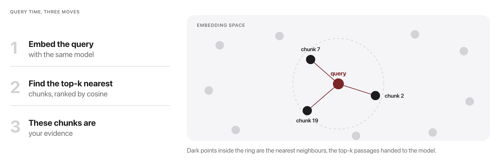
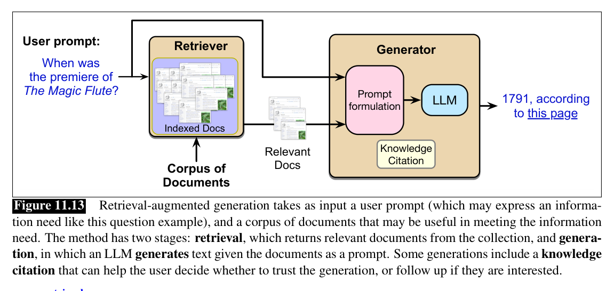

# W11C2 Lab: Retrieval-Augmented Generation

## 1. Learning objective

Build a RAG pipeline end to end: index a corpus, retrieve the chunks a question
needs, and write the prompt that forces the model to answer from them and cite
what it used.

You write two things in `rag.py`: the retriever's search, and the grounded
prompt. Chunking, citation checking and the generators are given.

## 2. Getting started

From the repository root on your own machine, once per session:

```bash
docker compose -f docker/docker-compose.yml run --rm --no-deps -w /workspace/weeks/week-11/class-02/exercise course bash
```

A step you have not written yet reports `skipped`, not a failure. If you get
stuck, `../solutions/WALKTHROUGH.md` works out every step, and these labs are
not graded.

## 3. Implement `TfidfRetriever.retrieve`



The index is TF-IDF, exactly as in W3C1:

$$w_{t,d} = \mathrm{tf}_{t,d} \times \log\!\frac{N}{\mathrm{df}_t}$$

and chunks are ranked against the query by cosine, which is why the query must
be transformed with the vectorizer already fitted on the corpus:

$$\mathrm{score}(q, c) = \cos(\mathbf{q}, \mathbf{c}) = \frac{\mathbf{q} \cdot \mathbf{c}}{\lVert\mathbf{q}\rVert\,\lVert\mathbf{c}\rVert}.$$

Transform the query with the fitted vectorizer, score it against every chunk,
and return the k best.

```bash
pytest -k step1 -q
```

```
..                                                                       [100%]
2 passed, 5 deselected
```

## 4. Implement `build_prompt`



The prompt is the join: it is where the retrieved chunks stop being search
results and become the only evidence the generator is allowed to use.

Number the chunks, demand citations, and give the model permission to say it
does not know.

```bash
pytest -k step2 -q
```

```
.                                                                        [100%]
1 passed, 6 deselected
```

## 5. Run it, then question it

```bash
python rag.py
```

```
Q: What does chain-of-thought prompting add?
  retrieved: ['week10-prompting.md', 'week11-rag.md', 'week11-rag.md']
  answer: Chain-of-thought prompting adds intermediate reasoning steps ...
  valid citations: []

Q: What does temperature do during decoding?
  retrieved: ['week07-decoding.md', 'week11-rag.md', 'week11-rag.md']
  answer: I don't know.
  valid citations: []
```

Two failures are visible in that output, and neither is a crash.

1. The last question retrieved the RIGHT document, `week07-decoding.md`, ranked
   first, and the model still answered "I don't know." Retrieval succeeded and
   the pipeline failed anyway. Which component is at fault, and how would you
   prove it rather than guess?
2. `valid citations: []` on every question, including the ones answered
   correctly. Your prompt asked for citations. Is this a prompt problem, a
   model-capability problem, or a parsing problem? Design the smallest test
   that distinguishes them.
3. Ask something the corpus cannot answer: `"What is the capital of France?"`.
   The retriever still returns three chunks, all irrelevant, because cosine
   always ranks something first. What would you add to the pipeline to catch
   this before the generator sees it?
4. Change `k` from 3 to 1 for the temperature question. The single retrieved
   chunk is now exactly the right one. Does a smaller k help or hurt here, and
   what does that suggest about tuning k in general?
