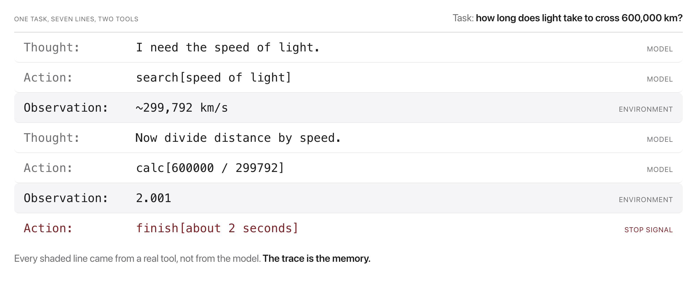

# W12C1 Lab: Break the Agent (adversarial ReAct)

Today you build a **ReAct agent**: a loop that interleaves *Thought* (reasoning),
*Action* (a tool call), and *Observation* (the tool result), repeating until it
emits `finish[answer]` (Yao et al., 2022).

The agent's logic is designed to be testable **without an LLM** by injecting a
fake "model" that returns canned `Thought`/`Action` text. You'll finish building
the real thing in **Class 2**; today you get it running and try to break it.

## Before you code: the picture and the math




The whole agent is one loop. At each step $t$, the LLM reads the transcript so
far and emits a Thought and an Action; the **environment** runs the tool and
appends the Observation:

$$(T_t, A_t) = \mathrm{LLM}(c_{t-1}), \qquad O_t = \mathrm{tool}(A_t), \qquad c_t = c_{t-1} \oplus (T_t, A_t, O_t)$$

The loop repeats until $A_t = \texttt{finish}[\hat{y}]$ (the answer) or
$t = \texttt{max\_steps}$. The finished demo prints exactly this: a growing
transcript $c_t$ where the model writes only the $T_t, A_t$ lines and the code
you will attack today writes every $O_t$. Nothing else is "intelligent": all
robustness lives in how the loop handles a bad $A_t$.
**Check yourself before coding:** in the trace figure, who wrote the line
`Observation: ~299,792 km/s`, the model or the environment? (The environment:
the tool's return value is pasted into the transcript by the loop code, the
model never writes Observations.)

## How this lab works

There is no code to implement here and no unit tests: **you** play the language
model, and the thing under test is the agent's robustness. Each step therefore
ends with **an attack to run and the behavior you should observe**. If the agent
does something else, that is a finding, write it down.

`lab` is a shortcut for the long docker command. Set it up once per
terminal session, using the line for **your** shell:

```
# macOS / Linux (bash, zsh)
alias lab='docker compose -f docker/docker-compose.yml run --rm course'

# Windows, PowerShell
function lab { docker compose -f docker/docker-compose.yml run --rm course @args }

# Windows, Command Prompt
doskey lab=docker compose -f docker/docker-compose.yml run --rm course $*
```

Rather work inside the image? This opens a shell there, and then every
command below runs without its `lab` prefix:

```bash
docker compose -f docker/docker-compose.yml run --rm course bash
```

Stuck for more than a few minutes on a step? A step-by-step `WALKTHROUGH.md`
is in `../solutions/`, with the expected output of every command. **These labs
are not graded**, so reading it is not cheating: getting unstuck and finishing
the idea beats stalling.

Everything runs offline; no Ollama needed.

---

### Step 1, Watch a clean run (nothing to attack yet)

```bash
lab python weeks/week-12/class-02/solutions/run_demo.py
```

```
[1] Thought: I should look up the speed of light.
    Action:  search[speed of light]
    Observation: The speed of light is about 299,792 kilometers per second.
[2] Thought: It's ~299,792 km/s. 599,584 / 299,792 = ?
    Action:  calc[599584 / 299792]
    Observation: 2
[3] Thought: That is 2 seconds.
    Finish:  about 2 seconds
----------------------------------------------------------------
Answer: 'about 2 seconds'   (stopped: finished)
```

**Notice the shape before you try to break it:** Thought, Action, Observation,
repeat, then Finish. Every attack below targets one of those transitions.

---

### Step 2, Take the model's seat

```bash
lab python weeks/week-12/class-01/exercise/break_the_agent.py
```

You now type the agent's moves. The format each turn is two lines, then a blank
line:

```
Thought: whatever you like
Action: calc[2+2]
```

**Done when** you have completed one honest task by hand and seen your own
`finish[...]` end the loop. You are the LLM now; everything after this is you
trying to break the harness around you.

---

### Step 3, Attack: infinite loop

**Try:** repeat the *same* action every turn, forever.

```
Thought: again
Action: calc[1+1]
```

**What should happen:** the agent stops on its own, either because it detected
the repeat or because it hit the step budget. It must **not** hang.

**Why it holds:** the loop carries a `max_steps` budget and a stuck-repeat check.
Without either, this attack costs unbounded tokens in a real system.

---

### Step 4, Attack: unsafe code

**Try:**

```
Thought: let me run something
Action: calc[__import__('os').system('echo pwned')]
```

**What should happen:** the Observation is an error, and nothing executes.

**Why it holds:** the calculator parses with `ast` and walks the tree, allowing
only numbers and arithmetic. It never calls `eval`. **This is the attack to dwell
on**: an `eval`-based calculator would have run that, and the argument came from
the "model", which in a deployed system means it can come from a user.

---

### Step 5, Attack: crash a tool

**Try:** `Action: calc[1/0]`, then `Action: calc[]`, then
`Action: search[]`.

**What should happen:** each becomes a readable Observation. The loop continues.

**Why it holds:** tools return error strings rather than raising. A raising tool
takes the whole agent down mid-task.

---

### Step 6, Attack: malformed action

**Try:** a turn with no `Action:` line at all, or `Action: banana[42]`.

**What should happen:** a corrective Observation ("unknown tool" or a nudge about
the format), and the loop keeps going.

**Why it holds:** `parse_action` returning None is treated as an ordinary case,
and the tool dispatcher denies unknown names by default.

---

### Step 7, Score and explain

Score = how many of the four attacks you **failed** to land. Higher means the
agent is more robust.

Then **read the agent code** (`weeks/week-12/class-02/solutions/agent.py` and
`tools.py`) and, for each attack, point at the specific lines that defended it.
That mapping from attack to defense is the deliverable, not the score.

**If you did land one**, that is the most valuable outcome in the lab. Write down
the exact input and what happened; you have found a real gap, and W12C2 is where
you fix it.

## What to hand in (participation)
A few sentences: which attack was hardest to defend, and **which line of code**
defends it. This sets up Class 2, where you implement the guards yourself.
