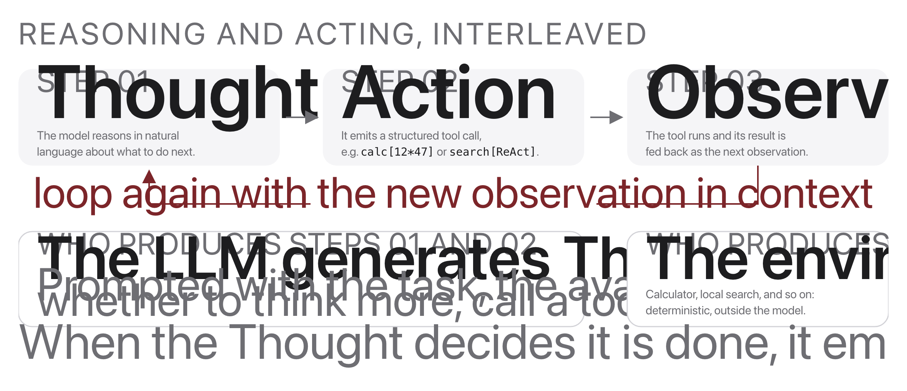
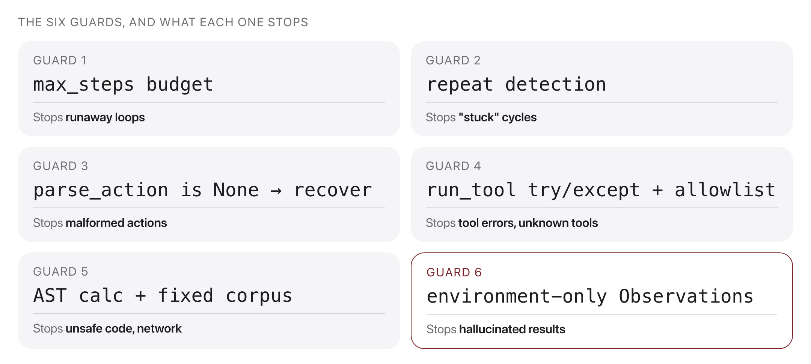

# W12C2 Lab: Build a Robust ReAct Agent

## 1. Learning objective

Finish the agent from last class and make it survive contact with a real model:
give it working tools, parse its actions without losing half the input, and
refuse answers it made up.

You write four things: `calculator` and the `TOOLS` registry in `tools.py`,
then `parse_action` and `is_grounded` in `agent.py`. The loop, the other three
tools and the guards are given.

## 2. Getting started

From the repository root on your own machine, once per session:

```bash
docker compose -f docker/docker-compose.yml run --rm --no-deps -w /workspace/weeks/week-12/class-02/exercise course bash
```

A step you have not written yet reports `skipped`, not a failure. If you get
stuck, `../solutions/WALKTHROUGH.md` works out every step, and these labs are
not graded.

## 3. Implement `calculator`



The loop is unchanged from W12C1: the model writes a Thought and an Action, the
environment runs the tool and writes the Observation, and the transcript grows
until the model calls `finish`. This step is the tool the environment runs.

Evaluate arithmetic with the given `_eval_node`, never `eval`. Every failure
returns an error STRING; raising would kill the loop.

```bash
pytest -k step1 -q
```

```
...                                                                      [100%]
3 passed, 20 deselected
```

## 4. Implement the `TOOLS` registry

Map each of the four tool names to its function. The prompt is built from this
dict, so an unregistered tool is one the model is never told about.

```bash
pytest -k step2 -q
```

```
...                                                                      [100%]
3 passed, 20 deselected
```

## 5. Implement `parse_action`

Count bracket depth so nested expressions survive intact.

```bash
pytest -k step3 -q
```

```
...                                                                      [100%]
3 passed, 20 deselected
```

## 6. Implement `is_grounded`

Accept only numbers that appeared in some observation.

```bash
pytest -k step4 -q
```

```
..                                                                       [100%]
2 passed, 21 deselected
```

## 7. Run it, then break it



Everything that makes this robust lives outside the model: a tool that returns
an error string instead of raising, a parser that survives nested brackets, a
repeat detector, a step budget, and a grounding check that rejects numbers no
tool ever produced.

```bash
python ../solutions/run_demo.py
```

```
WITHOUT TOOLS (the model answers from memory)
  What is log(3^2 * 16 - 10)?
    10
  What is today's date?
    2023-11-05

WITH TOOLS
  What is log(3^2 * 16 - 10)?
    calc[log(3^2 * 16 - 10)] -> 4.897839799950911
    finish[4.897839799950911]

A QUESTION THAT NEEDS THREE TOOL CALLS
  How much hotter is it today than yesterday in San Antonio?
    weather[san antonio, today] -> 101.0
    weather[san antonio, yesterday] -> 94.0
    weather[san antonio, today] -> 101.0
    weather[san antonio, today] -> Error: repeated action; stopping.
    stopped: stuck+fellback
```

Without tools the model says the date is 2023-11-05. With tools it is right.
Then the third question fails.

1. Read that failure carefully. The agent fetched 101.0 and 94.0, had both
   numbers it needed, and then asked for today's weather again instead of
   subtracting. Which guard caught it, and what would have happened without
   that guard?
2. Drop the depth counting. Make `parse_action` stop at the first closing
   bracket. `calc[log(3^2 * 16 - 10)]` now evaluates a truncated expression and
   the agent still finishes, with a wrong number and no error. Why is a silent
   wrong answer worse than a crash here?
3. Turn off grounding. Make `is_grounded` always return True, then ask a
   question with no tool that can answer it. What does the agent now report,
   and what did the check actually buy you?
4. Register only three tools, leaving `search` out of `TOOLS`. The model is
   never told it exists. Ask a question that needs it and watch what the agent
   does instead of failing cleanly.
