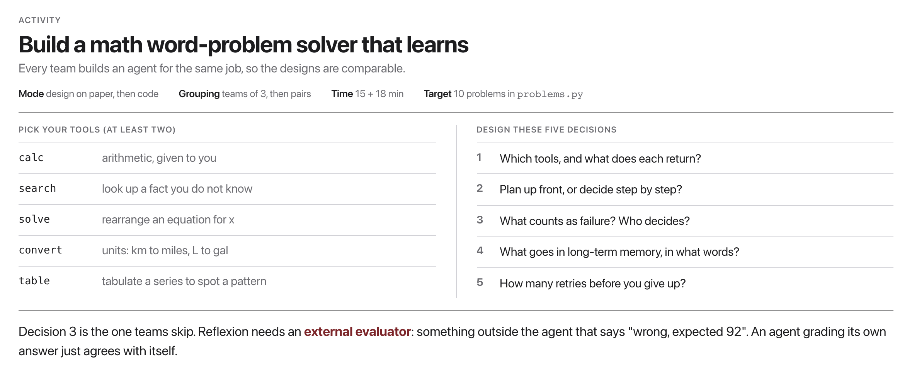

# W13C1 Lab: Design It, Then Build It (Memory, Planning & Reflexion)

Your W12 agent could *act*. Now make it *learn within a task*: plan first,
remember lessons, and **reflect on failures to retry better** (Reflexion,
Shinn et al., 2023). Everything is tested with a **mock LLM**, no Ollama.

## Before you code: the picture and the math


The flowchart is *exactly* `run_reflexion_agent`: `plan → attempt → (reflect → retry)*`. In the paper's diagram, the Actor is your `react_attempt`, the Evaluator is the `success()` check, and the "Reflective text" flowing into long-term memory is what `Memory.add()` stores. Formally, starting from empty memory $m_0 = \varnothing$, attempt $i$ is

$$\tau_i = \mathrm{ReAct}(\text{task} \mid \text{plan},\ m_{i-1}), \qquad m_i = m_{i-1} \cup \{\ \mathrm{reflect}(\text{task}, \tau_i)\ \}$$

and the loop stops as soon as $\mathrm{success}(\tau_i)$ is true, or after `max_attempts` tries (about 3). Your finished code runs one ReAct attempt per iteration, and on each failure appends one reflection note to memory so the *next* prompt contains the lesson. **Check yourself before coding:** in the flowchart, which event causes `memory.add(reflect)` to fire? (The `success?` check answering **no**: a failed attempt, and only then.)

## In-class activity: build a math word-problem solver (~37 min)

Everyone builds an agent for the **same job**, so the designs are comparable:
an agent that solves written maths problems and **gets better as it goes**.
Build the code in class; this is not a take-home lab.



**Phase 1, design on paper (teams of 3, ~15 min).** No code yet. Decide:

1. **Which tools**, and what does each return? At least two, from:
   `calc` (given), `search` (given), `solve` (rearrange an equation for x),
   `convert` (units), `table` (tabulate a series to spot a pattern).
2. **Plan up front, or step by step?**
3. **What counts as failure, and who decides?**
4. **What goes into long-term memory**, in what exact words?
5. **How many retries** before you give up?

Decision 3 is the one teams skip, and it is the one Reflexion is actually about.
The paper's agent does not grade itself: an **external evaluator** tells it
*"wrong, expected 92"*. An agent that marks its own homework agrees with itself
every time. In this lab that evaluator is `evaluate()` in `problems.py`, and its
message is what your reflection gets written from.

**Phase 2, build in pairs (~18 min).** Implement the loop you drew (Steps 1-5
below), then run it against the ten problems and compare your code to your
design: where did they differ, and which difference mattered?

## The ten problems

`problems.py` holds ten word problems with known answers. Nine need `calc`;
P7 needs `search` first, because the agent cannot know the population of Paris.

| | Problem | Answer | Needs |
|---|---|---|---|
| P1 | 23 students, 4 pencils each | 92 | calc |
| P2 | area of a 14 by 9 garden | 126 | calc |
| P3 | 240 km in 3 hours, speed | 80 | calc |
| P4 | 7 books at 12.50 | 87.5 | calc |
| P5 | 15% tip on 64 | 9.6 | calc |
| P6 | 450 L tank, two fifths full | 180 | calc |
| P7 | population of the capital of France, doubled | 4200000 | search + calc |
| P8 | square root of 1764 | 42 | calc |
| P9 | 1000 at 5% compound, 3 years | 1157.625 | calc |
| P10 | 8 L per 100 km, over 350 km | 28 | calc |

**The experiment.** `run_suite` works through all ten keeping ONE memory, so a
lesson written on P1 is still in the prompt at P8. Run it both ways:

```bash
docker compose -f docker/docker-compose.yml run --rm --no-deps -e OLLAMA_HOST=http://host.docker.internal:11434 course python weeks/week-13/class-01/solutions/run_suite.py
```

Real output, `qwen2.5:1.5b`:

```
A. memory RESET between problems
  solved on the FIRST attempt : 0/10
  solved within 2 attempts    : 4/10
  first-attempt timeline      : P1: . P2: . P3: . P4: . P5: . P6: . P7: . P8: . P9: . P10: .

B. memory CARRIED across problems (long-term memory)
  solved on the FIRST attempt : 5/10
  solved within 2 attempts    : 7/10
  first-attempt timeline      : P1: . P2:OK P4:OK P5:OK P6:OK P8:OK
```

Same model, same tools, same problems. The only difference is whether the agent
keeps its notes. **P1 always fails**, because memory is empty when it starts; the
lesson it writes there ("call calc for every arithmetic step instead of doing it
in my head") is what P2 onwards get for free.

Two things worth arguing about afterwards:

- It is still only 5/10. Look at which problems fail (P3, P7, P9, P10) and say
  what lesson *would* have helped. Reflexion improves an agent; it does not fix it.
- Try replacing the evaluator's message in `problems.py` with a bare `"wrong"`
  and rerun. A vaguer signal produces a vaguer lesson, and the gain shrinks.

## How this lab works

Each step tells you **what to write**, then exactly **how to check it**. Steps 1
to 3 add the pieces; Step 4 is the loop that uses them.

`lab` is a shortcut for the long docker command. Set it up once per
terminal session, using the line for **your** shell:

```
# macOS / Linux (bash, zsh)
alias lab='docker compose -f docker/docker-compose.yml run --rm --no-deps course'

# Windows, PowerShell
function lab { docker compose -f docker/docker-compose.yml run --rm --no-deps course @args }

# Windows, Command Prompt
doskey lab=docker compose -f docker/docker-compose.yml run --rm --no-deps course $*
```

Rather work inside the image? This opens a shell there, and then every
command below runs without its `lab` prefix:

```bash
docker compose -f docker/docker-compose.yml run --rm --no-deps course bash
```

```bash
lab python -m pytest weeks/week-13/class-01/exercise/test_agent.py -k step1 -q
```

Stuck for more than a few minutes? Open `../solutions/WALKTHROUGH.md` at the
matching step. The full reference solution sits in `../solutions/` too. **These
labs are not graded**, so reading them is not cheating: getting unstuck and
finishing the idea beats staring at a blank function.

---

### Step 1, Memory

**Write:** `Memory.add` (append a note) and `Memory.as_prompt` (return `""` when
empty, otherwise a "Lessons from previous attempts:" block with one bullet per
note).

**The empty case must return an empty string**, not a header with nothing under
it. An empty "Lessons:" heading in the prompt is worse than no heading, because
it invites the model to invent lessons.

**Done when:** `-k step1` gives `2 passed, 7 deselected`.

---

### Step 2, Planner

**Write:** `make_plan`. If `planner` is None, return `""`. Otherwise prompt it for
2 to 4 numbered steps and return them.

**`None` must be handled**, and there is a test for it: a planner is optional,
and an agent without one must still run.

**Done when:** `-k step2` gives `1 passed, 8 deselected`.

---

### Step 3, Put them in the prompt

**Write:** the prompt assembly. If `plan` is non-empty, append a `Plan:` block;
then append `memory.as_prompt()`.

**Done when:** `-k step3` gives `2 passed, 7 deselected`.

**This step is where memory and planning actually do something.** Until the text
lands in the prompt, both are just data structures. That is the honest mechanism
behind "agent memory": it is string concatenation into the context window.

---

### Step 4, The Reflexion loop

**Write:** the outer retry loop. Attempt the task; if it fails, ask the reflector
what went wrong, store that note in memory, and try again, up to `max_attempts`.

Four tests, one per behavior:

| Test | Behavior |
|---|---|
| `succeeds_first_try_no_extra_attempts` | do not retry on success |
| `recovers_after_failure` | the reflection actually helps |
| `gives_up_after_max_attempts` | bounded, never infinite |
| `reflector_callable_is_used` | you call the reflector, not a canned string |

**Done when:** `-k step4` gives `4 passed, 5 deselected`.

---

### Step 5, Run it

```bash
lab python -m pytest weeks/week-13/class-01/exercise/test_agent.py -q
```

```
.........                                                                [100%]
9 passed
```

Then the demo, and read the second attempt's prompt: the lesson from attempt 1
is sitting in it. That is Reflexion (Shinn et al. 2023) in one screen, and note
what it is **not**: no weights changed. The "learning" is a note in the context
window that disappears when the process exits.

## Stretch goals
- Cap memory at the **last K** reflections (don't let the prompt grow forever).
- Add a *planning-revision* step: re-plan after the first failed attempt.
- Make `reflect` quote the specific wrong Observation it should avoid repeating.
- Add one of the unbuilt tools from the activity menu (`solve`, `convert`,
  `table`) and write two new problems that need it.
- Cap the carried memory at the last 3 lessons and rerun `run_suite.py`. Does
  first-attempt success drop? Which lesson was carrying the run?

A reference solution is in `../solutions/` (don't peek until you've tried!).
