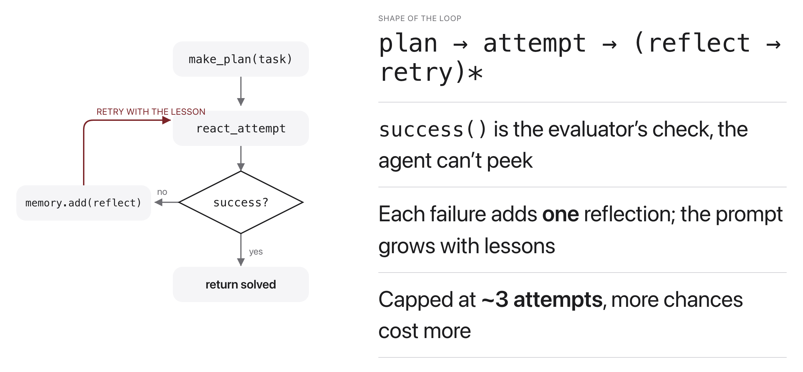
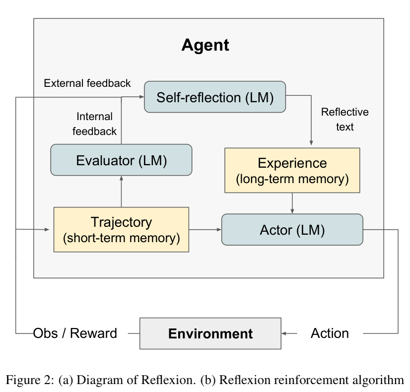

# W13C1 Lab: Reflexion, an Agent That Learns

## 1. Learning objective

Give an agent a second chance: when an attempt fails, have it write down what
went wrong and put that note in the prompt for the next try. Then see whether
carrying those notes ACROSS problems helps too.

You write three functions in `agent.py`: the planner, the self-critique, and
the retry loop. Memory, the ReAct attempt and the tools are given.

## 2. Understanding the math



Each attempt is an ordinary ReAct run, but conditioned on a plan and on
everything memory has accumulated. A failed attempt is turned into a note and
appended, so attempt $i+1$ sees what attempt $i$ learned:

$$\tau_i = \mathrm{ReAct}(\text{task} \mid \text{plan},\ m_{i-1}), \qquad m_i = m_{i-1} \cup \{\ \mathrm{reflect}(\text{task}, \tau_i)\ \}$$



The success check is the EVALUATOR's, not the agent's. The agent never sees it,
which is what stops it from simply declaring victory.

## 3. Getting started

From the repository root on your own machine, once per session:

```bash
docker compose -f docker/docker-compose.yml run --rm --no-deps -w /workspace/weeks/week-13/class-01/exercise course bash
```

A step you have not written yet reports `skipped`, not a failure. If you get
stuck, `../solutions/WALKTHROUGH.md` works out every step, and these labs are
not graded.

## 4. Implement `make_plan`

Ask for a few numbered steps. No planner means an empty plan, not an error.

```bash
pytest -k step1 -q
```

```
.                                                                        [100%]
1 passed, 9 deselected
```

## 5. Implement `reflect`

Turn a failed trace into one or two sentences of advice. The no-model fallback
is already written; you add the branch that uses a reflector.

```bash
pytest -k step2 -q
```

```
.                                                                        [100%]
1 passed, 9 deselected
```

## 6. Implement `run_reflexion_agent`

Attempt, check with the evaluator's oracle, and on failure write a reflection
into memory BEFORE trying again.

```bash
pytest -k step3 -q
```

```
...                                                                      [100%]
3 passed, 7 deselected
```

## 7. Run it, then question it

```bash
python ../solutions/run_suite.py
```

```
model: qwen2.5:1.5b   problems: 10

A. memory RESET between problems (reflection helps within a problem only)
  solved on the FIRST attempt : 0/10
  solved within 2 attempts    : 1/10
  first-attempt timeline      : P1: . P2: . P3: . P4: . P5: . P6: . P7: . P8: . P9: . P10: .

B. memory CARRIED across problems (long-term memory)
  solved on the FIRST attempt : 3/10
  solved within 2 attempts    : 5/10
  first-attempt timeline      : P1: . P2: . P3: . P4:OK P5:OK P6:OK P7: . P8: . P9: . P10: .
```

Everything is at temperature 0, so those numbers repeat exactly. The only
difference between A and B is whether an earlier lesson is still in the prompt.

1. Read run B's timeline. Nothing is solved first-try until P4, then P4, P5 and
   P6 all are, then it stops again at P7. What could make a lesson help three
   problems and then stop helping?
2. Move the reflection to AFTER the next attempt starts, instead of before.
   The retry now sees an empty memory. Does the agent still improve, and what
   does that tell you about which part of Reflexion is doing the work?
3. Let the agent see `success_check`. Pass it in as a tool and watch what
   happens to the reported success rate. Explain why the evaluator's oracle
   must stay outside the agent.
4. Run A solved 1/10 within two attempts and B solved 5/10. Both used the same
   model and the same number of attempts per problem. Name the cost of B that
   this table does not show.
