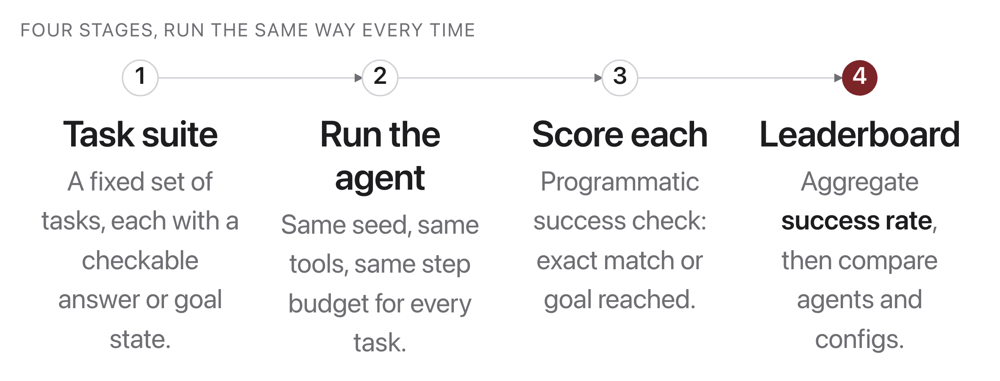

# W13C2 Lab: Evaluate four agents on a real benchmark

Today you do not build an agent. **Five are given to you, fully working**, and
your job is the harder one: decide which is best, and be able to defend it.

```
Naive              one call, "just give me the number"
CoT                one call, "let's think step by step"
Reflexion+CoT      CoT, plus one retry using the evaluator's feedback
ReAct              reason, then call a calculator, repeat
Reflexion+ReAct    ReAct, plus one retry using the evaluator's feedback
```

Note the shape of that list. **Reflexion is not a rival to CoT and ReAct, it is
a layer you put on top of one of them**: attempt, get told you were wrong, write
the lesson down, try again with the lesson in the prompt. So the suite contains
two before/after pairs, and the question you are really answering is not "which
of five wins" but **"is the retry worth what it costs, and on which base?"**

They run against **GSM8K** (Cobbe et al., 2021), the grade-school maths
benchmark that chain-of-thought reported its headline result on. Not a toy
suite invented for this class: 20 problems sampled with a fixed seed from the
real test split, MIT-licensed, with the sampling script kept in `data/` so you
can check it was not cherry-picked.



## Why evaluation is the interesting half

Every one of these four will produce confident-looking output. Only the harness
can tell you which one to ship, and a harness has more ways to lie than an
agent does:

- Score with `==` on strings and `18`, `18.0` and `"18.00"` become three
  different answers.
- Report accuracy without cost and the most expensive strategy always wins.
- Compare two averages on 20 problems and a one-problem difference looks like a
  3-point "improvement".

You will write the parts that make those mistakes impossible.

## How this lab works

`lab` is a shortcut for the long docker command. Set it up once per
terminal session, using the line for **your** shell:

```
# macOS / Linux (bash, zsh)
alias lab='docker compose -f docker/docker-compose.yml run --rm --no-deps -w /workspace/weeks/week-13/class-02/exercise course'

# Windows, PowerShell
function lab { docker compose -f docker/docker-compose.yml run --rm --no-deps -w /workspace/weeks/week-13/class-02/exercise course @args }

# Windows, Command Prompt
doskey lab=docker compose -f docker/docker-compose.yml run --rm --no-deps -w /workspace/weeks/week-13/class-02/exercise course $*
```

Rather work inside the image? This opens a shell there, and then every
command below runs without its `lab` prefix:

```bash
docker compose -f docker/docker-compose.yml run --rm --no-deps -w /workspace/weeks/week-13/class-02/exercise course bash
```

Some steps are **already written for you** and marked `(given)`. Run their
check, read the code, and use it as the pattern for the steps you do write. A
step you have not written yet reports `skipped`, never a failure, so the only
red you will ever see is a real wrong answer.

Stuck for more than a few minutes on a step? The reference solution and a
step-by-step `WALKTHROUGH.md` are in `../solutions/`. **These labs are not
graded**, so reading them is not cheating: getting unstuck and finishing the
idea beats staring at a blank function.

```bash
lab python -m pytest test_eval.py -k step1 -q     # one step
lab python -m pytest test_eval.py -q              # everything
```

> Until you fill in the TODOs the suite falls back to the reference solution so
> the course sweep stays green. A green test is not evidence *your* code works
> until every TODO is done.

The strategies in `strategies.py` are **provided and complete**. Read them, do
not edit them, until the stretch goals.

---

### Step 1, Score an answer (given)

**Given, already written for you.** Read it in the starter, run its check,
and use it as the pattern for the steps you do write.

**What it does:** `is_correct(predicted, gold, tol)` in `eval_suite.py`. `None` is never
correct; otherwise compare numerically with a tolerance that scales with the
size of `gold`.

**Done when:** `-k step1` gives `2 passed, 15 deselected`.

**Why not `==`:** the strategies return floats parsed out of prose. `18`, `18.0`
and `18.00000001` are the same answer to any human and to any sane benchmark.
Exact float equality would score a correct agent as wrong, and you would go
looking for a bug in the agent that is actually in your ruler.

---

### Step 2, Evaluate one run (given)

**Given, already written for you.** Read it in the starter, run its check,
and use it as the pattern for the steps you do write.

**What it does:** `evaluate_one(problem, name, fn, llm, **kw)`. Run the strategy, score
it, and pack the `Run` into a `Result` **including `calls`**, which is what the
run cost.

Both Reflexion variants need one extra thing: a `feedback_fn(answer) -> (ok,
message)` closure over this problem's gold answer, passed in as a keyword. That
is the external evaluator from last class; without it Reflexion has nothing to
reflect on and silently degrades to its base strategy. Match on the **prefix**
`"Reflexion"`, not the exact name, or `Reflexion+ReAct` will quietly go
unevaluated and look identical to plain ReAct.

**Done when:** `-k step2` gives `4 passed, 13 deselected`.

---

### Step 3, The matrix

**Write:** `run_matrix(problems, strategies, llm)` returning
`{strategy: [Result, ...]}`, every strategy against every problem.

**Done when:** `-k step3` gives `1 passed, 16 deselected`.

**Why every strategy sees every problem:** if you let each one run on a
different subset you cannot pair them later, and pairing is the only thing that
makes a 20-problem comparison trustworthy.

---

### Step 4, Two metrics, not one (given)

**Given, already written for you.** Read it in the starter, run its check,
and use it as the pattern for the steps you do write.

**What it does:** `success_rate(results)` and `avg_calls(results)`. Both must return
`0.0` for an empty list rather than dividing by zero.

**Done when:** `-k step4` gives `2 passed, 15 deselected`.

**Why cost is a metric:** Reflexion retries, so it gets two shots at the same
problem. If your leaderboard only reports accuracy, "better" and "allowed to try
twice" are indistinguishable, and the retry will win every time by construction.

---

### Step 5, Head to head

**Write:** `paired_wins(a, b)` returning `(a_only, b_only, both_or_neither)`,
pairing the two lists **by problem id**, not by position.

**Done when:** `-k step5` gives `1 passed, 16 deselected`.

This is the function that measures the **Reflexion lift**: run it on
`(Reflexion+CoT, CoT)` and you get exactly how many problems the retry
*recovered* and how many it *broke*, which two success rates cannot tell you.

**Why this is the honest comparison:** on 20 problems, a 5-point difference in
success rate is one problem. "A solved 3 that B missed, B solved 1 that A
missed" tells you something; "65% vs 60%" does not.

---

### Step 6, The leaderboard

**Write:** `leaderboard(matrix)` returning `(name, success_rate, avg_calls)`
sorted best first, **ties broken by fewer calls**.

**Done when:** `-k step6` gives `2 passed, 15 deselected`.

---

### Step 7, Run it for real

```bash
lab python -m pytest test_eval.py -q
```

```
.................                                                        [100%]
17 passed
```

Then the benchmark, which needs Ollama (`ollama pull qwen2.5:1.5b`). Start
small, because a full run is a few hundred model calls on a CPU:

```bash
docker compose -f docker/docker-compose.yml run --rm --no-deps -e OLLAMA_HOST=http://host.docker.internal:11434 course python weeks/week-13/class-02/solutions/run_bench.py --n 5 --progress
```

Full run of all 20 problems x 5 strategies, `qwen2.5:1.5b`, about 20 minutes on
a laptop CPU:

```
rank strategy            success   solved  calls/task
1    Reflexion+CoT           65%    13/20         1.5
2    CoT                     45%     9/20         1.0
3    Reflexion+ReAct         40%     8/20         9.3
4    ReAct                   35%     7/20         5.7
5    Naive                   10%     2/20         1.0

Reflexion lift, each variant against the baseline it wraps:
  Reflexion+CoT     65%  vs  CoT    45%   recovered: 4   broke: 0   unchanged: 16
  Reflexion+ReAct   40%  vs  ReAct  35%   recovered: 2   broke: 1   unchanged: 17

Baselines, paired by problem:
  CoT   vs Naive   CoT only: 8   Naive only: 1   same: 11
  ReAct vs CoT     ReAct only: 2  CoT only:  4   same: 14
```

**Reflexion improved both baselines, and the two lifts are not the same thing.**
That is the result worth taking away:

- **On CoT it recovered 4 problems and broke none**, for half an extra model
  call on average (many problems are right first time and never pay for a
  retry). 45% to 65% is the largest single improvement in the table.
- **On ReAct it recovered 2 and broke 1**, a net of one problem, for 3.6 extra
  calls per task. Positive, but you should be uneasy about calling that a win at
  n=20, and this is exactly why you built `paired_wins` instead of subtracting
  two percentages.
- **Same technique, same evaluator, same feedback.** What differed is the base
  it was wrapped around. A retry can only recover problems the base was *close*
  on; wrapping a weak strategy mostly buys you a slightly less weak one at
  double the price.

Also note **CoT beats ReAct** (45% vs 35%) while costing a fifth as much. Giving
the model a calculator helps on the arithmetic but costs it the fluent reasoning
it does well, and on a 1.5B model that trade is roughly a wash. Tools earn their
keep when the model genuinely *cannot* do the thing (the date and weather tools
in W12C2), not when it merely does it imperfectly.

## In-class activity: the leaderboard showdown

Teams, full period after the break.

1. **Run the benchmark** and post your leaderboard on the board.
2. **Defend a claim.** Pick the two strategies with the smallest gap and argue,
   from your paired comparison and cost numbers, whether the difference is real.
   "It is 5 points better" is not an argument on 20 problems.
3. **Break someone else's harness.** Swap with another team and find an input
   that makes their scoring disagree with yours: an answer with a comma
   (`1,050`), a negative, a trailing unit ("18 dollars"), `None`. Every
   disagreement you find is a bug one of you has.

## Stretch goals

- Add a fifth strategy (self-consistency: sample CoT three times at
  temperature 0.7 and take the majority answer) and see whether it earns its
  cost.
- Report a bootstrap 95% confidence interval on success rate. Notice how wide
  it is at n=20, and how that changes what you are willing to claim.
- Run with `--n 20` twice at temperature 0. Any difference at all is a
  reproducibility bug: find it.
- Score by **process** as well as outcome: what fraction of ReAct's answers
  came from a real `calc` observation rather than a guess?
