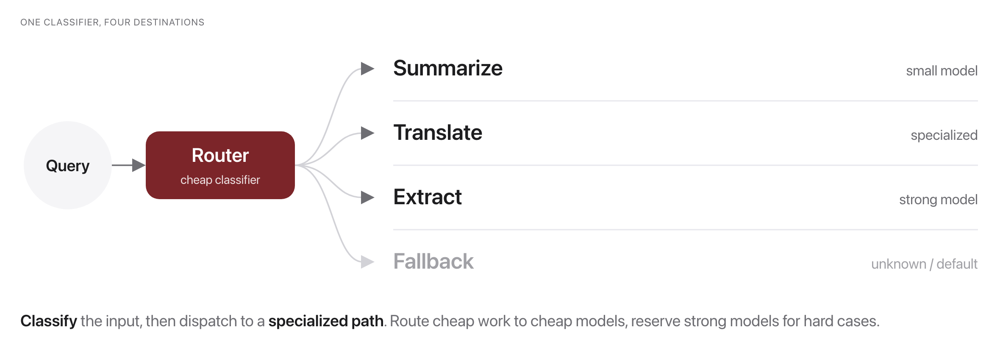
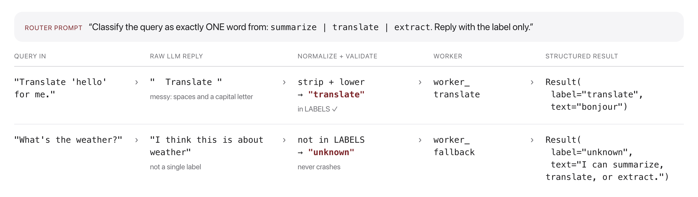

# W14C1 Activity: Jigsaw + Poster Lightning Share, then Build a Router + Workers Workflow

This class has two parts: a **team jigsaw + poster lightning share** to learn the
workflow patterns, then a **shortened pair-programming build** of the routing pattern.

## Part 1: Jigsaw + poster lightning share (TEAM, ~20 min)
1. **Jigsaw (12 min).** Your team is assigned **one** pattern: *prompt chaining*,
   *routing*, *parallelization*, or *orchestrator-workers*. Make a poster with:
   - a simple **diagram** of how it works,
   - one **real use-case** where it fits,
   - a **"when NOT to use an agent"** caveat for this pattern.
2. **Poster lightning share (8 min).** No wall walk needed, this works in a
   fixed-seat room. Each team gets **~60 seconds to teach its pattern from their
   seats** (or photograph the poster onto the shared screen while narrating). Take
   notes so you leave understanding all four patterns. If time is tight, the
   instructor may shorten this step, so keep your teach-back crisp.

## Part 2: Build the routing pattern (PAIR, ~21 min)

**Goal:** implement the **routing** pattern from Anthropic's *Building Effective
Agents*: a router that classifies a request and dispatches it to a specialized
worker, with a safe fallback. You'll make the orchestration logic **unit-testable
with a mock LLM** so it runs offline and deterministically.

## Before you code: the picture and the math





The router asks the LLM for a raw label, normalizes it, and validates it against
the allowed label set $L = \{\text{summarize}, \text{translate}, \text{extract}\}$:

$$
\hat{y} = \mathrm{normalize}\big(\mathrm{LLM}(p_{\text{route}}, q)\big),
\qquad
\text{label} =
\begin{cases}
\hat{y} & \text{if } \hat{y} \in L \\
\text{unknown} & \text{otherwise}
\end{cases}
$$

Dispatch then picks the worker from a table, with the fallback wired to `unknown`:

$$
\mathrm{run\_workflow}(q) = W_{\text{label}}(q),
\qquad
W_{\text{unknown}} = \mathrm{worker\_fallback}
$$

Your finished code takes any query string, classifies it into one of three job
labels (or `unknown`), and runs exactly one worker on it. It always returns a
structured `Result` with the label, the output, who handled it, and a trace: it
never crashes on a messy or off-topic query. **Check yourself before coding:**
if the LLM replies `"  Translate "` (extra spaces, capital T), which worker runs
and why? (`worker_translate`: normalize strips whitespace and lowercases, so
$\hat{y} = \text{translate} \in L$, exactly the top row of the anatomy figure.)

## The system you're building
```
query --> route() --> label --> dispatch --> worker --> Result(label, output, handled_by, trace)
                         |
                         +--> "unknown" --> worker_fallback   (never crashes)
```

## How this lab works

Each step tells you **what to write**, then exactly **how to check it**.

`lab` is a shortcut for the long docker command. Set it up once per
terminal session, using the line for **your** shell:

```
# macOS / Linux (bash, zsh)
alias lab='docker compose -f docker/docker-compose.yml run --rm --no-deps course'

# Windows, PowerShell
function lab { docker compose -f docker/docker-compose.yml run --rm --no-deps course @args }

# Windows, Command Prompt
doskey lab=docker compose -f docker/docker-compose.yml run --rm --no-deps course $*
```

Rather work inside the image? This opens a shell there, and then every
command below runs without its `lab` prefix:

```bash
docker compose -f docker/docker-compose.yml run --rm --no-deps course bash
```

```bash
lab python -m pytest weeks/week-14/class-01/exercise/test_workflow.py -k step1 -q
```

Stuck for more than a few minutes? Open `../solutions/WALKTHROUGH.md` at the
matching step. The full reference solution sits in `../solutions/` too. **These
labs are not graded**, so reading them is not cheating: getting unstuck and
finishing the idea beats staring at a blank function.

---

### Step 1, The router

**Write:** `route(query, llm)`. Prompt the LLM to reply with exactly one of the
allowed labels, then **defend against messy output**: strip, lowercase, take the
first token, and map anything not in `LABELS` to `"unknown"`.

**The defense is the step, not the prompt.** Models reply "Summarize.", "I think
this is a summarize task", or an empty string. Five tests cover this, including
one that feeds pure garbage.

**Done when:** `-k step1` gives `5 passed, 6 deselected`.

---

### Step 2, The workers

**Write:** `worker_summarize`. `worker_translate` and `worker_extract` are
written for you: read them first, then write the third the same way. Each worker
prompts the LLM for its one job and returns the reply.

**Each worker gets its own focused prompt**, which is the entire argument for the
routing pattern: three small, testable prompts beat one prompt that tries to do
everything.

**Done when:** `-k step2` gives `1 passed, 10 deselected`.

---

### Step 3, The fallback

`worker_fallback` is already written. Note what it does: returns a helpful
message and **never calls the LLM**.

**A fallback that needs the model cannot handle the model failing.** The test is
named `fallback_never_crashes_and_does_not_need_llm` for that reason.

**Done when:** `-k step3` gives `1 passed, 10 deselected`.

---

### Step 4, Orchestrate

**Write:** `run_workflow(query, llm)`. Route, look up the worker in a dispatch
table (falling back on `"unknown"`), call it, and return a `Result` with a trace.

**A dispatch dict, not a chain of `if`s.** Adding a capability then means adding
a label and a table entry, which is the property that makes this pattern scale.

**The trace matters as much as the answer.** When a workflow misbehaves, the
first question is always "which branch did it take?", and an answer with no trace
cannot tell you.

**Done when:** `-k step4` gives `3 passed, 8 deselected`.

---

### Step 5, Run it

```bash
lab python -m pytest weeks/week-14/class-01/exercise/test_workflow.py -q
```

```
...........                                                              [100%]
11 passed
```

With Ollama running:

```bash
docker compose -f docker/docker-compose.yml run --rm course python weeks/week-14/class-01/exercise/workflow.py
```

```
Q: Summarize the French Revolution.
 -> [summarize] via worker_summarize: The French Revolution was a period of radical
    social and political upheaval that began with the storming of the Bastille...

Q: Translate 'hello' for me.
 -> [translate] via worker_translate: Bonjour.
```

**Note the bracketed label in each line.** That is the trace, and it is the
difference between a workflow you can debug and one you can only re-run.

Also worth noticing in the summarize output: the model's history is shaky
(Robespierre did not lead the storming of the Bastille). The router did its job
perfectly and the worker still produced a confident error. **Routing controls
which prompt runs, not whether the answer is true**, which is why W9's evaluation
material does not stop being relevant once you build workflows.

## Stretch goals
- Add a **`classify`** worker and label; route negative/uncertain confidence to `unknown`.
- Make the router **rules-first** (regex keywords) and only fall back to the LLM , 
  cheaper and more deterministic. Discuss the trade-off.
- Add a **second stage** (prompt *chaining*): pass the worker's output through a
  "polish" LLM call before returning. Keep tests green.

A reference solution is in `../solutions/` (don't peek until you've tried!).
