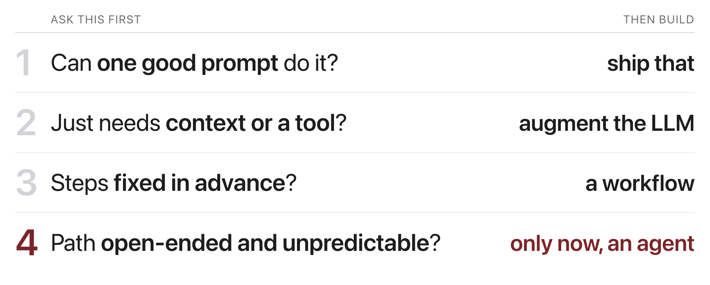
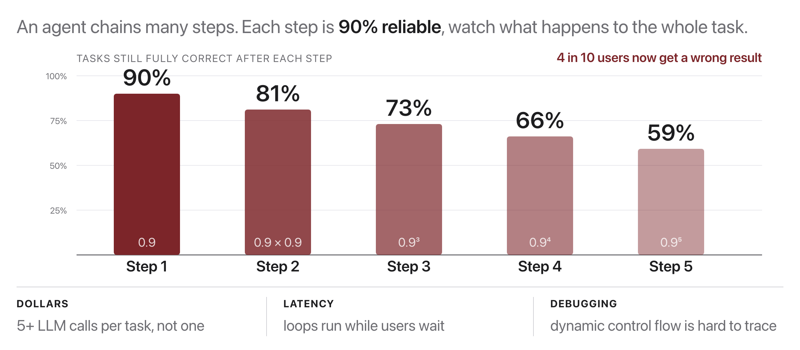

# W14C2 Exercise: Project Work + Instructor Feedback Session

This is **not** a coding exercise. It is a structured **work session** before next
week's final presentations. Use the time to push your project forward and get a
**1-on-1 instructor checkpoint**.

## Before you code: the picture and the math





Two ideas from lecture drive the "Design sanity" checklist item and the
take-home `repro_check.py`. First, reliability multiplies across chained LLM
steps: with per-step success $p$ and $n$ steps,

$$
P(\text{whole task succeeds}) = p^{n},
\qquad \text{e.g. } 0.9^{5} \approx 0.59
$$

so every step you can delete makes your pipeline more reliable. Second,
reproducibility is an equality check: with a fixed seed $s$, two runs of your
entry point must agree,

$$
f(x; s)_{\text{run 1}} = f(x; s)_{\text{run 2}}
$$

The take-home helper simply verifies that your entry point imports cleanly in
Docker and shows determinism hints (fixed seeds) so that equality can hold. Use
the checklist figure to justify each moving part of your design in your 1-on-1.
**Check yourself before coding:** your pipeline has 4 LLM steps, each 90%
reliable; what fraction of runs finishes fully correct? ($0.9^{4} \approx 0.66$,
about two thirds, which is why the checklist pushes you toward the simplest
design that works.)

## How the session runs (35 min)
1. **(5 min) Self-assess.** Fill in the checklist below for your project.
2. **(rest) Build + feedback rounds.** Keep working while the instructor
   circulates for ~5-minute 1-on-1s. Come to your slot with a **specific question**.

## Pre-final self-checklist
Score yourself honestly (this previews the final rubric in `project/RUBRICS.md`):

- [ ] **Problem & related work**, I can state my question in one sentence and name the paper(s) it builds on.
- [ ] **Method is clear**, someone could re-implement my approach from my description.
- [ ] **A working baseline exists**, I have at least one real, measured result (not just plans).
- [ ] **Metrics, not vibes**, I report a number (accuracy / F1 / success rate / perplexity…), not anecdotes.
- [ ] **Analysis**, I have at least one error-analysis example or ablation, and a stated limitation.
- [ ] **Reproducibility**, it runs in the course Docker image; seeds are fixed; data/model are pinned/cached.
- [ ] **Design sanity (Week 14!)**, no part is over-engineered; an agent is used only where a workflow won't do; failures have a fallback.
- [ ] **Presentation**, I have a 5-8 minute story: motivation → method → result → limitation.

## Bring a specific question to your 1-on-1
Vague ("is this good?") gets vague answers. Try instead:
- "My baseline gets X; is that a fair comparison to Y?"
- "My agent loop sometimes never stops, what stopping condition do you suggest?"
- "Is this metric the right one for my task?"

## Reproducibility quick-check (take-home lab, offline)

A tiny helper verifies the two things graders check first: that your entry point
parses, and that a fixed seed is set somewhere. **There is nothing to implement**
here, the checker ships complete. Each step below is a command and the output you
should see, and the last step runs it on **your own project**.

Open a shell inside the course image, already in this lab's folder. One
command, once per session:

```bash
docker compose -f docker/docker-compose.yml run --rm --no-deps -w /workspace/weeks/week-14/class-02/exercise course bash
```

Everything below runs in that shell.

Stuck for more than a few minutes on a step? A step-by-step `WALKTHROUGH.md`
is in `../solutions/`, with the expected output of every command. **These labs
are not graded**, so reading it is not cheating: getting unstuck and finishing
the idea beats stalling.

---

### Step 1, See a passing file

```bash
python repro_check.py ../../../week-04/class-01/solutions/mlp_classifier.py
```

```
Reproducibility check: ../../../week-04/class-01/solutions/mlp_classifier.py
  [OK]   parses cleanly.
  [OK]   found seeding: torch.manual_seed
  Note: run your real entry point in Docker too; this is only a static hint.
```

---

### Step 2, See a warning

```bash
python repro_check.py ../../../week-02/class-01/solutions/ngram_lm.py
```

```
Reproducibility check: ../../../week-02/class-01/solutions/ngram_lm.py
  [OK]   parses cleanly.
  [WARN] no RNG seeding found, set seeds for reproducible results.
  Note: run your real entry point in Docker too; this is only a static hint.
```

**That warning is a false positive, and noticing why is the point.** `ngram_lm.py`
*is* deterministic: it seeds a local `random.Random(seed)` inside `generate`
rather than calling a global seeder, and the checker only looks for the global
pattern. A static check reports what it can see, not what is true.

---

### Step 3, See the failure modes

```bash
python repro_check.py no_such_file.py
```

A missing file and a file with a syntax error both report cleanly and return a
non-zero exit code, so this can go in a CI script.

---

### Step 4, Run it on YOUR project

```bash
python repro_check.py path/to/your_entrypoint.py
```

**Then do the thing the checker cannot do**: actually run your entry point inside
the course image, twice, and confirm you get the same numbers. The tool does no
network calls and no execution; it is a static hint, and the note in its own
output says so.

The graders' first two questions are "does it run in Docker?" and "do I get your
numbers?". This step is where you find out before they do.

### Smoke test

```bash
pytest -q
```

```
..........                                                               [100%]
10 passed
```

## When you are done

Nothing to submit. The checklist is yours: note the one piece of feedback you
will act on before the final report.

## Deliverables reminder
- **Final report + presentation:** Week 15 + finals (see `project/RUBRICS.md`, `project/final/report-template.md`).
- Presentations run across **W15C2 and the finals session**.
