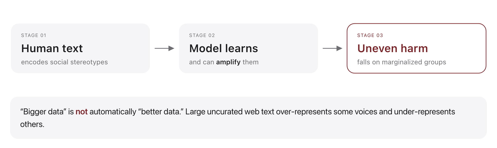
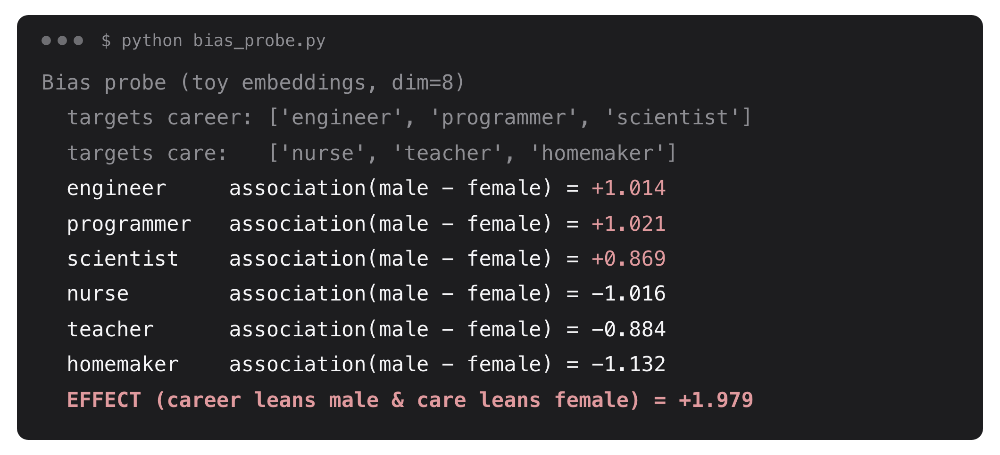

# W15C1 Lab: Measuring Bias in Embeddings

## 1. Learning objective

Turn "this model seems biased" into a number: measure how far each word leans
along an attribute axis, and summarize a whole stereotype pattern in one score.

You write three functions in `bias_probe.py`. The toy vectors and the report
formatting are given.

## 2. Getting started

From the repository root on your own machine, once per session:

```bash
docker compose -f docker/docker-compose.yml run --rm --no-deps -w /workspace/weeks/week-15/class-01/exercise course bash
```

A step you have not written yet reports `skipped`, not a failure. If you get
stuck, `../solutions/WALKTHROUGH.md` works out every step, and these labs are
not graded.

## 3. Implement `cosine`



Everything in this lab is built on cosine similarity:

$$\cos(a, b) = \frac{a \cdot b}{\lVert a \rVert \, \lVert b \rVert}$$

Dot product over the two lengths, and 0.0 when a vector has no length.

```bash
pytest -k step1 -q
```

```
....                                                                     [100%]
4 passed, 6 deselected
```

## 4. Implement `association`

One word's association is how much closer it sits, on average, to attribute set
$A$ than to set $B$. Averaging each side is what lets the two sets differ in size:

$$s(w, A, B) = \frac{1}{|A|} \sum_{a \in A} \cos(w, a) \; - \; \frac{1}{|B|} \sum_{b \in B} \cos(w, b)$$

Average the cosine against each set, then subtract.

```bash
pytest -k step2 -q
```

```
...                                                                      [100%]
3 passed, 7 deselected
```

## 5. Implement `effect`



The WEAT-style effect applies that to two groups of target words at once, and
asks whether $X$ leans toward $A$ while $Y$ leans toward $B$:

$$\mathrm{effect}(X, Y, A, B) = \frac{1}{|X|} \sum_{x \in X} s(x, A, B) \; - \; \frac{1}{|Y|} \sum_{y \in Y} s(y, A, B)$$

The same subtraction, one level up, over two groups of target words.

```bash
pytest -k step3 -q
```

```
...                                                                      [100%]
3 passed, 7 deselected
```

## 6. Run it, then question it

```bash
python bias_probe.py
```

```
Bias probe (toy embeddings, dim=8)
  engineer     association(male - female) = +1.014
  programmer   association(male - female) = +1.021
  scientist    association(male - female) = +0.869
  nurse        association(male - female) = -1.016
  teacher      association(male - female) = -0.884
  homemaker    association(male - female) = -1.132
  EFFECT (career leans male & care leans female) = +1.979
```

These vectors were CONSTRUCTED to show this pattern, so the number proves
nothing about any real model. What it does let you practise is interrogating a
bias metric before you trust one.

1. Swap the attribute sets, then swap the targets instead. Both give -1.979,
   and `effect(X, X, A, B)` is exactly 0.000. A metric that flips sign under a
   relabelling has no inherent direction. What does that mean for a headline
   like "the model scores +1.98 on gender bias"?
2. Shrink the attribute sets to one word each, `["man"]` and `["woman"]`. The
   effect barely moves, to +1.971. On real embeddings it would move a lot. What
   is the toy corpus hiding about how sensitive this metric is?
3. Probe words with nothing to do with the axis: `river`, `tree`, `music` are
   in the vocabulary. Compute their associations. What score should a truly
   unrelated word get, and what would you conclude if it got +0.4?
4. Suppose a real model scores +1.9 here. Name one decision you would NOT be
   willing to make on the strength of that number alone, and say what evidence
   you would want instead.
