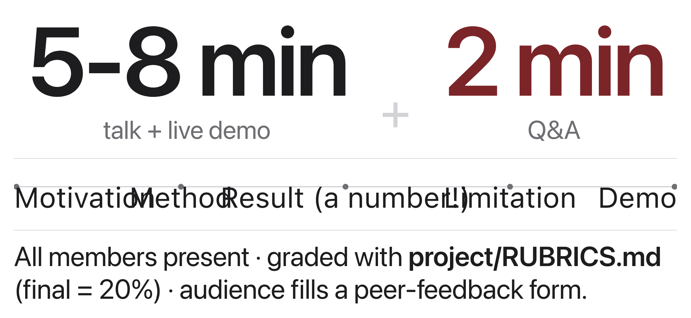
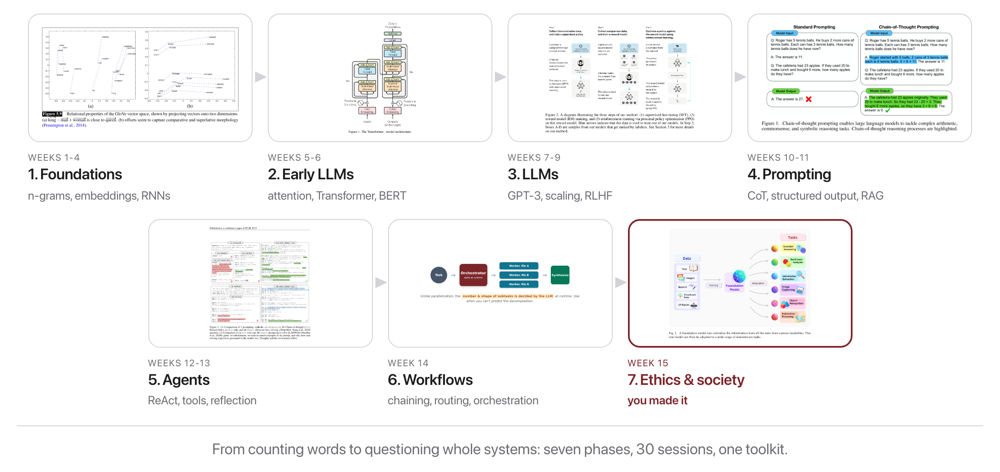

# W15C2 Lab: Exit Ticket & Final Presentations

## 1. Learning objective

Present your project, and close the course by writing down what you think the
field does next.

There is no code today. This is the facilitation guide and your checklist.

## 2. Getting started

Test your demo before class, in the same image everything else ran in:

```bash
docker compose -f docker/docker-compose.yml run --rm -w /workspace/<your project> course bash
```

Have a fallback ready, screenshots or recorded output, in case the live demo
fails in the room.

## 3. Write the exit ticket (5 min, individually)

On paper, before the talks start:

- One grounded prediction about where this field is in five years. Pick a lane:
  scale, evaluation, agents and workflows, or ethics.
- One thing you refuse to predict, and why.

## 4. Present (5-8 min + 2 min Q&A)



The only arithmetic today is the time budget:

$$T_{\mathrm{group}} = t_{\mathrm{talk}} + t_{\mathrm{QA}}, \qquad 5 \le t_{\mathrm{talk}} \le 8, \quad t_{\mathrm{QA}} = 2 \quad (\text{minutes})$$

Plan for at most 10 minutes. Six groups at the maximum is a full hour, which is
why rehearsing the timing matters. Presentation plus report is 20% of the
course grade (`project/RUBRICS.md`).

Every member presents. Walk the arc in the figure:

**Motivation → Method → Result (with a number) → Limitation → Demo.**

Lead with why it matters, put a concrete number in the Result box, and end with
what you would do next. `presentation-guide.md` has the full checklist.

## 5. Be an audience

Fill in `peer-feedback-form.md` for every talk. It counts toward
participation, and a room that asks real questions makes everyone's talk
better.

## 6. Reflect



1. Your prediction names something that will change. What has to STAY true for
   that prediction to make sense?
2. Look back at the course arc figure. Which phase did your project actually
   live in, and which one would you move it to if you had another month?
3. Name the single result from your project you would defend to someone
   skeptical, and the one you would not.
4. What did you refuse to predict, and what evidence would change your mind?
